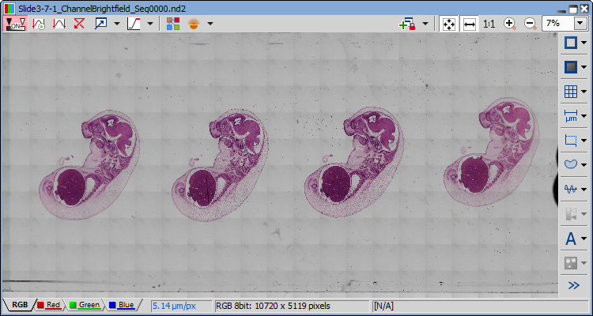
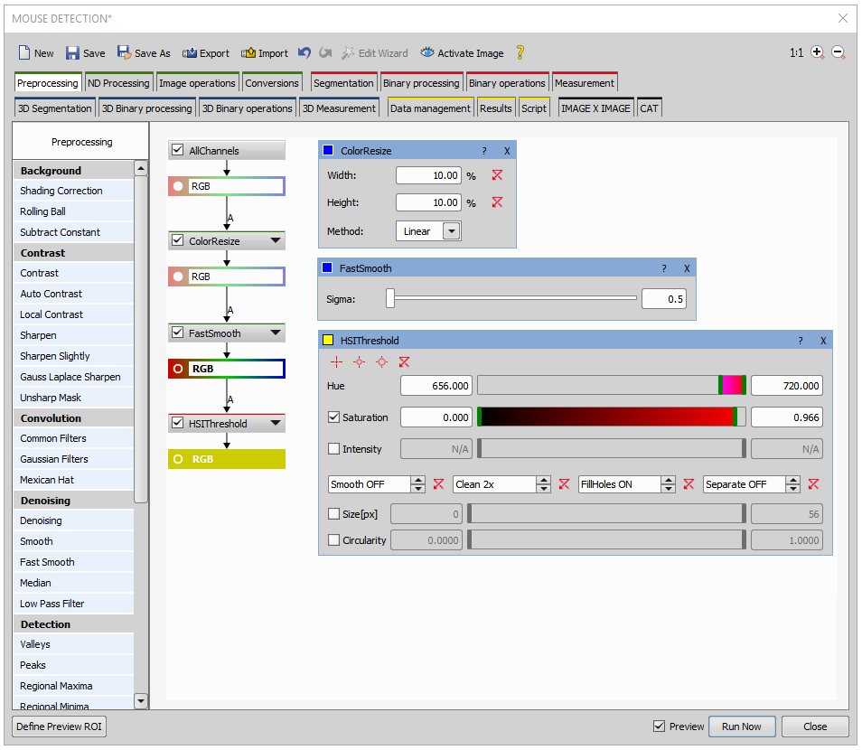
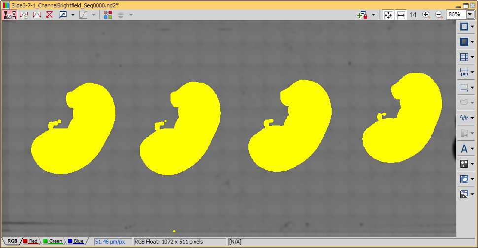
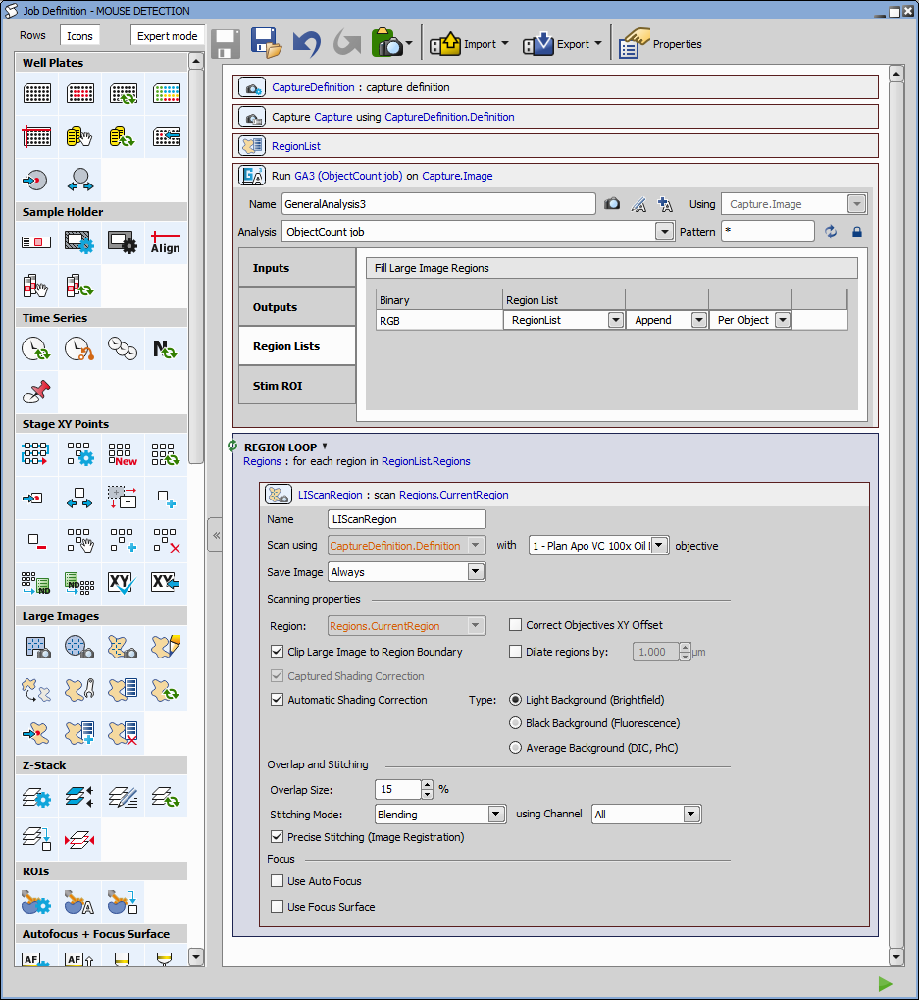
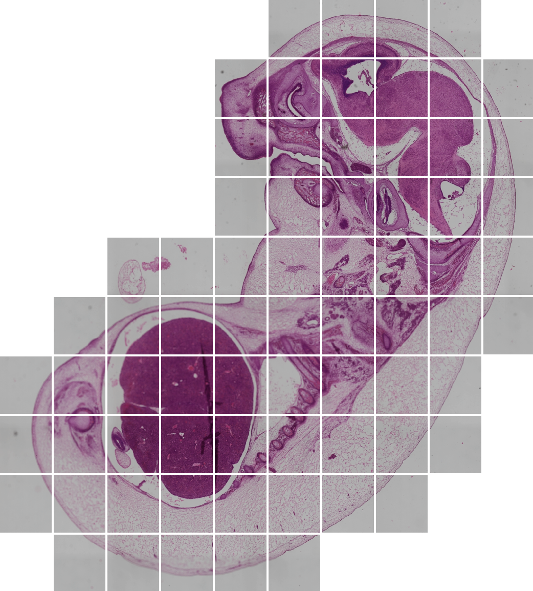

# Mouse embryos detection on lo-mag and acquisition using hi-mag

This example shows how to:
1. detect regions of interest (embryos) on an image acquired with a lo-mag objective and
2. acquire detected regions with hi-mag objective.

In this example we simulate the lo-mag image with a stitched large image (10720 x 5119 px) of four embryos.

## 1. Detect embryos using GA3

As the image is large and the object of interest are large we can downsample the image quite a bit. 
In this example 10% of the original size is still good.

Since we are interested in big objects we will smooth ("Fast Smooth" node under Preprocessing and Denoising) the image until we see four blobs and the small detail disappear.
For segmenting the blobs we use the HSI threshold node (under Segmentation and Threshold). This will help us to detect base on the color (hue) instead of intensity. To remove small debris we use Clean 2x in the Threshold dialog.

The resulting detection should look like this:

## 2. Use the segmented embryos to fill a region list

In the job definition below, the General Analysis 3 task (under GA3 Processing section) is
connected to the Capture task (under Acquisition section) providing
input samples. At the same time it uses a general analysis named “MOUSE
DETECTION” (shown above) to fill in a region list which was defined above the analysis.

In the GA3 task, the binary layer with the segmented embryos is connected with the region list. 
We can choose from appending the Regions or replacing the complete list. In this case it does not matter as we do it once. 
We choose the regions per object.

Finally we add a Region Loop task (under Large Images section) which will iterate over all the regions and acquire a large image for each. 
In this task we use a hi-mag objective and capture definition. We define parameters for stitching.

