# Detecting embryos in lo-mag and acquiring in hi-mag using confocal scan area

In this example Nikon A1 confocal microscope is used for image
acquisition of the Drosophila melanogaster embryos. We want to capture a
Z-stack of each complete embryo in high-resolution and as fast as
possible.

In order to do that, we will:
1. Start from a lo-mag image captured with the A1 scanning setting set to a large FOV,
1. use GA3 to detect the embryos and measure its position (in absolute stage coordinates) and orientation,
1. prepare lo-mag and hi-mag optical configurations (A1-FULL and A1-ROTATE),
1. create a JOB that will use this information 
    - in a point loop over the detected objects and
    - to set the angle to the A1 scanning head

## 1. Low magnification image

Here is the original image (Courtesy of Richter, Schuetz, Crocker; European Molecular Biology Laboratory, Heidelberg Germany).

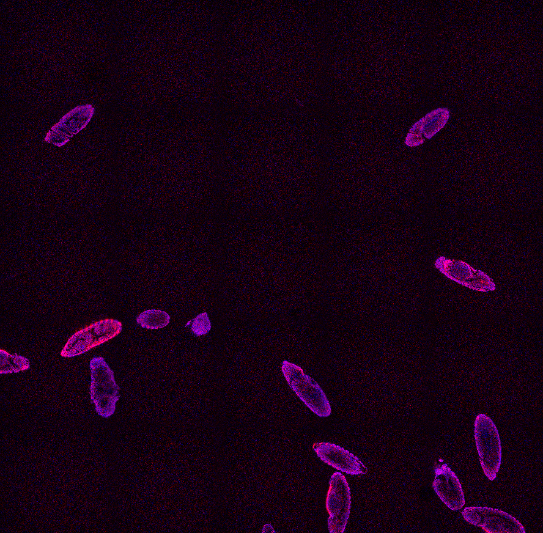 \

## 2. Detect the embryos and measure its position and orientation

We create a simple GA3 recipe that will
- threshold the embryos,
- remove incomplete embryos at the border and 
- measure their CenterAbs and Orientation

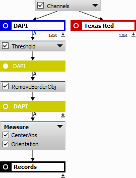

The Threshold node (under Segmentation and Threshold) is connected to the DAPI channel.

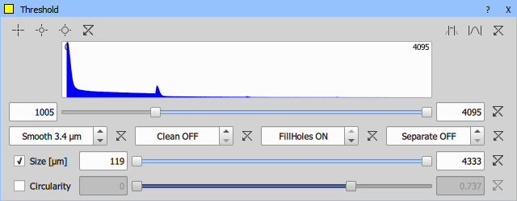

The segmentation should look like this:

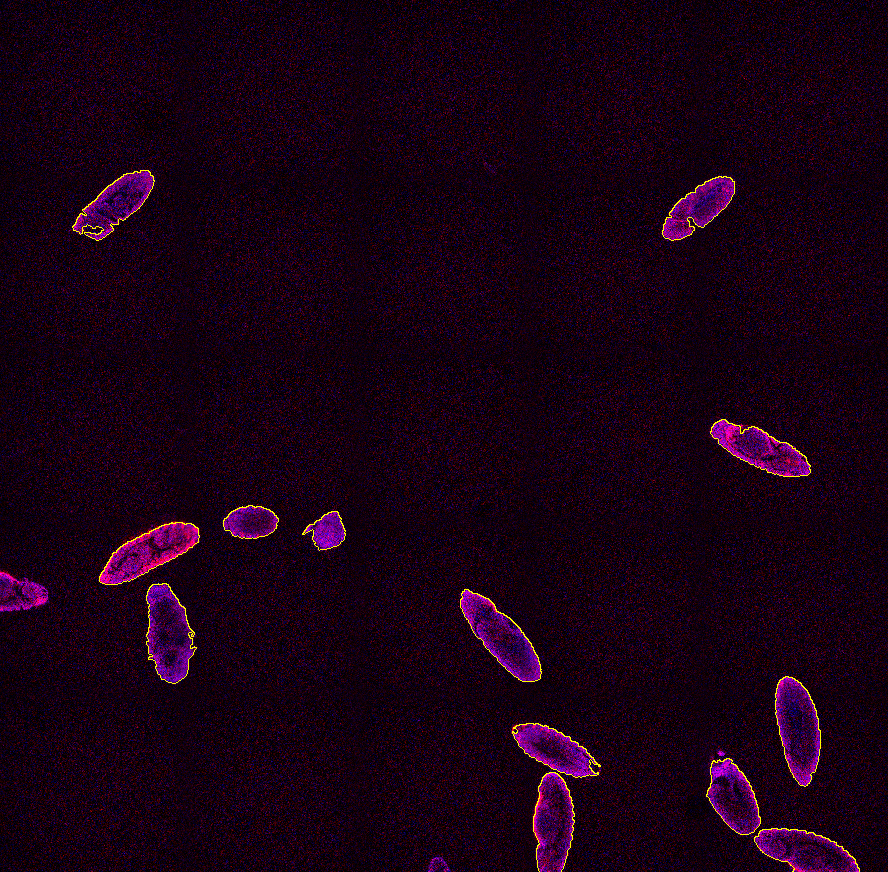

All embryos touching the image border are then removed using Touching Borders node (under Binary Processing and Remove objects).
Then CenterAbs and Orientation measure nodes (under Measurement and Object position, Object shape resp.) are connected.

The resulting object table is shown below:

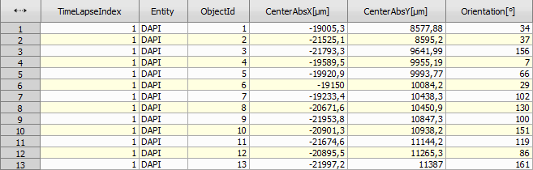

## 3. Prepare lo-mag and hi-mag optical configurations

Now we define two optical configurations. One for the low magnification
overview (“A1-FULL”) and one for the high magnification scan
(“A1-ROTATE”) using the rotated scan area. We make sure Scan Area
Settings is unchecked for the latter configuration.

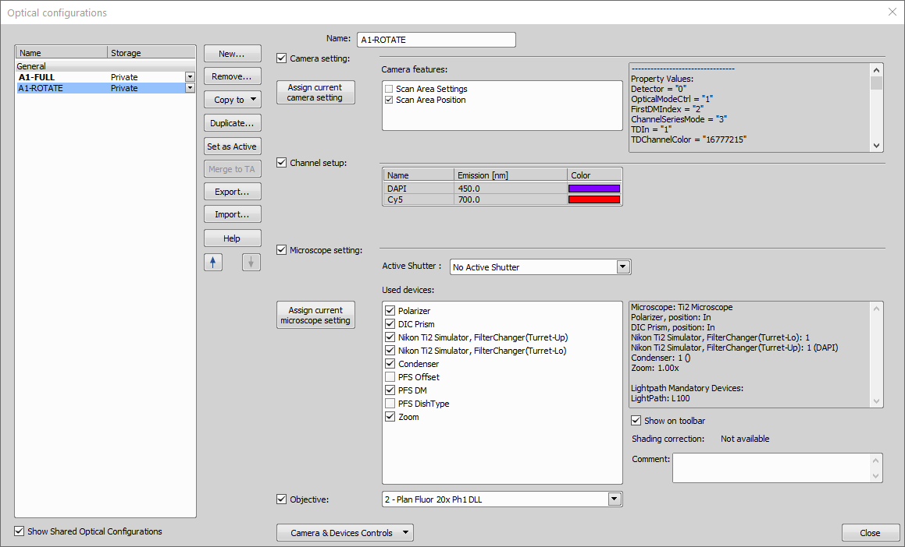

## 4. Create the JOB

We can move on by defining a new Job. Low magnification Capture Definition task (under Acquisition section) is set with the “A1-FULL” optical configuration. 
Then a New Point Set task (under XY points section) is added and filled with the General Analysis 3 data acquired before.

We check all the records available from the selected GA3 task (under General Analysis 3 section):

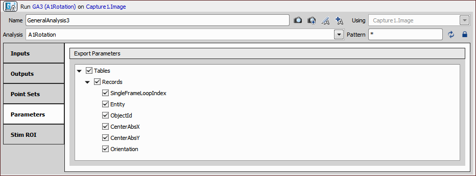

Then we select the “A1-ROTATE” using the Select Optical Configuration task (under Optical Configurations section) and use
Macro task (under System section) to select the *Band Scan* scan mode and set the zoom size (8) and shape of the area (2 by 1
rectangle of 1024 x 512).

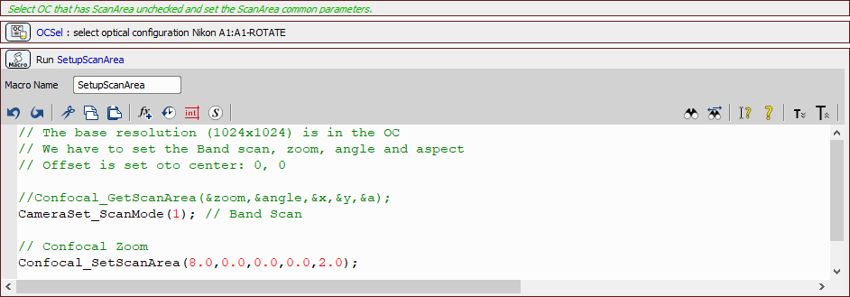

Scan Area settings shown on the microscope pad. These
settings will be applied by the job.

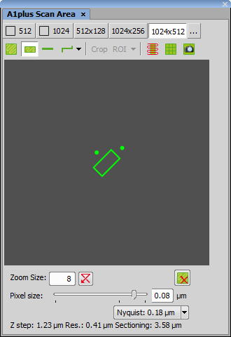

We define a Z-Stack for the high-resolution acquisition of the embryo using the Define Z-Stack task (under Z-Stack section)
and another Macro task (under System section) to set the proper orientation of the scan area is placed inside a
Point loop task (under XY Points section) together with the Z-Stack loop task (under Z-Stack section) capturing the
final images.

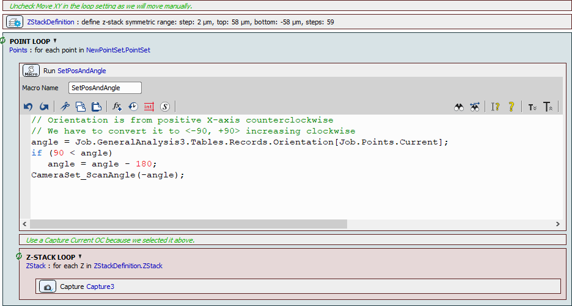

Now the job is complete and can be executed. Data from the General Analysis 3 are used to properly position the scan area over each embryo
and capture the high-resolution Z-Stack.

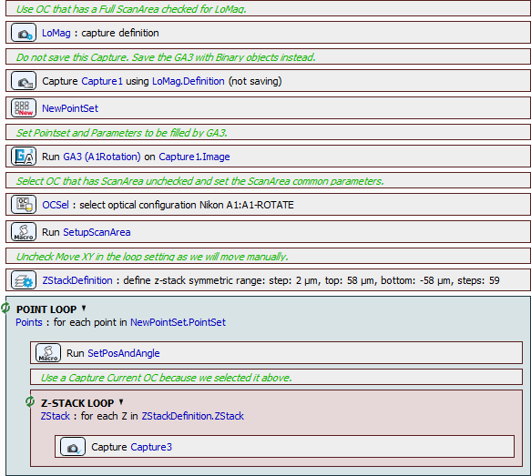

Scan area positioned over one embryo:

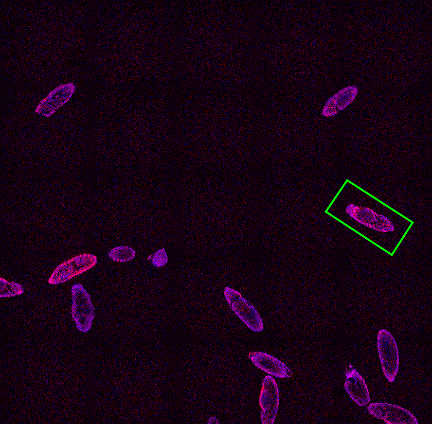

Z-Stack of the same embryo visualized in the Volume Viewer:

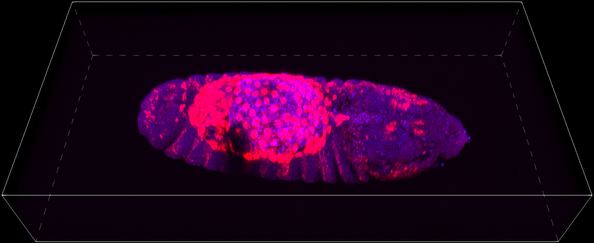
