# Narrowing a Z-Stack - set top and bottom using GA3

GA3 can be used to find the top and bottom relevant parts of a sample.
These values can narrow down the scanned Z-range in Jobs by skipping the
irrelevant parts of the sample. This is useful for fundamentally
speeding up the sample acquisition.

1.  Acquire a low resolution Z-Stack.
2.  Use GA3 to set the size and position of the bounding box.
3.  Acquire the full-resolution Z-Stack with nyquist sampling.

## Overview

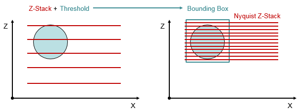

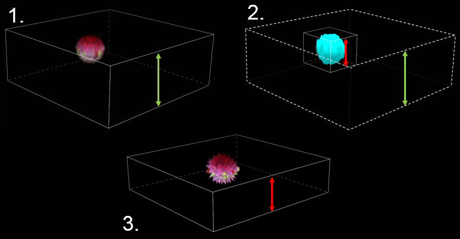

## GA3 recipe

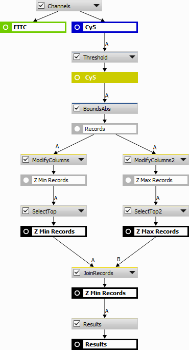

First of all 3D threshold is applied to the channel where the sample is
visible.

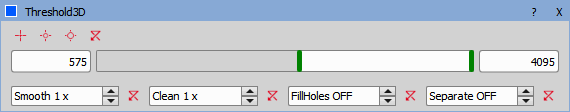

*BoundsAbs* are determined for each detected object.

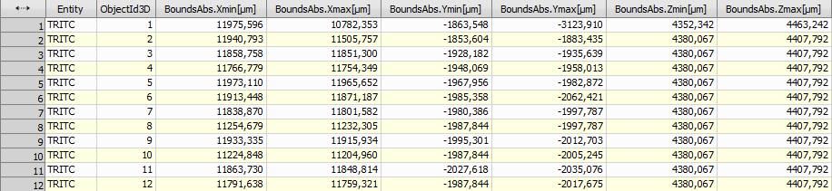

Only the minimum and maximum Z are selected using the *Modify Columns* action.

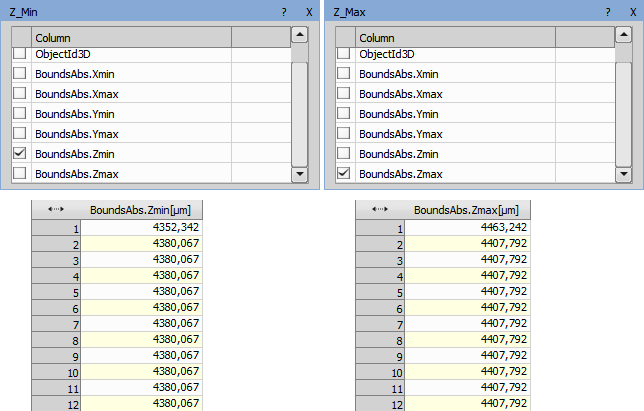

 
*Select Top* node is used for selecting only the smallest and biggest value in their result.

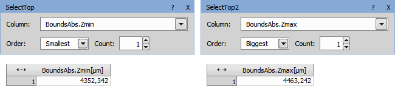

Records are put into single table using the *Join Records* action.

GA3 recipe is saved using Save As.

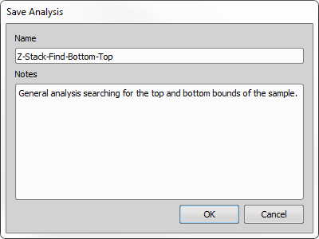

## JOB definition

Jobs Explorer is opened and the tasks are dragged into the definition to form the following job.

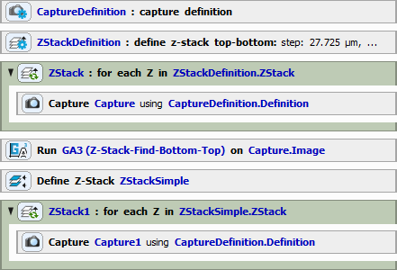

Capturing is using the Capture Definition task (under Acquisition section). For the nyquist *step* we use Define Z-Stack task (under Z-Stack section). 
Then the first stack is captured by Capture task (under Acquisition section) inside the Z-Stack Loop task (under Z-Stack section).

Then, in the GA3 task (under GA3 Processing section) parameters we check the minimum and maximum results from the GA3 recipe.

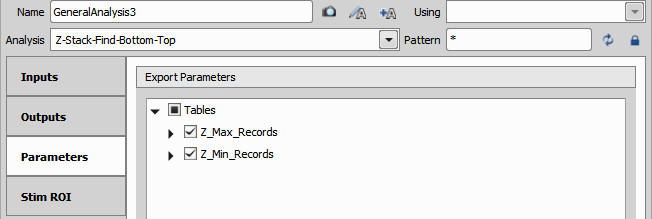

Z-Stack Bottom and Top task (under Z-Stack section) the uses the GA3 exported BoundsAbsZMin and BoundsAbsZMax values to set the Bottom and Top of the Z-Stack.

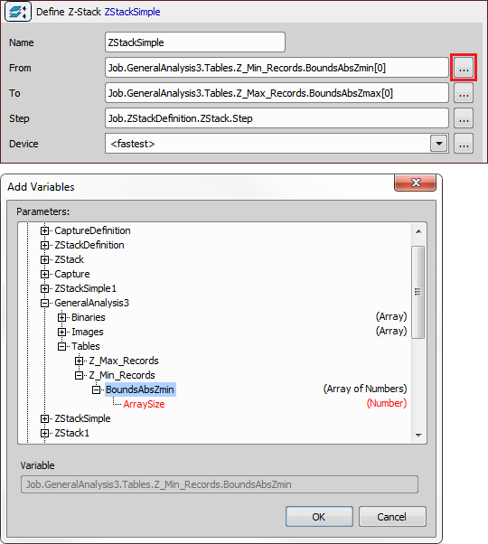

Finally another Z-Stack loop (under Z-Stack section) task is used to run the newly defined Z-Stack. Inside the loop there is a Capture task.

