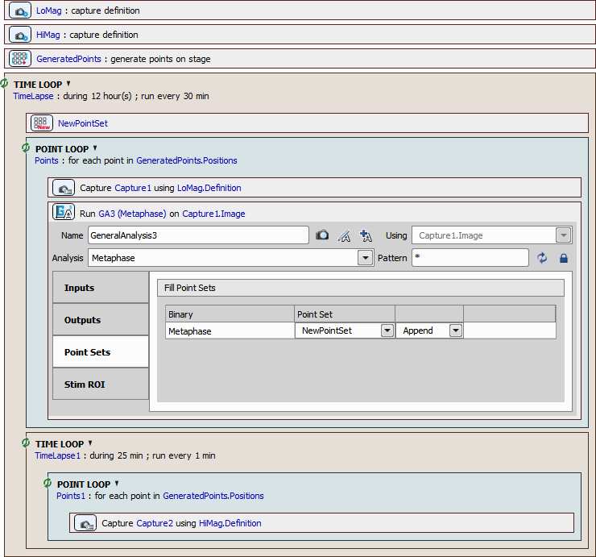

# Rare events - metaphase

In this example, the imaging phase is run over multiple locations at a
low rate. When a dividing cell is detected, it is automatically switched
to high-speed imaging.

Source image (red is cranked up using LUTs to see the round shape).

## 1. GA3 recipe

To detect cells in metaphase using GA3, the following criteria are taken into account:
- Cells are small, round and well defined (threshold with restrictions on object size and circularity),
- nuclei are intense and well defined too (spot detection) and
- dividing cells have two nuclei.

All these criteria make up the following GA3 recipe:

## 2. GA3 in JOBS

Inside JOBs a regular pattern of points on a slide is analyzed every 30
minutes using a low magnification objective (“LoMag”). Every image is
analyzed by the GA3 defined above.The detected cells are then visited
and acquired with a high magnification objective (“HiMag”) every minute
for half an hour. If no dividing cell is found or after the high
magnification acquisition is finished, the experiment goes back to the
slow pace.

