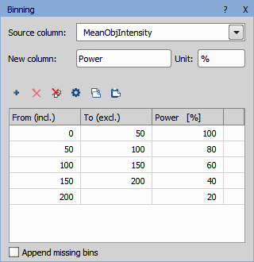

# Stimulating cells based on their intensity

In this example we use a measured feature to determine the stimulation power.

## 1. Create a GA3

We will detect some objects and measure their intensity, which will be the base for determining the stimulation power.

The image for stimulation should be either:
- integer image where zero is 0% and the maximum value (255 for 8-bit and 65535 for 16-bit) is 100% of stimulation power or
- floating point image where 0.0 is 0% and 1.0 is 100% (all values are clipped to this range).

We will use the first option and scale the values to 0-65535.

We first threshold the image to segment the objects and measure their Mean intensity. The with Binning node we map the measured feature values into percentage for stimulation power. 
We also add it into the wizard so that it can be changed inside JOBs.

*Convert Using Table* node fills the color image with the corresponding object value in the table (Power in this example) or Zero in the background.

The *Multiply*, *Clip* and *Change Bit Depth* sequence converts the final color image into a suitable format for the stimulation - in
this case to a 16-bit image. The data range 0-100 is multiplied by 65535/100 in order to have the full 16-bit range.

## 2. Create the JOB

Define the JOB containing the Capture task (under Acquisition) which will be analyzed. The Power image is taken as a source for the *Stim ROIs* S1. 
We add the GA3 into the Wizard so that the bins and powers can be adjusted later.

Run the JOB and edit the wizard as needed.

After the run is finished, observe the ROIs with the stimulation applied to each one of them.

