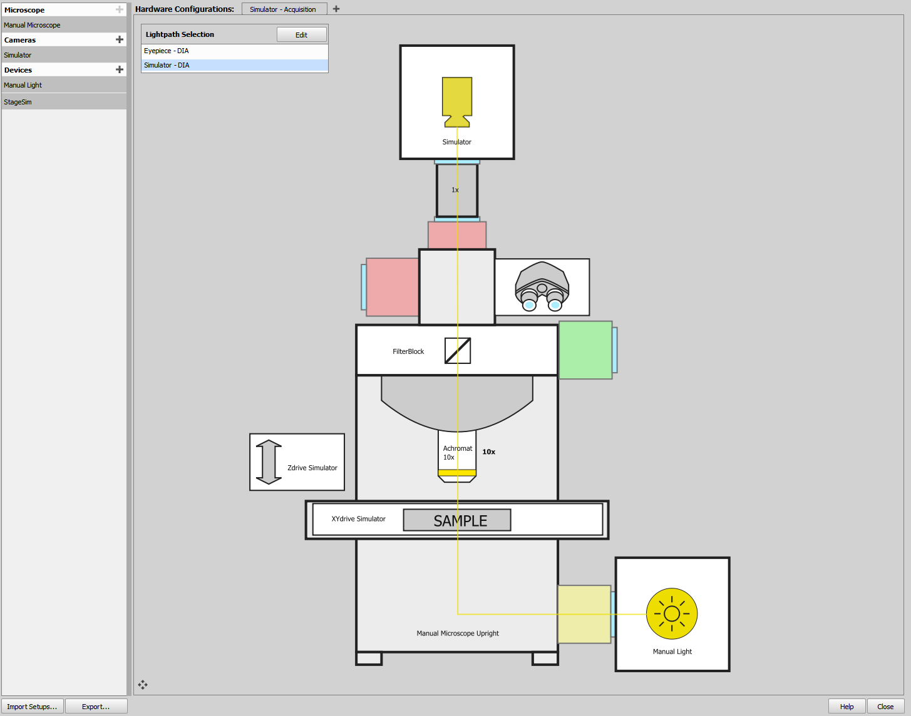
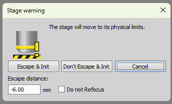
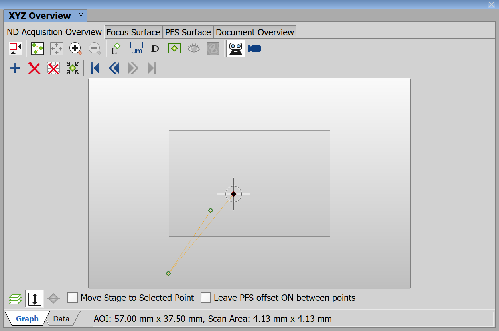

# Simulated manual microscope with camera and stage sumilators

## 1. device manager setup
- Manual Microscope
- Simulator
- Manual light
- StageSim

## 2. Camera setup

Camera simulator plays a provided ND2 file in a loop.

## 3. Stage setup

Initiate the state (menu Devices -> Initiate Stage...).

> [!NOTE]
> With StageSim device this initiation must be done after every start of NIS Elements.

Set the current stage position roughly in the middle of the scan area in order to avoid hitting the stage limits.
