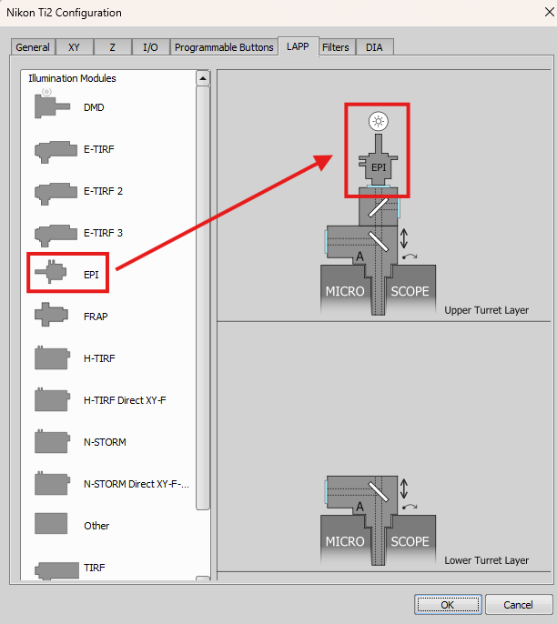
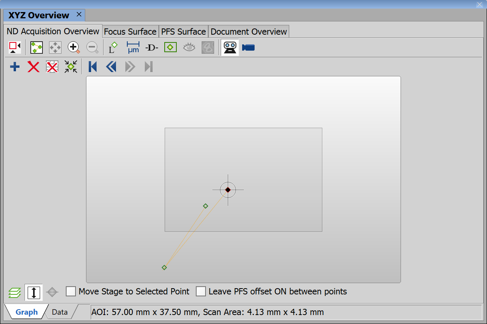

# Simulated Nikon Ti2 with camera simulator

## 1. Device manager setup

Following window is found in `Devices -> Devices Manager`.

- Nikon Ti2 Simulator
- Simulator
- DIA Lamp
- D-LEDI Simulator

In Device manager select the camera "Simulator File". Then select "mono camera":

Add EPI light source:

Right-click on the upper lapp and select "Configure..."

Add the EPI by dragging it from the list on the left to the top position.

## 2. Camera setup

You can now close Device manager and open Acquisition window in `View -> Acquisition Controls -> Acquisition`.

Camera simulator plays a provided ND2 file in a loop.

| :exclamation: Make sure to uncheck the "File metadata" to use the current microscope settings.|

Set some mono ND2 file and check the live (menu: Acquire -> Live Fast).

## 3. Microscope setup

Add objectives so that we have calibrated images.

Add some filters into Turret 1:

## 4. Objectives

Following window is found in `Calibration -> Objectives`.

Check that objectives are calibrated (the calibrations are taken form Hamamatsu simulator):

Each example will state what calibration and which objective was used when the example was made.

To set it, select the objective, run live and calibrate it as follows:

Select manual method:

Click on Set Pixel Size... and enter the number

## 5. Simulated Stage setup

Following window is found in `View -> Acquisition Controls -> XYZ Overview`.

Set the current stage position roughly in the middle of the scan area in order to avoid hitting the stage limits.

Alternatively in `View -> Acquisition Controls -> XYZ Navigation`.

Set values for X, Y and Z directly:  

