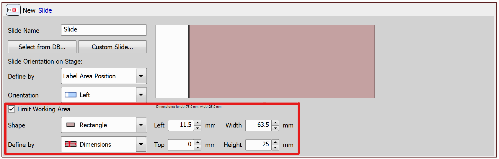
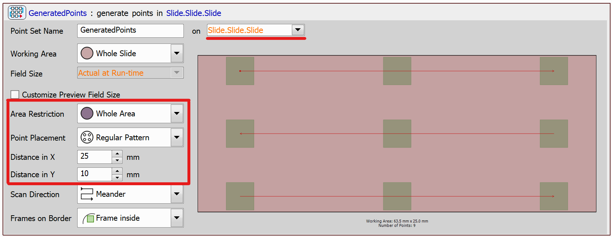
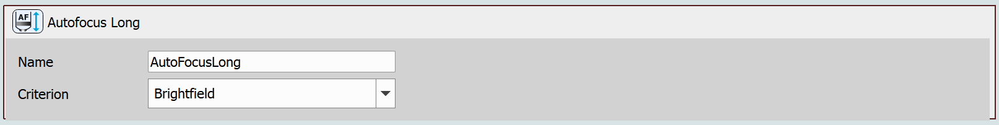
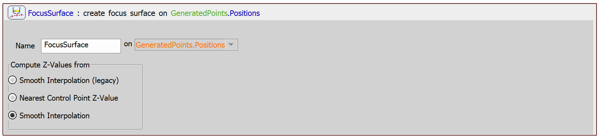
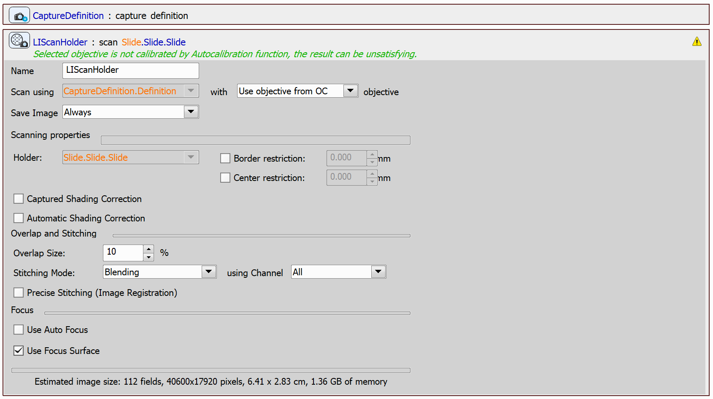

# Create Focus Surface on a Slide

The goal of this example is to show how a focus surface on a slide can be created using a simple JOB. The focus surface calculation can be useful when a slide should be scanned repeatedly and it is undesirable to perform autofocus each time. The slide can also be tilted or the sample can be applied unevenly, therefore, the focus position may change depending on the position on the slide.

## Setting up the JOB

First, use the `Define Slide` task and select a slide from the database or define a custom slide. In our case, we used the standard sized (75 x 25 mm) slide and we limited the working area outside of the slide sticker using the highlighted settings.

Next, use the `Generate Points` task to generate points in the area defined by the slide. Select Whole Slide as the working area, set area restriction to Whole Area and set point placement to Regular Pattern. Select Distance in X and Y in such a way, that the number of points is approximately 3 x 3. Make sure the point set is to be generated on the Slide defined by the previous task and not on Actual Stage Position.

Now, we can start going through the generated points. At each of the points, autofocus will be performed. If the autofocus finishes successfully, the resulting Z position will be assigned to the respective point. For this, we will use the `Point Loop` task together with the `Autofocus Long` and `Assign Current Z to Point/Well/Point Set` tasks.

In the Criterion field of the `Autofocus Long` task select Brightfield:

And for the condition, use the Failed parameter of the `Autofocus Long` task, so that the whole point loop looks as follows:

Finally, create the focus surface using the `Create Focus Surface` task. Check the Smooth Interpolation option.

To use the focus surface, you can scan the whole slide using the `Scan Large Image in Slide/Well/Area` task and check the Use Focus Surface option:

JOB file: [[View on GitHub](10-SlideCreateFocusSurface.bin)] [[Download link](https://laboratory-imaging.github.io/JOBS-examples/NIS_v6.10/10-Create_focus_surface_slide/10-SlideCreateFocusSurface.bin)] [[View as html](https://laboratory-imaging.github.io/JOBS-examples/NIS_v6.10/10-Create_focus_surface_slide/10-SlideCreateFocusSurface.html)]