# Conditional Acquisition

This example will provide a tutorial on how to build a JOB capable of creating a Z-stack based on the condition that there are enough cells present in the well.

The aim of this example is to show how a simple condition can help in saving acquisition time and memory, and two different approaches to cell detection in an image.

## Setting up the JOB

As a start, define a wellplate using the `Define Plate` task. We used a plate with 96 wells.

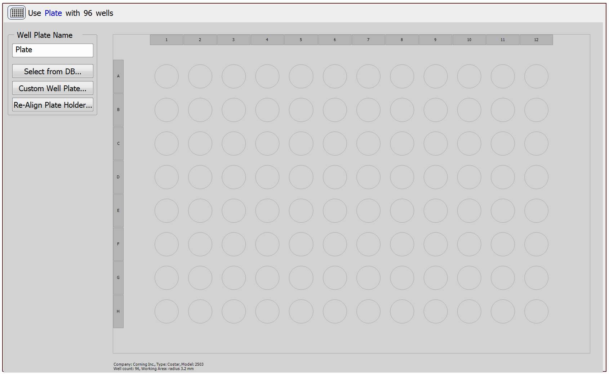

Then, select wells from the plate using the `Select Wells` task:

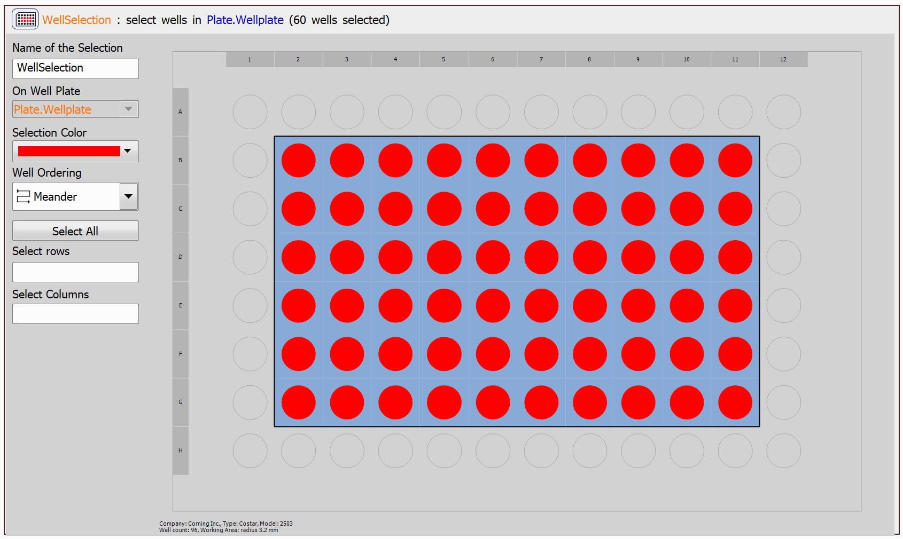

Next, define a Z-Stack using the `Define Z-Stack` task. You can leave this task in its default setting or you can modify it to better suit your needs.

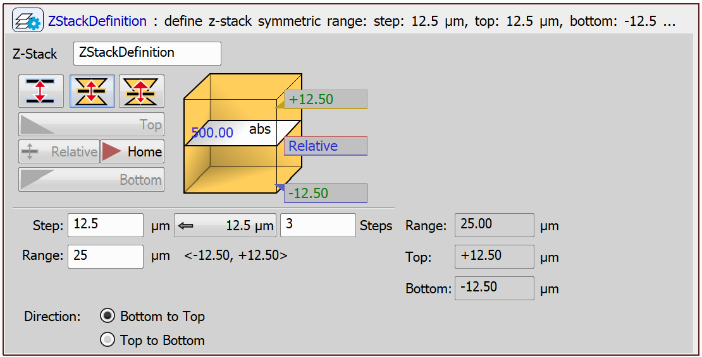

Create a `Capture Definition` task:

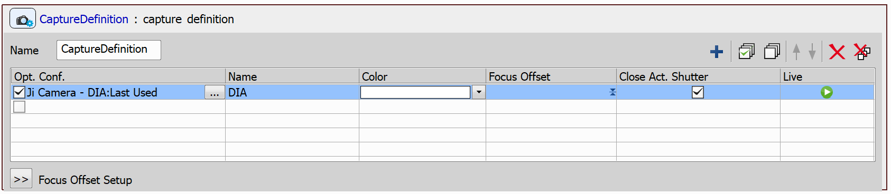

Now we can start going through the wells. At each well center, an image will be captured and the number of cells will be counted. If there are enough cells present in the captured image, Z-stack will be captured and saved.

To count the cells, we can use the `Cell Count Analysis` task or a GA3 recipe.

### Counting cells using Cell Count Analysis

In the case of the `Cell Count Analysis` task, the final well loop looks as follows:

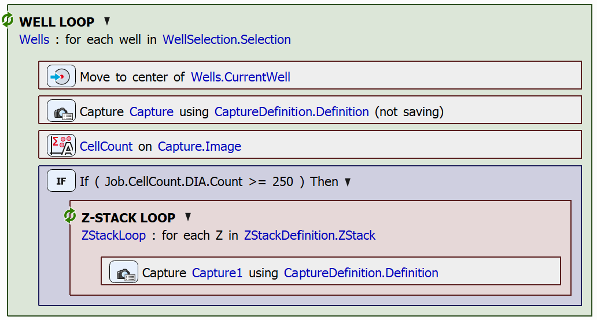

The minimum of cells should be chosen with regard to how many are expected to be found in the sample, or how many are relevant for further processing. In the `If` statement we have set the number of cells detected in the image to be greater than 250. You can set this number to be whatever suits your purposes best.

To count the cells in each captured image, we will use the `Cell Count Analysis` task. This task requires a threshold to be set in order to count cells correctly. The threshold should be set manually. To do so, open the `Cell Count Analysis` task:

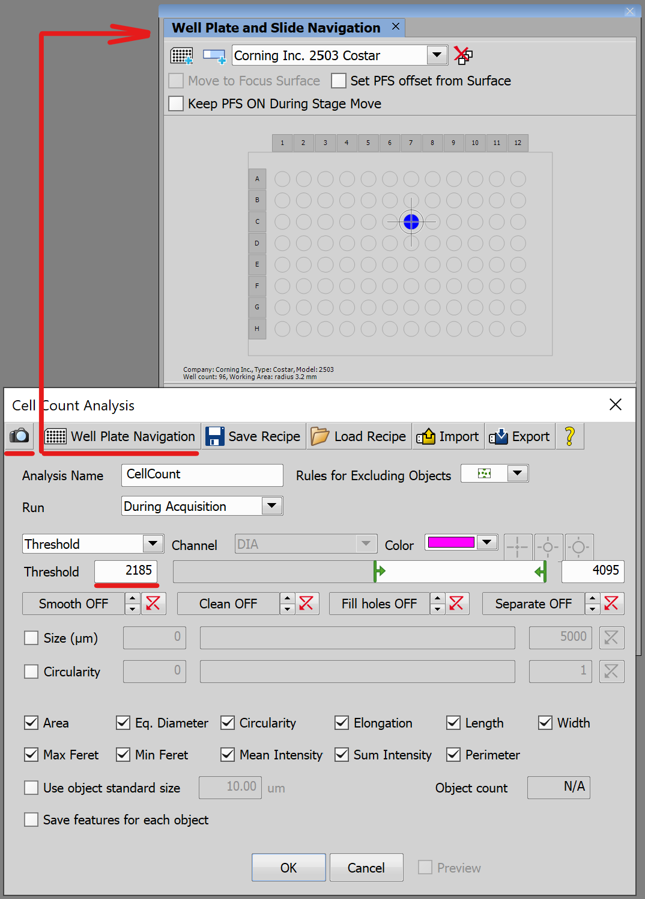

Click the Well Plate Navigation button, which opens a window, where you can navigate to a cell in which cells are present.

Then, click the button with the camera icon and capture the center of the well. After you have captured the image, set the threshold values or use the slider so that the cells are separated correctly.

In our case, the number of cells in different wells varies significantly, therefore, the thresholded images may look like this (the pink patches represent the cells):

Well C7 | Well B11
:-: | :-:
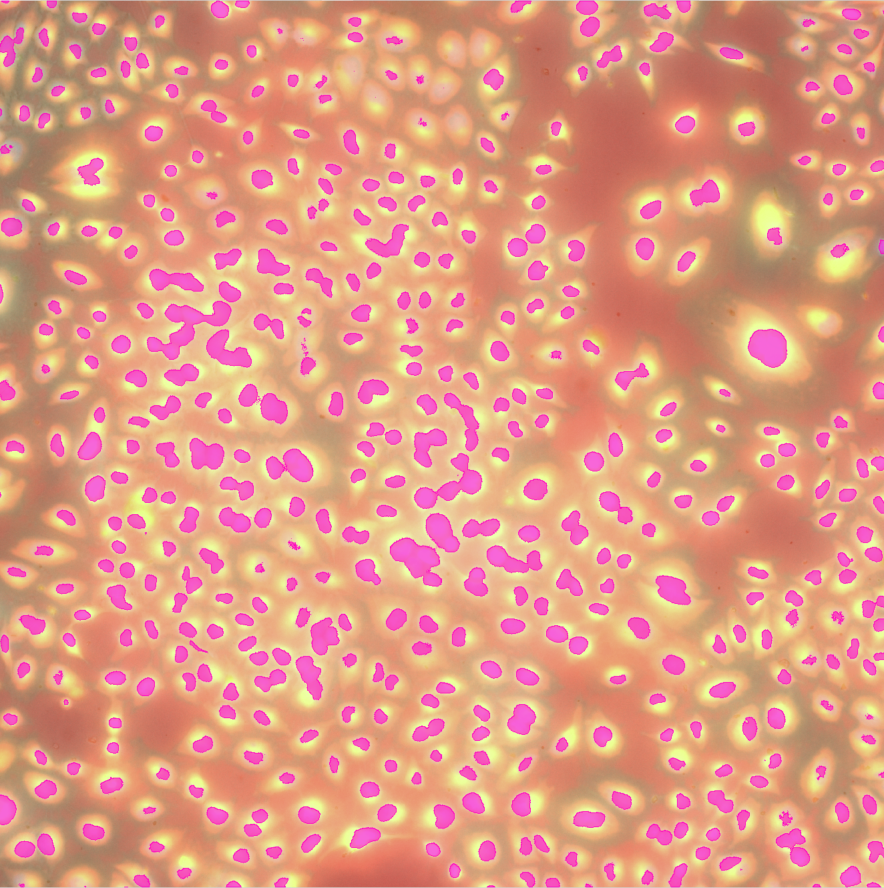 | 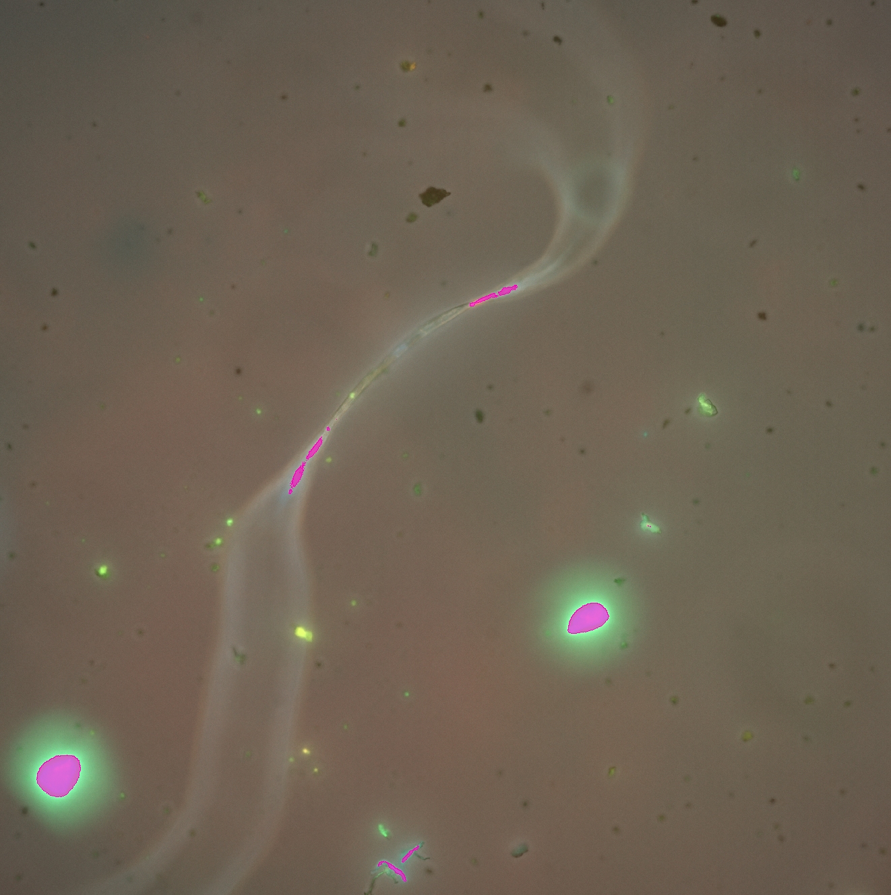

JOB file: <!---[[View on GitHub](11-ConditionalAcquisition_CellCountAnalysis.bin)]--> [[Download link](https://laboratory-imaging.github.io/JOBS-examples/NIS_v6.10/11-Conditional_acquisition/11-ConditionalAcquisition_CellCountAnalysis.bin)] [[View as html](https://laboratory-imaging.github.io/JOBS-examples/NIS_v6.10/11-Conditional_acquisition/11-ConditionalAcquisition_CellCountAnalysis.html)]

### Counting cells using GA3

In the case of the `General Analysis 3` task, the final well loop looks as follows:

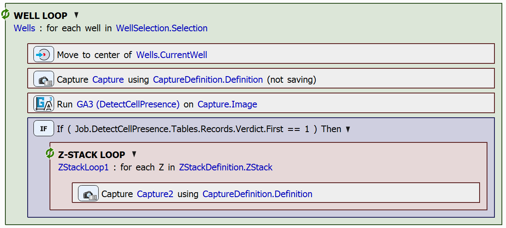

In the `If` statement, we used a parameter Verdict exported from the `General Analysis 3` task, which indicates whether or not cells are present in the captured image. You may also have other parameters exported and decide on capturing the Z-stack based on more information (see section ["Setting up the GA3 task"](#setting-up-the-ga3-task)).

#### Creating a GA3 recipe for cell presence detection

Append the CellPresence_ai node to the brightfield channel, because the node detects whether cells are present in the brightfield image.

The GA3 recipe will look as follows:

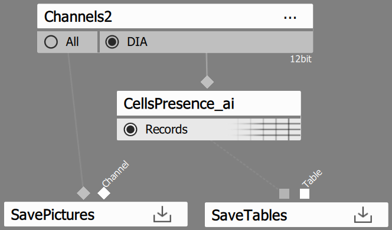

#### Setting up the GA3 task

In the JOB, set the following settings in the GA3 task:

In the Save Outputs tab deselect both the Images and the Tables options, because in our example, only the detection of the cells is necessary.

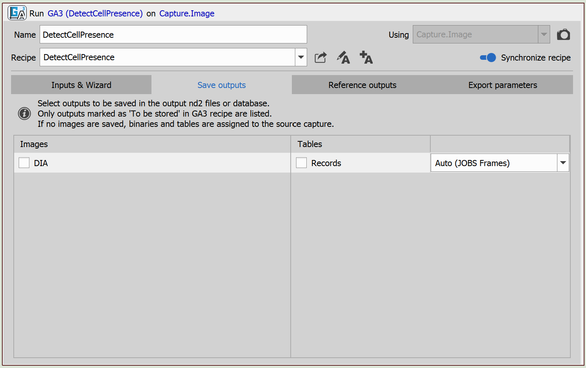

In the Export Parameters tab select Verdict, which is used in the `If` statement.

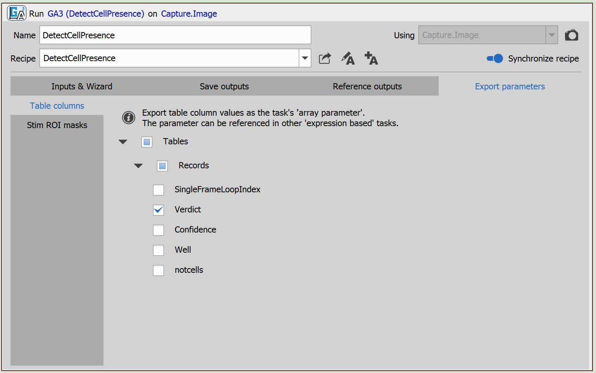

> [!NOTE]
> You can also have other parameters exported, e.g. the Confidence parameter, which states how confident the GA3 recipe is about the Verdict.

JOB file: <!---[[View on GitHub](11-ConditionalAcquisition_GA3.bin)]--> [[Download link](https://laboratory-imaging.github.io/JOBS-examples/NIS_v6.10/11-Conditional_acquisition/11-ConditionalAcquisition_GA3.bin)] [[View as html](https://laboratory-imaging.github.io/JOBS-examples/NIS_v6.10/11-Conditional_acquisition/11-ConditionalAcquisition_GA3.html)]

GA3 file: <!---[[View on GitHub](11-detectCellPresence.ga3)]--> [[Download link](https://laboratory-imaging.github.io/JOBS-examples/NIS_v6.10/11-Conditional_acquisition/11-detectCellPresence.ga3)]
