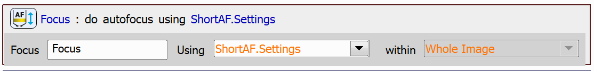

# Find Focus Position

The aim of this example is to show three simple JOBs which are able to find the focus position.

Contents:

- [Simple JOB](#find-focus-position---simple)
    - [Focusing Range Calculation](#focusing-range-calculation)
        - [Autofocus Long](#autofocus-long)
        - [Autofocus Short](#autofocus-short)
- [Basic JOB](#find-focus-position---basic)
- [Advanced JOB](#find-focus-position---advanced)

## Find Focus Position - Simple

In the case of a simple focusing JOB, we will first try to perform autofocus with a short range using the `Autofocus Short` task. You can leave this task in its default settings.

Then, if the short autofocus failed and the focus position was not found, we will try to focus again using the `Autofocus Long` task, which uses a longer range. If this next attempt to focus also fails, in this example we simply stop the JOB execution using the `Exit with Error` task, however, you can implement a different behaviour to better suit your needs.

> [!NOTE]
> The focusing range is calculated automatically for both the `Autofocus Short` and `Autofocus Long` tasks (see the [Focusing Range Calculation](#focusing-range-calculation) section).

JOB file: <!---[[View on GitHub](12-FocusSimple.bin)]--> [[Download link](https://laboratory-imaging.github.io/JOBS-examples/NIS_v6.10/12-Find_focus/12-FocusSimple.bin)] [[View as html](https://laboratory-imaging.github.io/JOBS-examples/NIS_v6.10/12-Find_focus/12-FocusSimple.html)]

### Focusing Range Calculation

Here is a brief description of the focusing ranges for the `Autofocus Short` and `Autofocus Long` tasks. The focusing range depends on the selected objective and in some cases on the settings defined in Service Settings.

#### Autofocus Long

For the `Autofocus Long` task, the focusing range calculation depending on the objective looks roughly like this:

##### 4x or Lower:

If the *Sample Swap* and *Z Limit for Imaging* values are defined in Service Settings, then the focusing range is defined between these values, i.e. the minimal value of the focusing range is the *Sample Swap* position and the maximal is the *Z Limit for Imaging* value.

If these values are not defined in Service Settings, then the focusing range is defined as relative around the current Z position with the value of $\pm 3000$ μm.

##### Greater than 4x to 10x:

The focusing range is defined as relative around the current Z position with the value of $\pm 500$ μm.

##### Other Objectives:

The focusing range is defined as relative around the current Z position with the value of $\pm 400$ μm.

#### Autofocus Short

For the `Autofocus Short` task, the focusing range is always relative to the current Z position and depends only on the objective.

##### 2x or Lower:

The focusing range is defined as relative around the current Z position with the value of $\pm 1000$ μm.

##### Greater than 2x to 4x:

The focusing range is defined as relative around the current Z position with the value of $\pm 600$ μm.

##### Other Objectives:

The focusing range is defined as relative around the current Z position with the value of $\pm 200$ μm.

## Find Focus Position - Basic

In the case of the slightly more advanced way of finding the focus position, we will use the `Autofocus` task along with the `Fast Autofocus Settings` task. The concept of this JOB is exactly the same as in the case of the [simple JOB](#find-focus-position---simple) we discussed earlier, only this time we will use tasks which allow the user to customize the settings of the autofocus to a greater extent than in the previous case.

First, we will create two sets of Autofocus Settings - one will be used for the short range autofocus and the other for the long range autofocus. 

The only difference between the settings is the range around current Z position.

> [!NOTE]
> It is possible to use the `Autofocus Settings` task instead of the `Fast Autofocus Settings` task, as it provides a wider range of settings to configure.

The use of the `Autofocus Settings` task might look as follows:

The *Step by Step* parameter moves the Z drive incrementally within the specified range, capturing images at each step and evaluating their focus criterion. The Z position corresponding to the highest focus criterion is then selected as the focus point.

The *Continuous* parameter, compatible with Nikon Ni or Ti2-E microscopes, operates similarly to *Step by Step* but adjusts the step size based on the camera's frame rate. In this method, the camera captures images at the maximum possible speed while the Z drive moves continuously within the defined range.

However, in this example we will proceed with using the `Fast Autofocus Settings` task.

Then, we will try to find the focus position with the short autofocus settings using the `Autofocus` task:

If the short autofocus fails, we will try again with the long autofocus settings:

JOB file: <!---[[View on GitHub](12-FocusBasic.bin)]--> [[Download link](https://laboratory-imaging.github.io/JOBS-examples/NIS_v6.10/12-Find_focus/12-FocusBasicAltAFSettings.bin)] [[View as html](https://laboratory-imaging.github.io/JOBS-examples/NIS_v6.10/12-Find_focus/12-FocusBasicAltAFSettings.html)]

## Find Focus Position - Advanced

We will add one more step to the advanced way of determining the focus position. 

We will create two sets of `Fast Autofocus Settings`, just like we did in the [basic JOB](#find-focus-position---basic) example:

We will then try to perform autofocus using the short autofocus settings:

Now, instead of immediately trying to focus with long range if the short range autofocus fails, we check whether the attempted autofocus was close to the focus position. This can be determined by the *SmallRange* property of the `Autofocus` task. If the *SmallRange* property is set to true, we again try to focus using short range. Only if this new attempt also fails, we will try to focus using long range. Focusing with long range takes more time to execute and process, that is why we try to focus using short range repeatedly, before attempting to focus using longer range.

The decision making process looks as follows:

JOB file: <!---[[View on GitHub](12-FocusAdvanced.bin)]--> [[Download link](https://laboratory-imaging.github.io/JOBS-examples/NIS_v6.10/12-Find_focus/12-FocusAdvanced.bin)] [[View as html](https://laboratory-imaging.github.io/JOBS-examples/NIS_v6.10/12-Find_focus/12-FocusAdvanced.html)]

