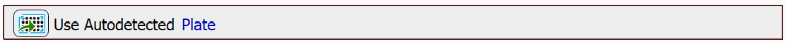
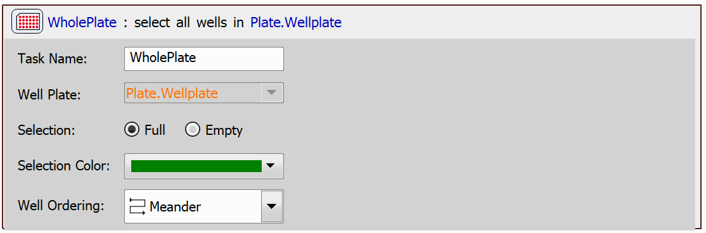
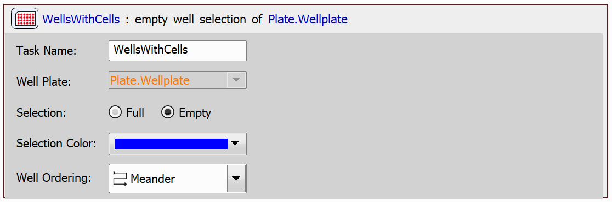
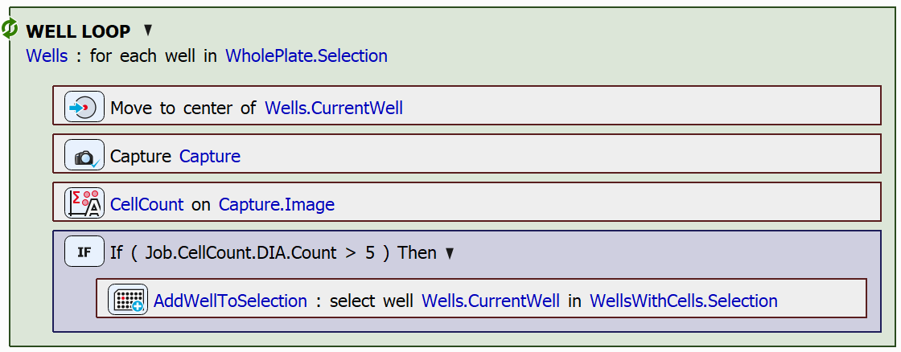
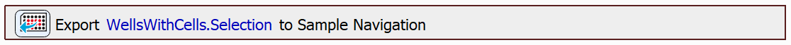
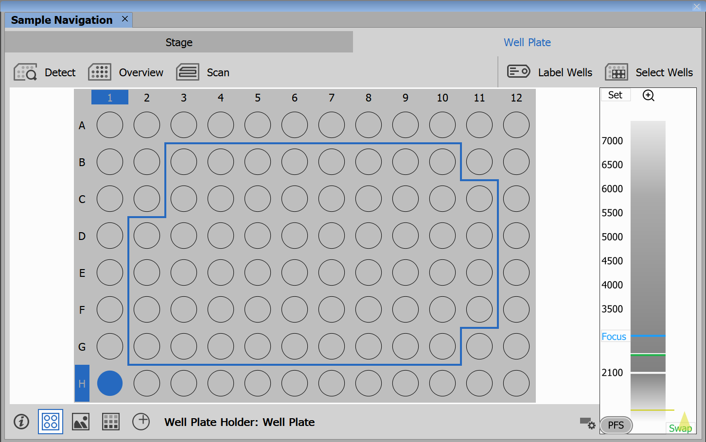

# Modify Well Selection in Sample Navigation

The aim of this example is to show how a well selection can be created, modified, and exported to Sample Navigation. We will create a selection of wells containing cells and export this selection.

> [!NOTE]
> See also [Export Well Labeling to Sample Navigation](../19-Export_labeling_to_sample_nav/README.md).

# Setting up the JOB

First, we will drag in the `Use Autodetected Plate` task. This task uses a plate that has already been detected and aligned (see the [Use Autodetected Plate](../18-Use_detected_plate/README.md) example).

Next, we will create two `Empty/Full Well Selection` tasks. One of these will select all wells in the plate, the other one will create an empty selection of wells.

Then, we will loop through all of the wells in the plate and count the cells present in each well. If the well does contain cells, we will add it to the well selection. After cell presence is determined for each of the wells, the selection will be exported to Sample Navigation.

The well loop looks as follows:

To count the cells in the captured image, we used the `Cell Count Analysis` task. For a more detailed description on how to set up and use this task, see e.g. the [Conditional Acquisition example](../11-Conditional_acquisition/README.md#counting-cells-using-cell-count-analysis).

Finally, we can export the well selection to which we have been adding the wells using the `Export Well Selection to Sample Navigation` task:

In our case, after running the JOB the following wells are selected in Sample Navigation:

JOB file: <!---[[View on GitHub](13-ModifyWellSelectionInSampleNavigation.bin)]--> [[Download link](https://laboratory-imaging.github.io/JOBS-examples/NIS_v6.10/13-Modify_selection_sample_nav/13-ModifyWellSelectionInSampleNavigation.bin)] [[View as html](https://laboratory-imaging.github.io/JOBS-examples/NIS_v6.10/13-Modify_selection_sample_nav/13-ModifyWellSelectionInSampleNavigation.html)]