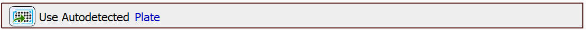
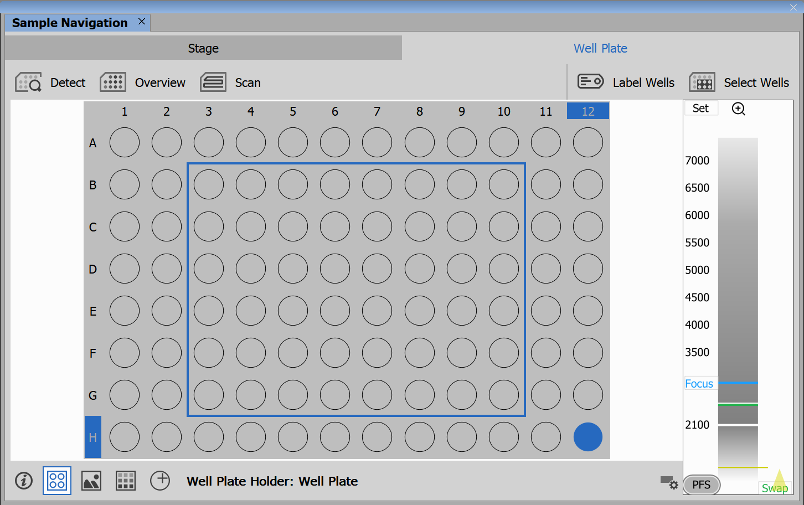
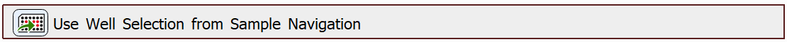
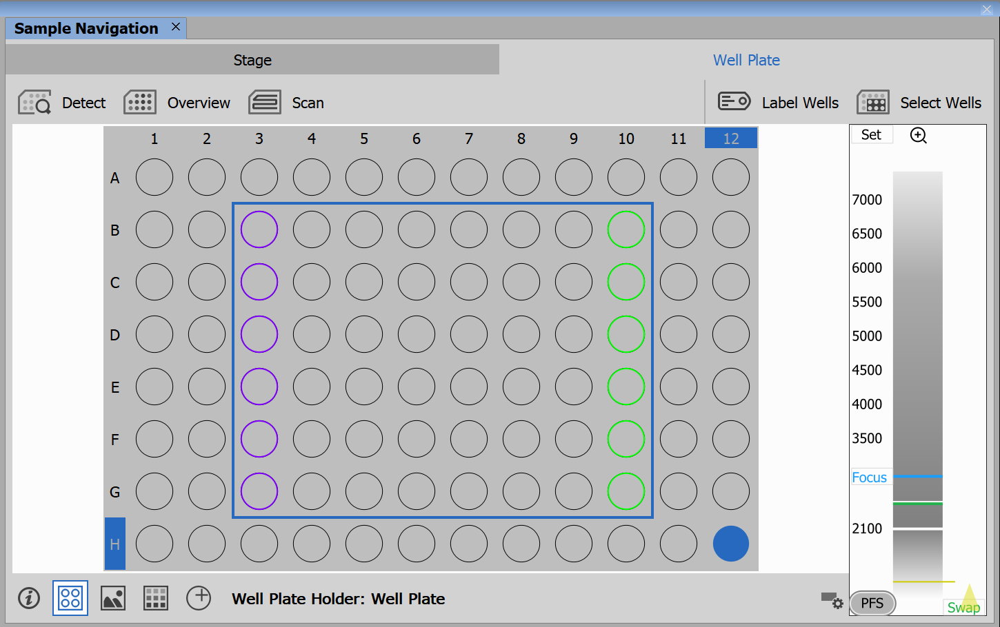
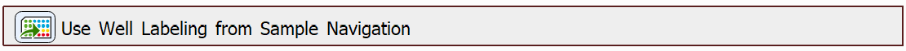
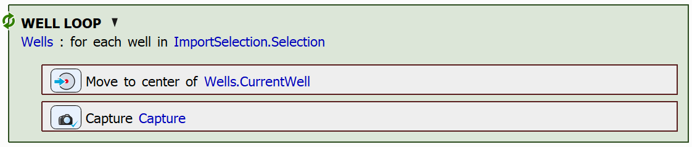
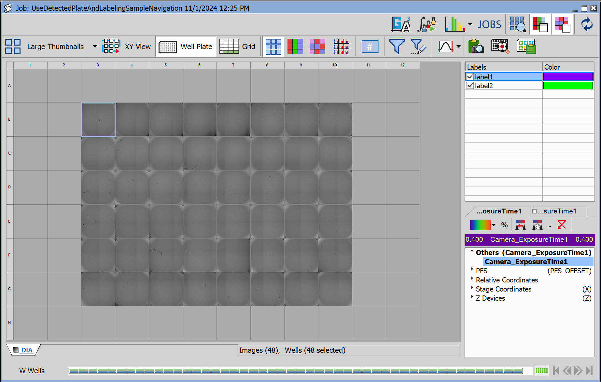
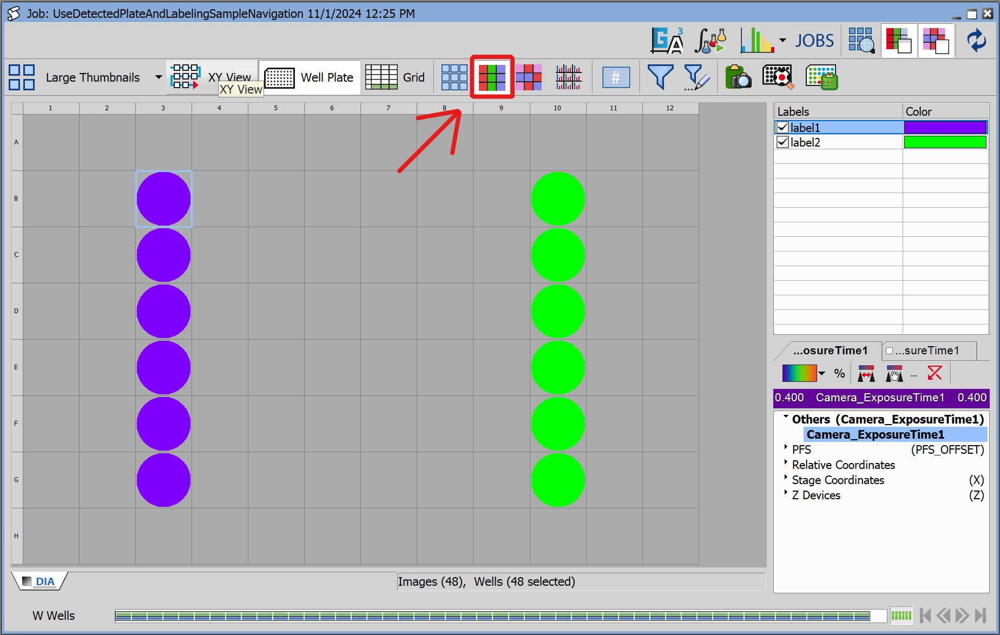

# Use Labeling from Sample Navigation

In this example, we will demonstrate the functionality of tasks that can import well selection and well labeling from Sample Navigation.

## Setting up the JOB

First, we will drag in the `Use Autodetected Plate` task.

Next, we will import the selection of wells that are selected in Sample Navigation using the `Use Well Selection from Sample Navigation`. In our case, we selected these wells in Sample Navigation:

Import the selection using the task: 

We will also label some of the wells in Sample Navigation with custom labels like so:

We can import the well labeling (and dosing, should it be defined) from Sample Navigation using the `Use Well Labeling from Sample Navigation` task:

Finally, we will capture the well centers of the wells in the imported selection:

After running the job, you can see that only the selected wells have been captured:

You can also see the imported labels after clicking the "Show Labeling" button:

JOB file: <!---[[View on GitHub](14-UseDetectedPlateAndLabelingSampleNavigation.bin)]--> [[Download link](https://laboratory-imaging.github.io/JOBS-examples/NIS_v6.10/14-Use_labeling_sample_nav/14-UseDetectedPlateAndLabelingSampleNavigation.bin)] [[View as html](https://laboratory-imaging.github.io/JOBS-examples/NIS_v6.10/14-Use_labeling_sample_nav/14-UseDetectedPlateAndLabelingSampleNavigation.html)]

