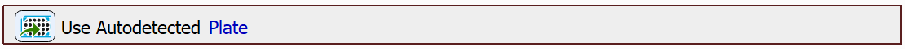

# Autosignal on Plate

In this example, we will demonstrate how we can determine autosignal for a whole plate. The `Autosignal.ai` task uses AI (artificial intelligence) to find an ideal camera exposure time and illumination power on the captured image and stores the brightness settings into a Well Selection or Point Set. In this example we will work with the case of storing the results into a Well Selection.

## Setting up the JOB

First, we will drag in the `Use Autodetected Plate` task.

Then, select some wells on which autosignal should be determined, in our case, it is this selection:

Next, we will move to the center of every well of the selection and determine the autosignal for each of the wells using the `Autosignal.ai` task:

As the *Mode* parameter, *Live* or *Fixed* can be selected. The *Live* mode prefers fast exposure times, whereas the *Fixed* mode prefers image quality (longer exposure times). In some cases, longer exposure times can be undesirable, for example when the captured well contains living cells which can be damaged by longer exposure to light.

The *Max signal [%]* parameter states the percentage of the available intensity range allowed in the image. Higher intensities will be considered as over-illuminated. For example, if the value is set to 50% for 8-bit images, any intensity higher than 128 is over-illuminated.

The *Over-illuminated pixels limit [%]* parameter controls the acceptable percentage of over-illuminated pixels in the image.

After we've determined the exposure for all of the wells, we need to aggregate the results to find the one setting to be used. For this, we will use the `Aggregate Autosignal.ai Results` task:

Finally, we can move onto capturing the whole plate. We will select all wells in the plate and in a loop move to their centers and capture the images:

JOB file: <!---[[View on GitHub](15-AutosignalOnPlate.bin)]--> [[Download link](https://laboratory-imaging.github.io/JOBS-examples/NIS_v6.10/15-Autosignal_on_plate/15-AutosignalOnPlate.bin)] [[View as html](https://laboratory-imaging.github.io/JOBS-examples/NIS_v6.10/15-Autosignal_on_plate/15-AutosignalOnPlate.html)]
