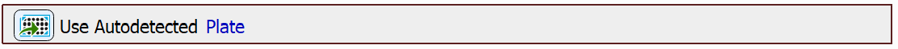
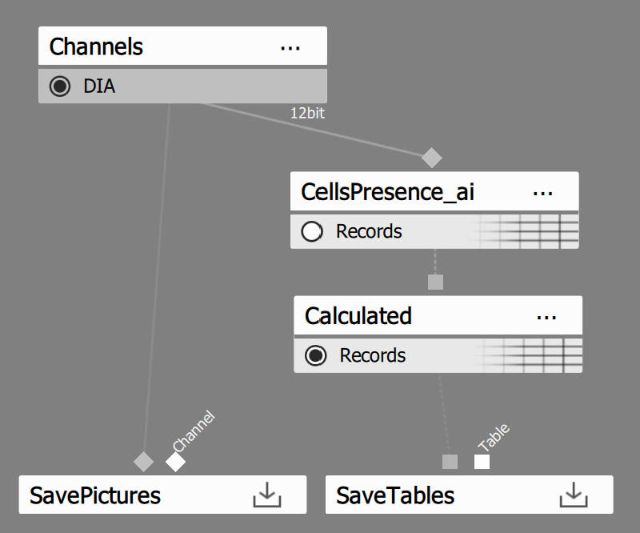
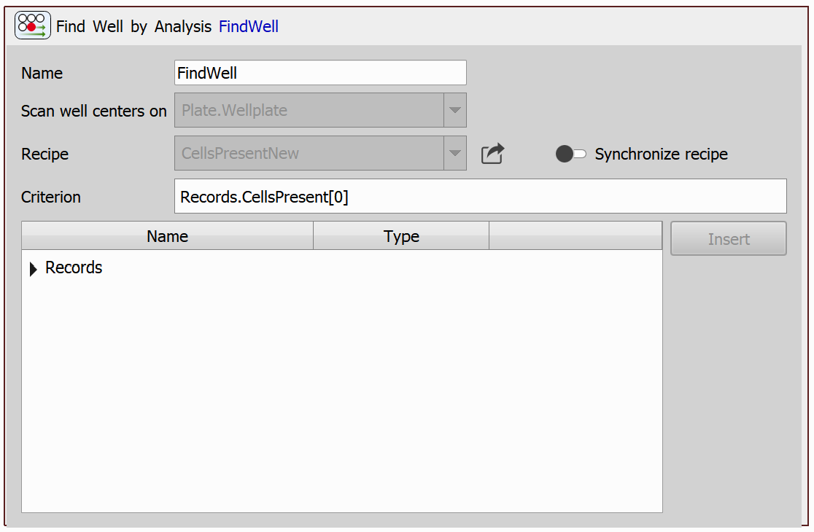
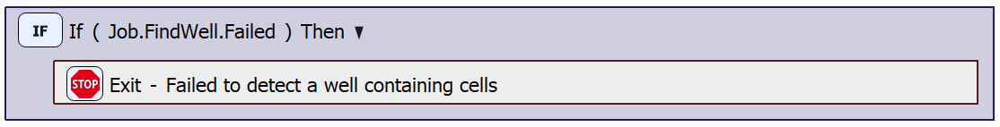
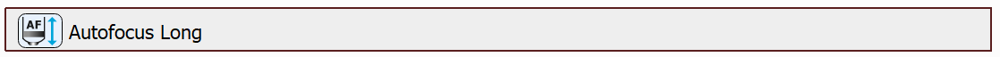

# Find Well Containing Cells during Continuous Scan

This example will provide information about a task capable of finding a well containing cells during continuous scan, i.e. without the need to move to well centers one by one, capturing the images and evaluating the cell presence on each image, as was shown e.g. in the [Conditional Acquisition example](../11-Conditional_acquisition/README.md#conditional-acquisition).

## Setting up the JOB

First, we will use the autodetected plate using the `Use Autodetected Plate` task.

Then, we will use the `Find Well by Analysis` task. This task starts a continuous scan of the wells and evaluates the cell presence during the scanning. This task uses a GA3 recipe, which looks as follows:

In the task settings, select the following criterion:

Then, we can check whether a well was found successfully, and if not, we can exit the JOB with an error message using the `Condition (If)` and `Exit with Error` tasks:

Finally, if the well was found, therefore the JOB has not ended, we perform a long range autofocus, using the `Autofocus Long` task - this can be a realistic usecase, beacause it is common to try to perform autofocus on a well of which we know contains cells. 

JOB file: <!---[[View on GitHub](16-FindWell.bin)]--> [[Download link](https://laboratory-imaging.github.io/JOBS-examples/NIS_v6.10/16-Find_well/16-FindWell.bin)] [[View as html](https://laboratory-imaging.github.io/JOBS-examples/NIS_v6.10/16-Find_well/16-FindWell.html)]

GA3 file: <!---[[View on GitHub](16-CellsPresentNew.ga3)]--> [[Download link](https://laboratory-imaging.github.io/JOBS-examples/NIS_v6.10/16-Find_well/16-CellsPresentNew.ga3)]