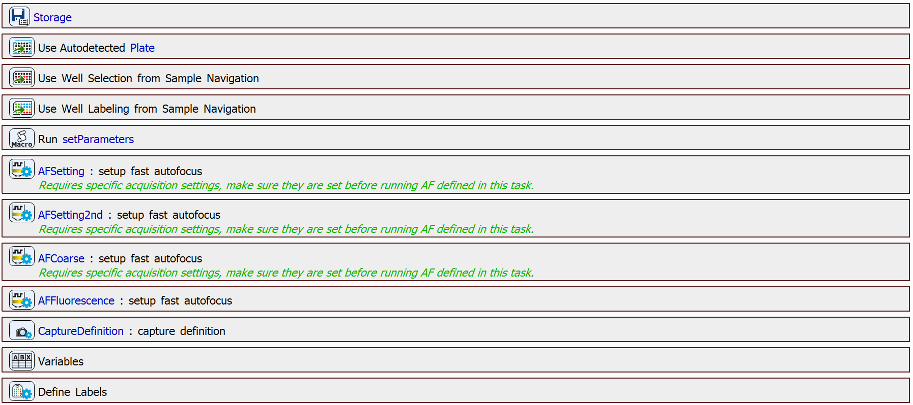
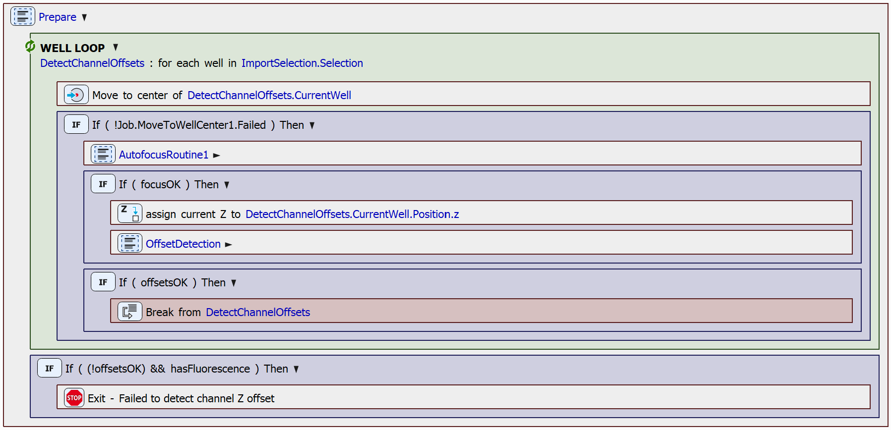
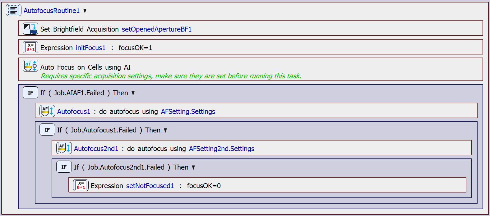
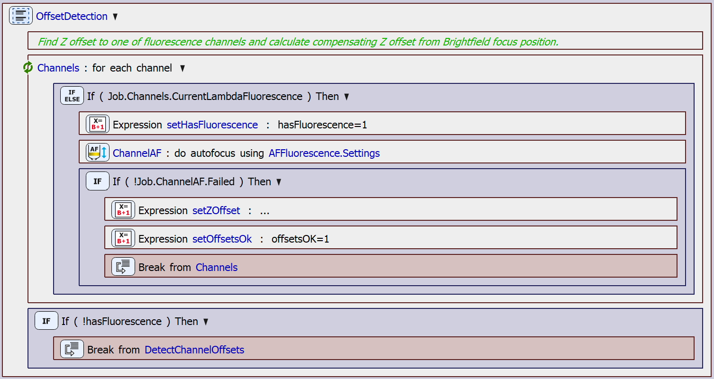

# Brightfield Autofocus Scan

This text offers a brief overview of a built-in JOB that can be used for scanning a well selection from Sample Navigation. This job uses the Brightfield modality for autofocus.

## JOB Description

At the beginning of the JOB, the workspace is prepared by defining the storage path, importing the well selection and labeling from Sample Navigation, setting various parameters, preparing fast autofocus settings, a capture definition, variables, and labels.

In the next step, the JOB moves onto the *Prepare* block. This block loops over the imported well selection, and consists of two parts, which are to determine the brightfield focus position (inside the *AutofocusRoutine* block), and to detect the offsets of the channels from the Brightfield channel (inside the *OffsetDetection* block). Once the channel offsets have been determined succesfully, the *Prepare* step is done. The whole *Prepare* block looks as follows:

The autofocus is performed on each well inside the *AutofocusRoutine* block. The autofocus is first tried using the `Autofocus using AI` task, which is a very fast focusing procedure as it only uses a few Z drive movements, without the need to analyze a range of images. If this focusing attempt fails, it is tried again using a short range around the current Z position. If this attempt also fails, the autofocus is tried again using a longer range around the current Z position. The *AutofocusRoutine* block looks as follows:

Once the focus position is succesfully determined, the *OffsetDetection* block is executed. In the *OffsetDetection* block, the JOB loops through the channels specified in the capture definition and determines the channel offsets relative to the Brightfield channel, provided a fluorescence channel is present.

Finally, the JOB can move onto the acquisition implemented in the *Acquire* block. This involves looping over the well selection again and repeating the *AutofocusRoutine* step. If the the focus position is found, the Z position is moved by the offset detected in the *OffsetDetection* block and the well center is captured.

JOB file: [[Download link](https://laboratory-imaging.github.io/JOBS-examples/NIS_v6.10/16-Scan_wellplate/16-ScanBF.bin)] [[View as html](https://laboratory-imaging.github.io/JOBS-examples/NIS_v6.10/16-Scan_wellplate/16-ScanBF.html)]