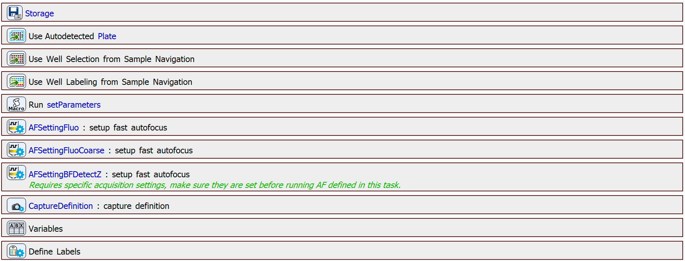
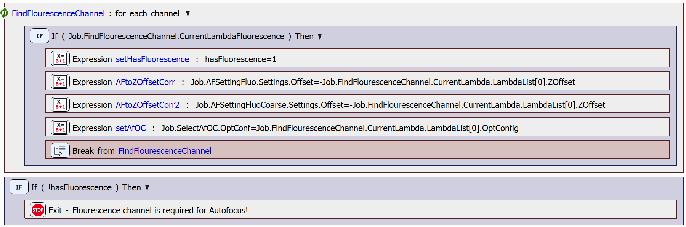
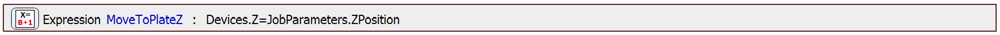
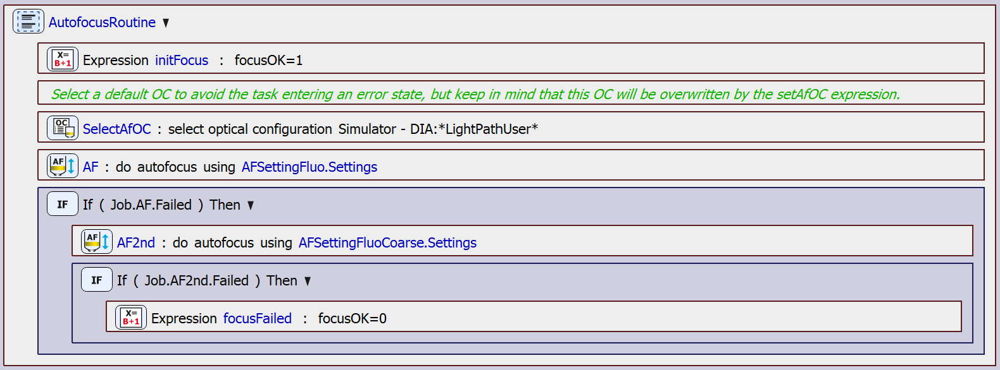
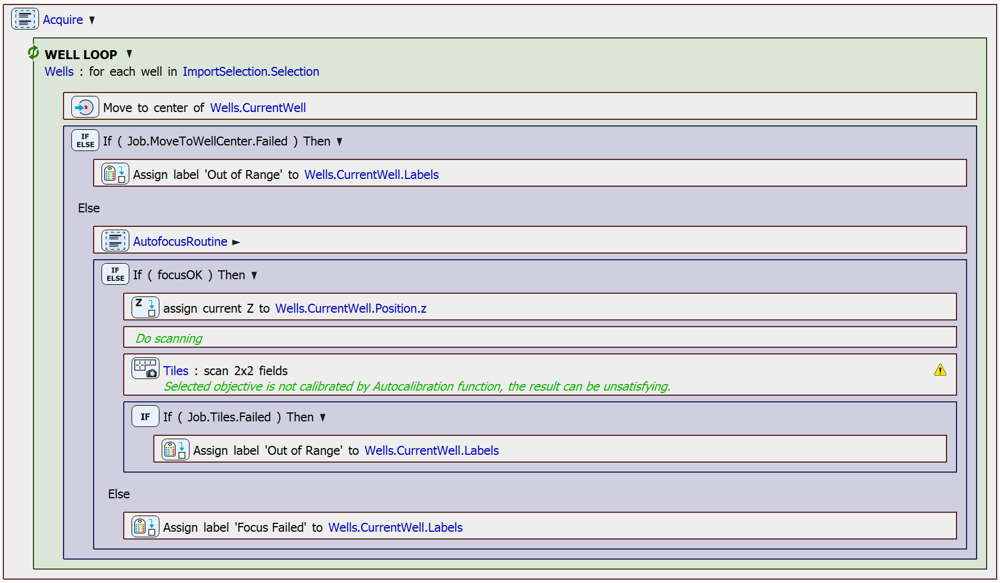

# Fluorescence Autofocus Scan

This text offers a brief overview of a built-in JOB that can be used for scanning a well selection from Sample Navigation. This job uses the Fluorescence modality for autofocus.

## JOB Description

At the beginning of the JOB, the workspace is prepared by defining the storage path, importing the well selection and labeling from Sample Navigation, setting various parameters, preparing fast autofocus settings, a capture definition, variables, and labels.

Next, the JOB finds a fluorescence channel in the channels defined by the used optical configuration. The first found channel is set to the SelectAfOC task, which is later used inside the autofocus routine. 

The device is then moved to a predefined Z position.

Finally, the JOB can move onto the acquisition implemented in the *Acquire* block. This involves looping over the well selection and performing the *AutofocusRoutine* step. The autofocus is performed on each well. The autofocus is first tried using a short range around the current Z position. If this attempt fails, the focus is tried again using a longer range around the current Z position. The AutofocusRoutine block looks as follows:

If the the focus position is found, the Z position is set to the found value and the well center is captured.

JOB file: [[Download link](https://laboratory-imaging.github.io/JOBS-examples/NIS_v6.10/16-Scan_wellplate/16-ScanFluoAF.bin)] [[View as html](https://laboratory-imaging.github.io/JOBS-examples/NIS_v6.10/16-Scan_wellplate/16-ScanFluoAF.html)]