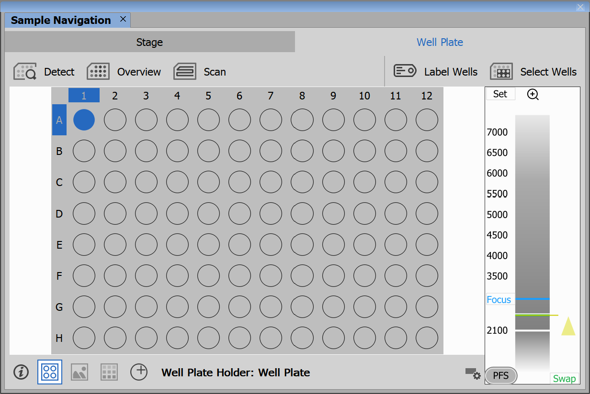
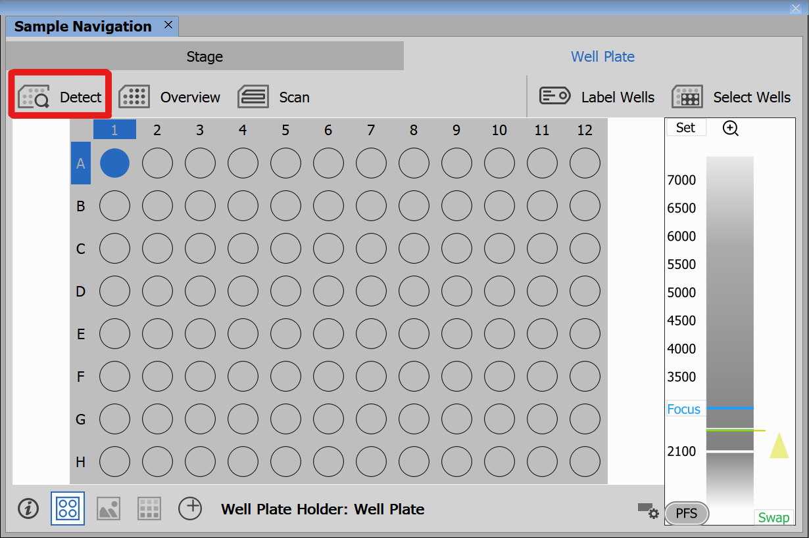
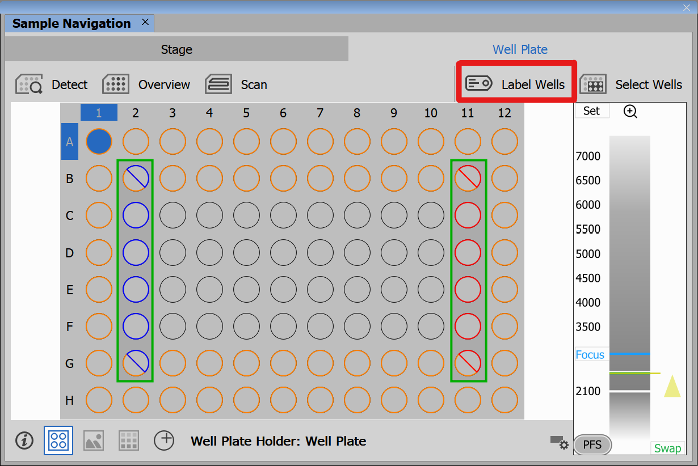
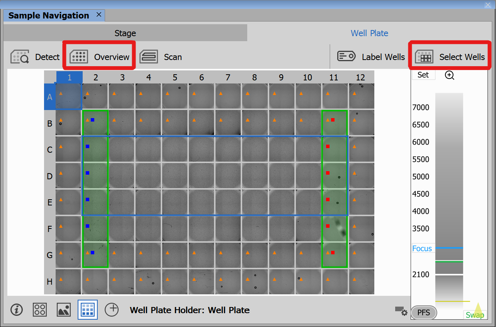
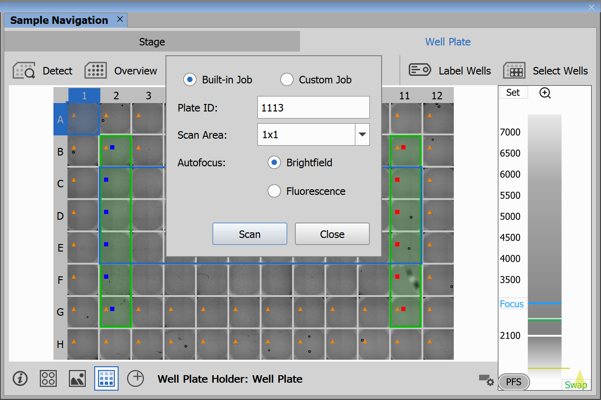

# Scan Wellplate from Sample Navigation

To setup the Nikon Ti2 microscope for wellplate scanning from Sample Navigation see this [guide](https://github.com/Laboratory-Imaging/documents/blob/main/Ti2_Wellplate_Apps/system_setup_overview_objective.md).

## Sample Navigation

To scan a well plate from Sample Navigation, first navigate to **View → Acquisition Controls → Sample Navigation**. Here, select the *Well Plate* tab.

#### 1. Detect plate

Next, detect the plate type and position using the "*Detect*" button:

#### 2. Define or import labeling and dosing

Then you can define the labeling and dosing of the wells using the "*Label Wells*" button:

#### 3. Run overview of the wells and create a well selection

Run the overwiew of the whole well plate using the "*Overview*" button and create a well selection using the "*Select Wells*" button.
 

#### 4. Scan the wellplate

Finally, click the "*Scan*" button. A dialog window will open allowing the selection of the JOB to be used for scanning the well selection. Either a built-in job or a user-defined custom job can be used for the scan.

The scanning routine uses the current experiment settings.

Refer to the following examples for a concise description of the built-in jobs:
- [Brightfield Autofocus Scan](BFScanREADME.md)
- [Fluorescence Autofocus Scan](FluoScanREADME.md)

> [!NOTE]
> The *Custom Job* option allows the selection of any JOB saved in the currently selected project in the JOBS Explorer.

> [!TIP]
> If a JOB .bin file is stored in either Platform/[user.name]/ScanJob or Platform/ScanJob, the JOB is executed immediately when the "*Scan*" button is pressed. The path containing the [user.name] subfolder takes priority.