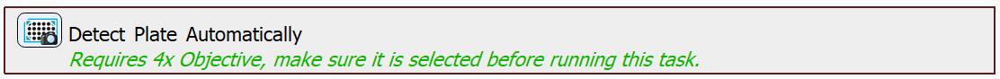

# Detect a Plate and Capture

In this example, we will present a task which automatically detects and aligns the well plate on the stage. It can then be directly used as plate definition in the JOB.

## Setting up the JOB

First, we will detect the plate using the `Detect Plate Automatically` task. Unlike the `Use Autodetected Plate` which we have worked with in the previous examples, this task detects the type and position of the plate during the JOB execution.

Next, we will select all wells in the plate:

Finally, we will loop through all the wells, move to the center of each well and capture an image:

JOB file: <!---[[View on GitHub](17-DetectAndCapture.bin)]--> [[Download link](https://laboratory-imaging.github.io/JOBS-examples/NIS_v6.10/17-Detect_and_capture/17-DetectAndCapture.bin)] [[View as html](https://laboratory-imaging.github.io/JOBS-examples/NIS_v6.10/17-Detect_and_capture/17-DetectAndCapture.html)] 