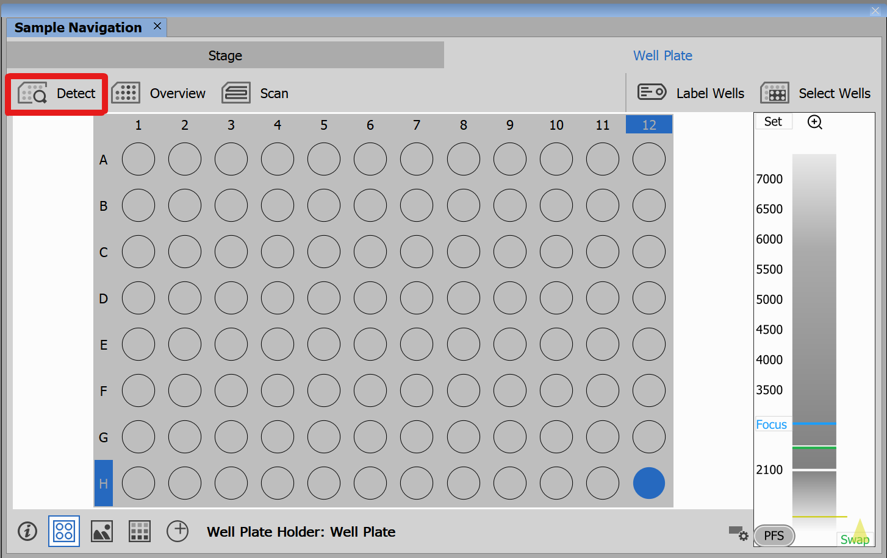
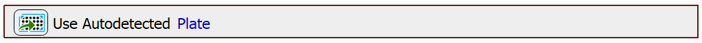
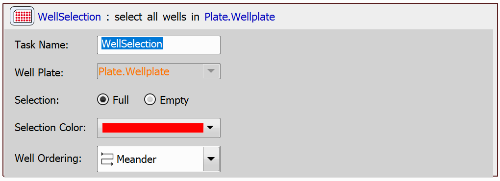
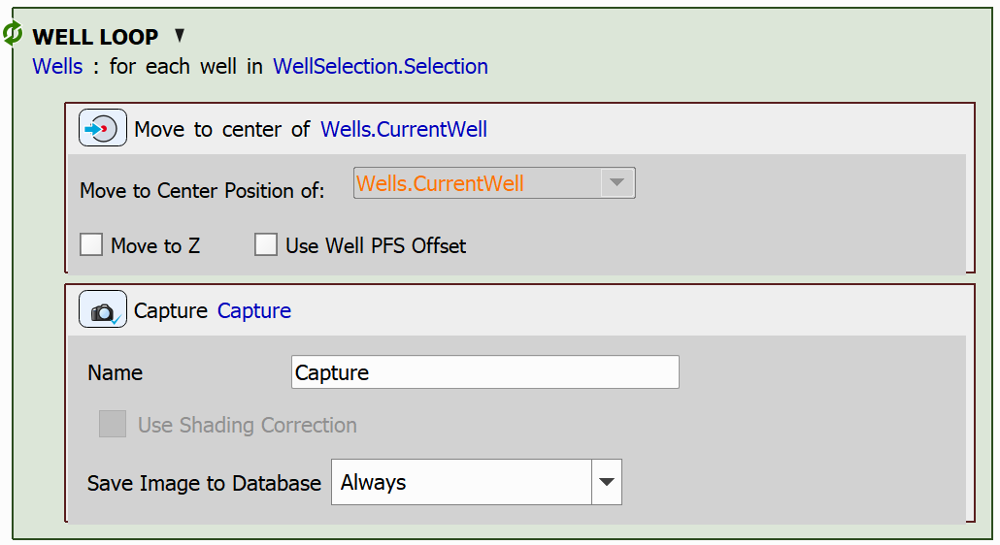

# Use Autodetected Plate

This example will demonstrate the use of a task which uses a detected plate.

## Setting up the JOB

The aim of this job will simply be to capture the center of each well in the plate.

To use the detected plate, use the `Use Autodetected Plate` task. To be able to use this task, the plate must first be detected via Sample Navigation (on the *Well Plate* tab click *Detect*):

Once the plate has been detected, you can use the task:

Then select all wells in the plate using the `Empty/Full Well Selection` task:

Finally, loop through all the wells using the `Loop over Wells` task, move to the center of each well using the `Move to Well Center` task and capture an image using the `Capture Current OC` task:

JOB file: <!---[[View on GitHub](18-UseDetectedPlate.bin)]--> [[Download link](https://laboratory-imaging.github.io/JOBS-examples/NIS_v6.10/18-Use_detected_plate/18-UseDetectedPlate.bin)] [[View as html](https://laboratory-imaging.github.io/JOBS-examples/NIS_v6.10/18-Use_detected_plate/18-UseDetectedPlate.html)]