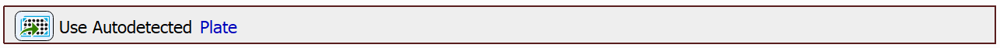
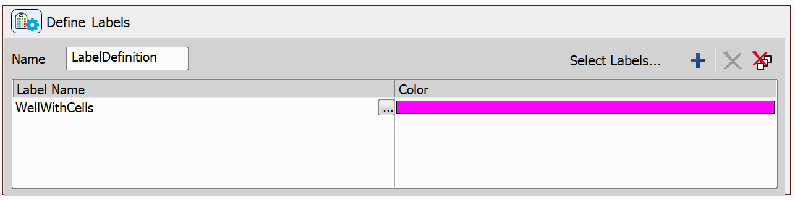
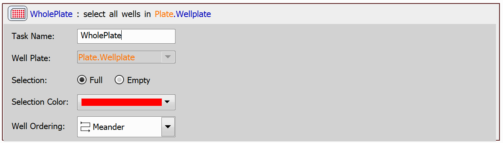
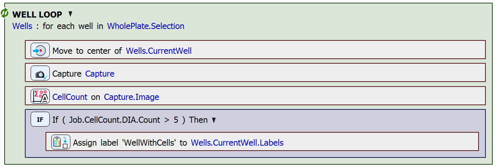
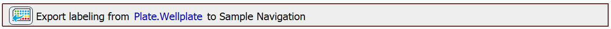
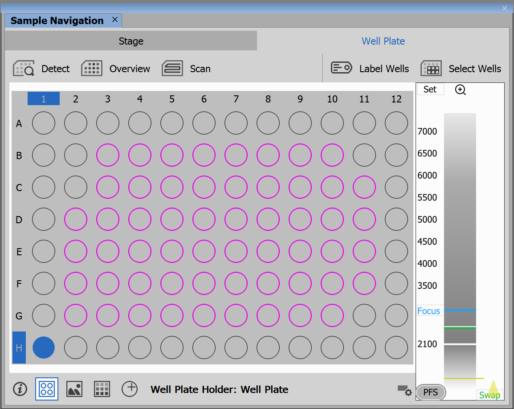

# Export Well Labeling to Sample Navigation

In this example, we will show how wells can be labeled according to a condition and how these labels can be exported to Sample Navigation.

> [!NOTE]
> See also [Modify Well Selection in Sample Navigation](../13-Modify_selection_sample_nav/README.md).

## Setting up the JOB

First, we will drag in the `Use Autodetected Plate` task. This task uses a plate that has already been detected and aligned (see the [Use Autodetected Plate](../18-Use_detected_plate/README.md) example).

Next, we will use the `Create Labels` task. In this task, we will define one label. Select a name and a color for the label, e.g.:

Next, we will create the `Empty/Full Well Selection` task and we will use it as full selection:

Then, we will loop through all of the wells in the plate and count the cells present in each well. If the well does contain cells, we will assign the label we have defined earlier to the well. To assign a label to a well use the `Assign Label` task. After cell presence is determined for each of the wells, the labeling will be exported to Sample Navigation.

The well loop looks as follows:

To count the cells in the captured image, we used the `Cell Count Analysis` task. For a more detailed description on how to set up and use this task, see e.g. the [Conditional Acquisition example](../11-Conditional_acquisition/README.md#counting-cells-using-cell-count-analysis).

Finally, we can export the well labeling using the `Export Well Labeling to Sample Navigation` task:

In our case, after running the JOB the following wells are labeled in Sample Navigation:

JOB file: [[Download link](https://laboratory-imaging.github.io/JOBS-examples/NIS_v6.10/19-Export_labeling_to_sample_nav/19-ExportLabelingToSamNav.bin)] [[View as html](https://laboratory-imaging.github.io/JOBS-examples/NIS_v6.10/19-Export_labeling_to_sample_nav/19-ExportLabelingToSamNav.html)]