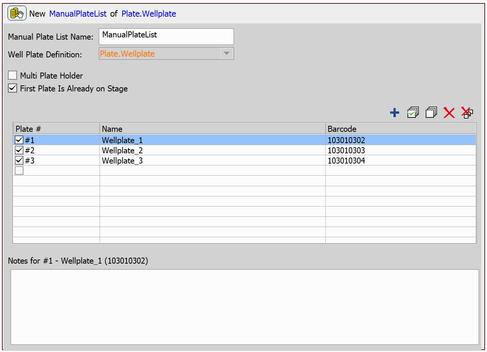
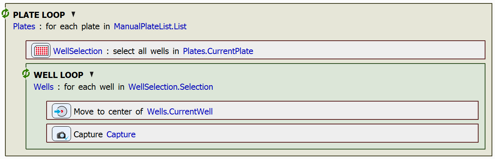

# Manual Plate List

This example will demonstrate the use of a Plate List. A Plate List specifies the list of well plates to be used in a loop over well plates.

## Setting up the JOB

First, we will define a plate using the `Define Plate` task. The plate type (i.e. the well shape and number of wells in the plate) will be used for all of the plates in the list.

Next, we will set up the plate list using the `Manual Plate List` task. In our case, we have three well plates in the list:

Now we can loop over the plates using the `Loop over Plates` task. In each iteration, we create full well selection of the current plate's wells. Then, we loop through the well selection using the `Loop over Wells` task and in each iteration move to the well center (`Move to Well Center`) and capture an image (`Capture Current OC`):

JOB file: [[Download link](https://laboratory-imaging.github.io/JOBS-examples/NIS_v6.10/20-Manual_plate_list/20-ManualPlateList.bin)] [[View as html](https://laboratory-imaging.github.io/JOBS-examples/NIS_v6.10/20-Manual_plate_list/20-ManualPlateList.html)]