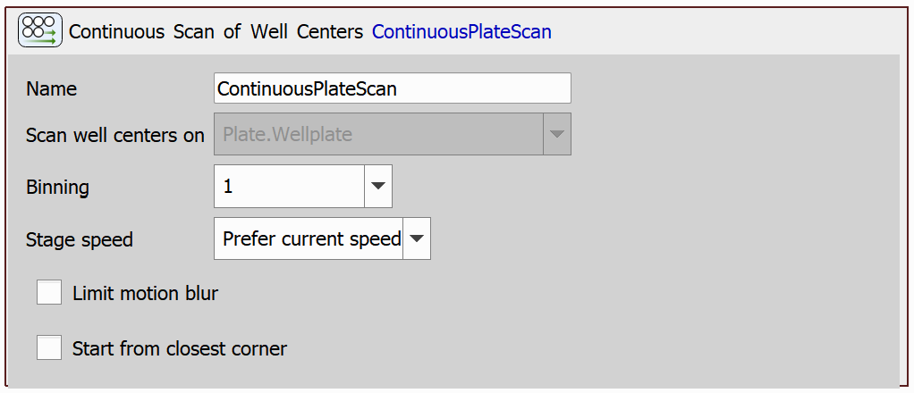

# Continous Scan of Well Centers

This example will demonstrate the use of a task that continuously scans well centers on a plate.

## Setting up the JOB

First, we will drag in the `Use Autodetected Plate` task.

Then, we will use the `Continuous Scan of Well Centers` task:

You can leave this task in its default settings, or change some of the parameters. 

The *Binning* parameter specifies the degree to which the data size will be reduced during post-processing. A higher binning value results in greater data reduction.

The *Stage speed* parameter offers two options. The *Prefer current speed* option respects stage speed restriction, if there is any (e.g. due to the `Set XY Speed/Accuracy` task). The *Maximum speed* option uses the maximum speed available to achieve the expected result. 

The *Limit motion blur* parameter causes the speed of the XY stage to be reduced to prevent motion blur in the resulting image.

The *Start from closest corner* parameter ensures that the scanning will start in the corner of the scanned area which is closest to the current XY position.

JOB file: [[Download link](https://laboratory-imaging.github.io/JOBS-examples/NIS_v6.10/21-Continuous_scan_wells/21-ContinuousScanOfWellCenters.bin)] [[View as html](https://laboratory-imaging.github.io/JOBS-examples/NIS_v6.10/21-Continuous_scan_wells/21-ContinuousScanOfWellCenters.html)]