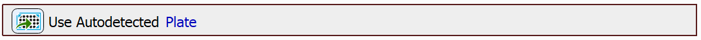
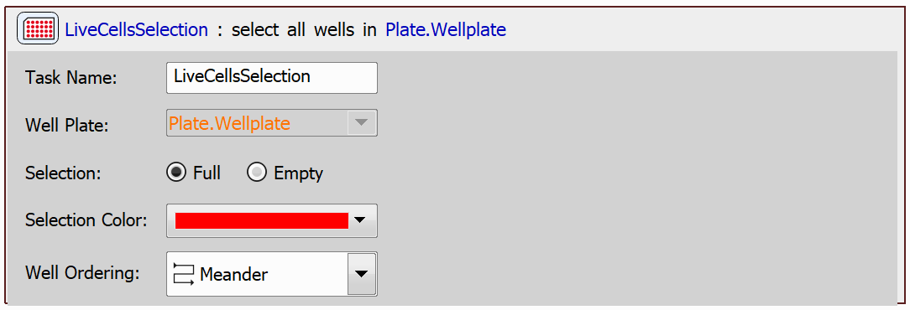
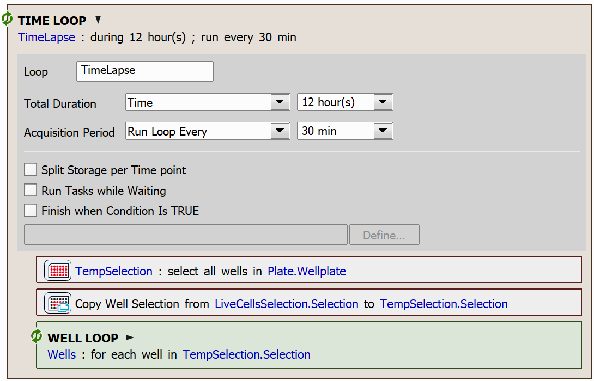
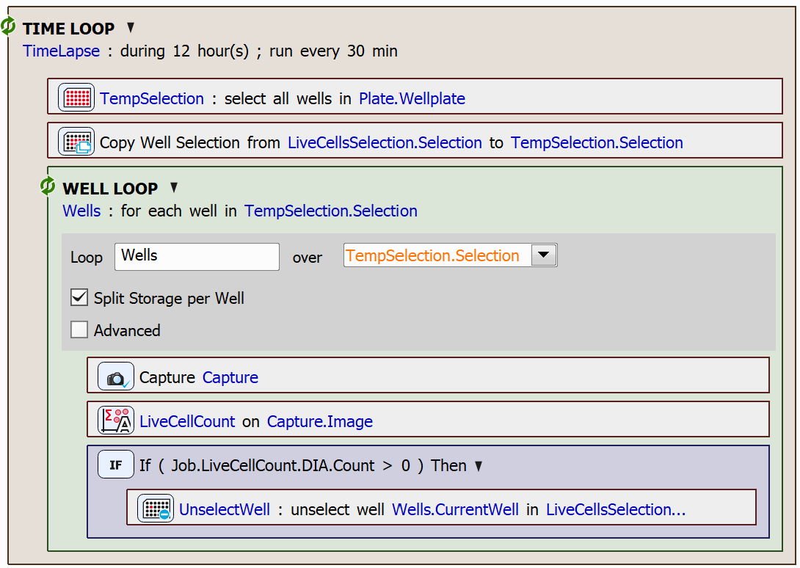

# Remove Wells from a Selection

In this example, we will show how wells can be removed from a selection based on a condition. The aim of the JOB will be to remove wells that don't contain cells from an initially full selection.

One of the possible usecases for gradually removing wells from a selection involves monitoring a well plate over an extended period of time. Periodic observations can determine whether the cells in each well remain alive. If a well no longer contains living cells, it can be excluded from further analysis. This approach optimizes resources by saving both time and memory, focusing attention only on wells that require ongoing observation.

## Setting up the JOB

First, we will drag in the `Use Autodetected Plate` task.

Then, we will create a full selection of wells, in which we will store the wells containing cells.

We will then create a time loop using the `Time Lapse` task. In our case, the time lapse will be active over the course of 12 hours and it will run every 30 minutes. 

In each iteration of the time loop, we will create a temporary well selection. We will copy the selection of living cells to this temporary selection.

Within the time loop, we will iterate through the **temporary selection** to assess whether the cells in each well are alive. If the cells in a well are no longer alive, the well will be removed from the **original selection**. In the next iteration of the time loop, the original selection will be copied again into the temporary selection, ensuring that the loop only processes wells containing living cells.

The use of a temporary selection is necessary because directly modifying a selection while iterating over it results in undefined behavior.

> [!NOTE]
> Enabling the *Split Storage per Well* option in the well loop settings is recommended, as it is likely preferable to avoid saving all captures into a single file.

To copy the selection, use the `Copy Well Selection` task.

To remove a well from a selection, use the `Remove Well from Selection` task.

### Live Cell Count Analysis

To count the cells in the captured image, we used the `Cell Count Analysis` task. For a more detailed description on how to set up and use this task, see e.g. the [Conditional Acquisition example](../11-Conditional_acquisition/README.md#counting-cells-using-cell-count-analysis).

In this case, we used a simple analysis based on the circularity of the cells. Cells with a circularity value within the range of <0, 0.6> were classified as alive, while those outside this range were considered dead.

However, you can customize the analysis procedure to better meet your requirements, such as switching to a GA3 recipe or using the `Live/Dead Analysis` task.

JOB file: [[Download link](https://laboratory-imaging.github.io/JOBS-examples/NIS_v6.10/22-Remove_wells_from_selection/22-RemoveWellsFromSelection.bin)] [[View as html](https://laboratory-imaging.github.io/JOBS-examples/NIS_v6.10/22-Remove_wells_from_selection/22-RemoveWellsFromSelection.html)]
