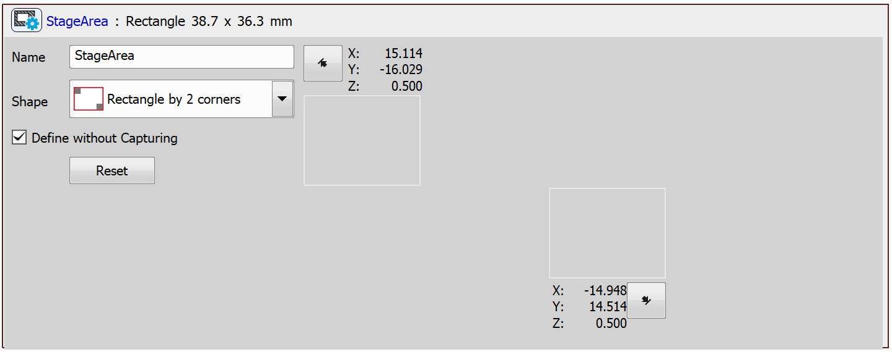
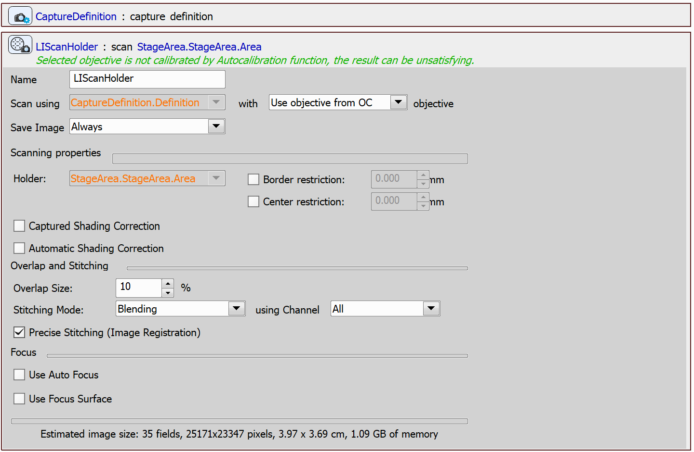

# Scan Stage Area

This example will present a JOB that defines and scans a stage area.

## Setting up the JOB

Start by defining a stage area using the `Define Stage Area` task. Choose a shape from the *Shape* dropdown menu to outline the area. Position the stage as needed, then use the arrow buttons (highlighted in the preview image) to assign points to their corresponding locations within the selected shape.

Then, create a capture definition using the `Capture Definition` task and scan the area using the `Scan Large Image in Slide/Well/Area`.

JOB file: [[Download link](https://laboratory-imaging.github.io/JOBS-examples/NIS_v6.10/23-Scan_stage_area/23-ScanStageArea.bin)] [[View as html](https://laboratory-imaging.github.io/JOBS-examples/NIS_v6.10/23-Scan_stage_area/23-ScanStageArea.html)]