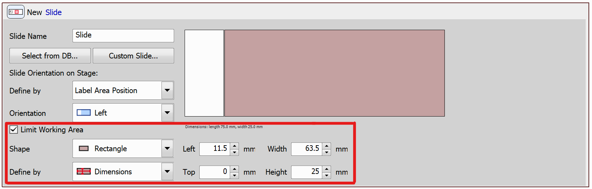

# Manual Slide List

In this example, we will demonstrate the use of a manually created list of slides as well as a simple way to iterate through the slides. The aim of the JOB presented in this example is to scan a Large Image of every slide defined in the list.

> [!NOTE]
> See also [Use Slide Loader and Advanced Slide Loop](../25-Slide_loader_advanced_loop/README.md)

## Setting up the JOB

First, use the `Define Slide` task and select a slide from the database or define a custom slide. In our case, we used the standard sized (75 x 25 mm) slide and we limited the working area outside of the slide sticker using the highlighted settings.

Next, determine the exact position of the slide on the XY stage using the `Align Slide Holder` task. To do so, move your stage to one corner of your slide and click *Set*, then move the stage to the Opposite Corner and click *Set*, which finishes the alignment.

Then, specify the list of slides to be used:

These slides need to be changed manually.

We will also create a capture definition (using the `Capture Definition` task) and autofocus settings (using the `Fast Autofocus Settings` task) to be used in the large image scan later.

Finally, we can start iterating over the slides using the `Loop over Slides` task. We will scan a large image of every slide using the `Scan Large Image in Slide/Well/Area` task:

<!--The `Loop over Slides` task automatically loads and unloads slides from the stage. If you need more control over the slides loading, refer to the [Use Slide Loader and Advanced Slide Loop](../25-Slide_loader_advanced_loop/README.md) example. // tohle je pravda kdyz se pouzije loader, v manualnim te to vyzve abys to prehodil, takze idk jestli to sem davat-->

You can configure the parameters of the `Scan Large Image in Slide/Well/Area` task:

**Border/Center restriction** - Enter an optional border/center restriction on your sample holder

**Captured Shading Correction** - Applies shading correction saved with the Optical Configuration

**Automatic Shading Correction** - Enables automatic shading correction without capturing the shading image. Check this option and choose the type of correction which best represents the background of your sample image

**Overlap and Stitching** - Parameters defining the overlap size, stitching mode and a channel which is used for the stitching. The **Precise stitching (Image Registration)** parameter can be enabled, however, be aware that it increases the computational demands of the task.

**Use Auto Focus** - Uses autofocus, choose where in the large image it will be performed

**Use Focus Surface** - Focuses using a defined surface (see e.g. the [Create Focus Surface on a Slide](../10-Create_focus_surface_slide/README.md) example)

JOB file: [[Download link](https://laboratory-imaging.github.io/JOBS-examples/NIS_v6.10/24-Manual_slide_list/24-ManualSlideList.bin)] [[View as html](https://laboratory-imaging.github.io/JOBS-examples/NIS_v6.10/24-Manual_slide_list/24-ManualSlideList.html)]

