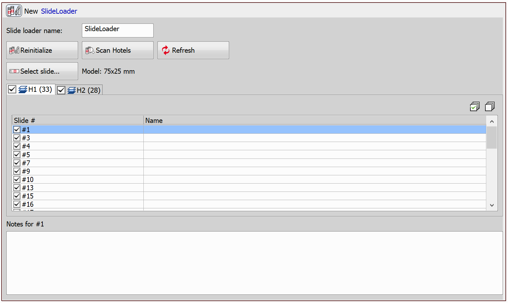
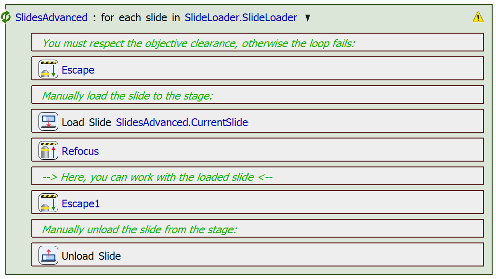
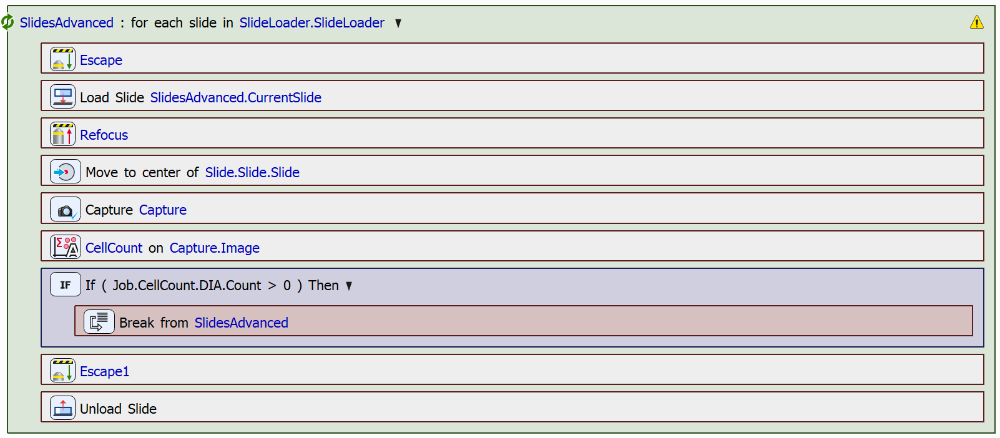

# Use Slide Loader and Advanced Slide Loop

In this example, we will create a JOB that uses the slide loader device to automatically create a list of slides and then loops through them in an advanced slide loop. The advanced slide loop allows the user to fully control the procedure when working with a slide loader.

The aim of the JOB is to find a slide containing cells and leave it on the stage after it is found and the loop is terminated. 

> [!NOTE]
> See also [Manual Slide List](../24-Manual_slide_list/README.md)

## Setting up the JOB

First, create the `Slide Loader` task. This task requires a slide loader device to be connected to your system. After creating the task:

1. Click "*Initialize*" and follow the instructions to initialize your slide loader
2. Scan for the loader hotels by clicking "*Scan Hotels*"
3. To change the slide model used in the slide loader, click "*Select slide...*"
4. Select or deselect the found slides and hotels to be used in your JOB
5. Optionally, add the name and barcode to each of your slides and *Notes* for the hotel

Next, create the advanced slide loop using the `Advanced Loop over Slides` task. It is important to note that objective clearance (escape and refocus) has to be respected, otherwise the loop fails. For this, use the `Escape Z` and `Refocus Z` tasks. The slides are loaded (using the `Load Slide to Stage` task) and unloaded (using the `Unload Slide from Stage` task) manually.

> [!IMPORTANT]
> 
> This is the minimal working example of using the `Advanced Loop over Slides` task. This procedure respects the objective clearance and manually loads and unloads slides from the stage. 

In our case, we will capture the center of each slide (using the `Move to Well Center` and `Capture Current OC` tasks) and determine whether or not the slide contains cells (using the `Cell Count Analysis` task). For a more detailed description on how to set up and use the `Cell Count Analysis` task, see e.g. the [Conditional Acquisition](../11-Conditional_acquisition/README.md#counting-cells-using-cell-count-analysis) example.

If the cell count analysis detects cells in the captured image, we will break from the loop (using the `Break` task) prior to unloading the slide from the stage. 

The slide loop looks as follows:

Further analysis can be performed on the slide without the need to search and/or load it again.

> [!NOTE]
> The difference between the `Advanced Loop over Slides` task and the `Loop over Slides` task (shown in the [Manual Slide List](../24-Manual_slide_list/README.md) example) lies in their functionality when combined with the `Slide Loader` task. The `Loop over Slides` task fully automates the loading and unloading of slides but provides less control over the timing of these actions, making it more suitable for straightforward workflows that do not require customized handling of the process.

JOB file: [[Download link](https://laboratory-imaging.github.io/JOBS-examples/NIS_v6.10/25-Slide_loader_advanced_loop/25-UseSlideLoaderAndAdvancedLoop.bin)] [[View as html](https://laboratory-imaging.github.io/JOBS-examples/NIS_v6.10/25-Slide_loader_advanced_loop/25-UseSlideLoaderAndAdvancedLoop.html)]

