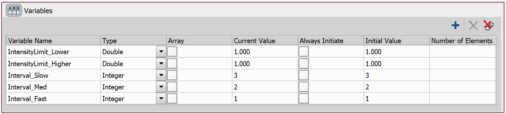
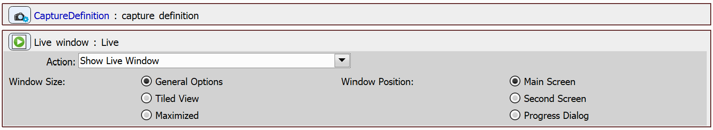
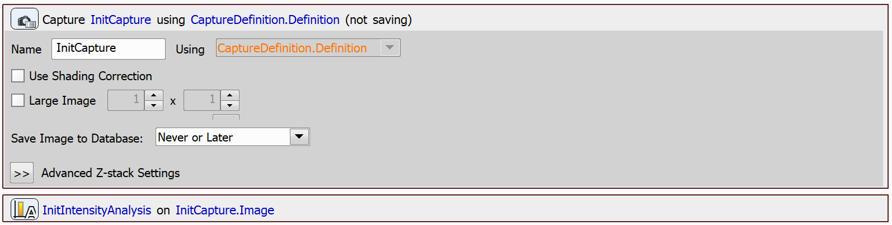
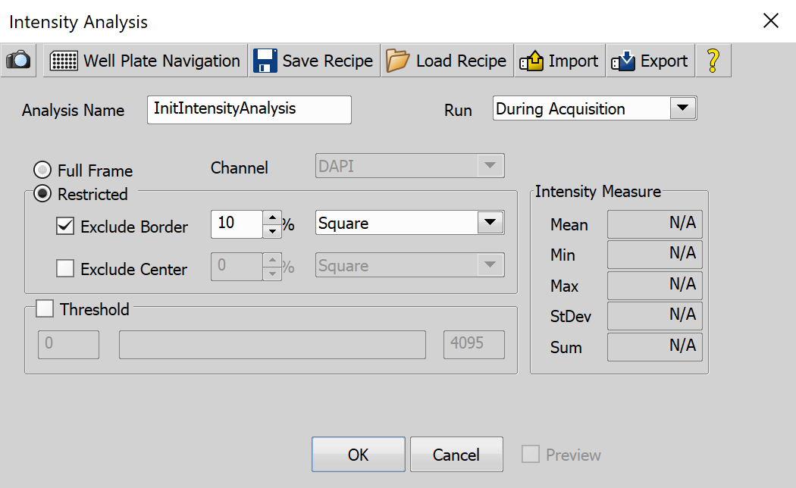
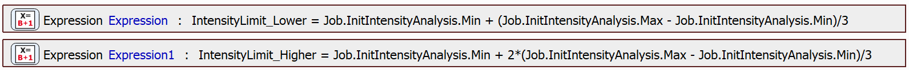
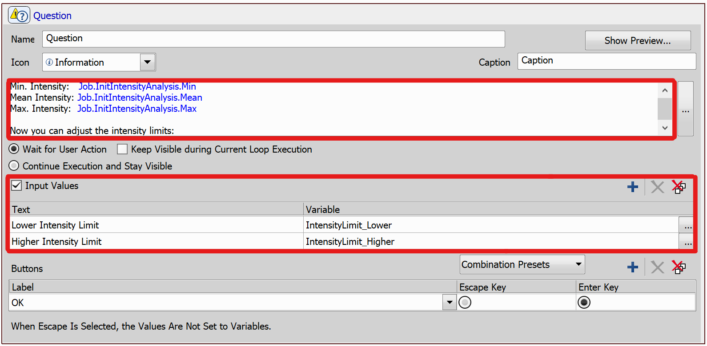
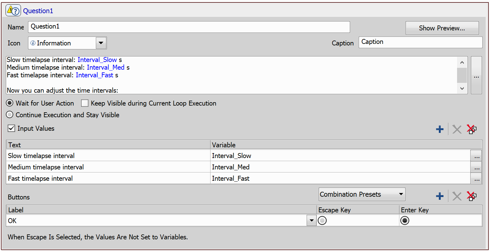
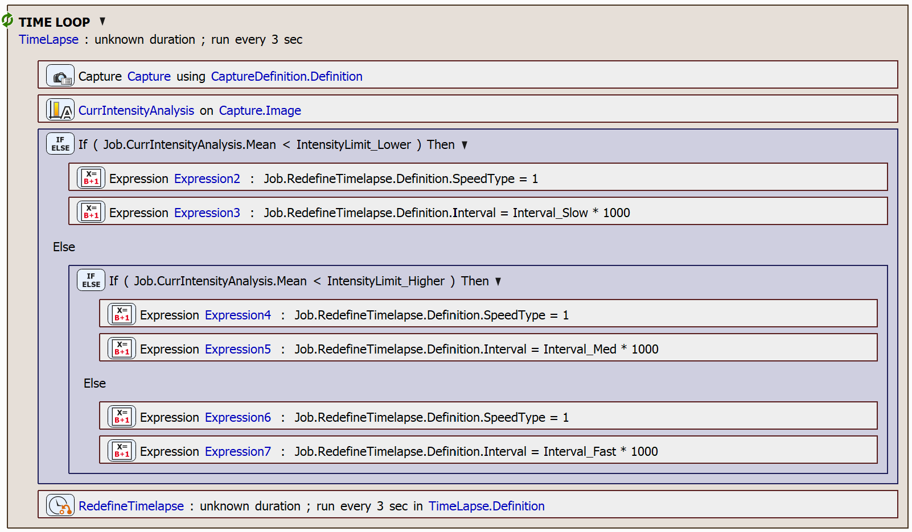

# Intensity Dependent Capture

In this example, we will demonstrate how to set up a JOB for time-lapse acquisition with three different time intervals. The intervals are automatically adjusted based on the average intensity of the captured images.

In the JOB, users will have the opportunity to set two intensity limits following an initial intensity analysis. Images will then be captured in a time-lapse sequence, with the time intervals dynamically adjusted. Specifically, as intensity increases, the intervals shorten, allowing for faster image capture.

## Setting up the JOB

First, we will define a set of variables that will be used for the decision-making process in the JOB. The variables are:

- **The lower intensity limit** - images with intensity lower than this limit will cause the time-lapse to be slow
- **The higher intensity limit** - images with intensity lower than this limit will cause the time-lapse to be medium fast
- **The slow interval** - the time interval used for slow acquisition; in seconds
- **The medium interval** - the time interval used for medium speed acquisition; in seconds
- **The fast interval** - the time interval used for fast acquisition; in seconds

Use the `Variables` task to define the variables:

Then, we will create a capture definition using the `Capture Definition` task. We will also open the Live Window to monitor real-time feedback. 

Next, the initial image will be captured using the `Capture` task, and its intensity will be analyzed using the `Intensity Analysis` task.

In the `Intensity Analysis` dialog, you can configure the parameters for performing the intensity analysis. These parameters include:

- **Run** - Specifies when the analysis will be executed (During Acquisition or After Acquisition)

- **Full Frame** - Analyzes the intensity of the entire live image frame

- **Restricted** - Enables the option to limit the analysis to a specific area of the image

- **Channel** - Allows you to select an optical configuration for the analysis

- **Exclude Border** - Excludes the outer edges of the live image from the analysis, with options for circular or square shapes

- **Exclude Center** - Excludes the central region of the live image from the analysis, with options for circular or square shapes

- **Threshold** - Adjust sliders to differentiate objects for which intensity measurements will be performed

- **Intensity** Measure - Displays the current intensity values measured from the live image

- **Preview** - Provides a live preview of the current Image Intensity settings

After the initial intensity analysis is done, the intensity limits are set using the `Expression` task. The lower limit is set to 

$\text{lowerLimit} = min + \frac{1}{3}(max - min)$

and the higher limit is set to 

$\text{higherLimit} = min + \frac{2}{3}(max - min)$, 

where $min$ is the minimal intensity measured by the `Intensity Analysis` task and $max$ is the maximal measured intensity.

Now, we will allow the user to adjust these limits using the `Question` task. This task will display a pop-up window requiring user interaction. In the information text box, we will display the information about the intensity analysis result (i.e. the minimal, mean, and the maximal intensity values) and prompt the user to adjust the intensity limits as needed. Additionally, we will enable the *Input Values* option and specify the input fields, linking them to the appropriate variables we defined earlier.

We will also provide the user with the option to adjust the time-lapse intervals. For this we will again use the `Question` task, following a similar approach as before. We will show the current interval settings and link the variables accordingly:

Finally, we can start the time-lapse. During each iteration, an image will be captured, and intensity analysis will be performed. Based on the analysis results, the loop interval will be adjusted according to the mean intensity in the image and the defined intensity limits like so:

    if mean < lowerLimit:
        set time-lapse speed to slow

    else if mean < higherLimit:
        set time-lapse speed to medium

    else:
        set time-lapse speed to fast

Use the `Time Lapse` task to start the time-lapse. To adjust the interval, we need to use the `Redefine Time Lapse` task which will be executed at the end of every iteration of the time loop. We will use the `Condition (If-Else)` task to compare the intensity mean and limits, and we will use the `Expression` task to set the parameters of the `Redefine Time Lapse` task.

The *SpeedType* parameter defines the acquisition period of the time-lapse. The parameter can be set to the following values:

- **0** - Sets the period to *No Delay*
- **1** - Sets the period to *Run Loop Every*
- **2** - Sets the period to *Wait Between Loops*

JOB file: [[Download link](https://laboratory-imaging.github.io/JOBS-examples/NIS_v6.10/26-Intensity_dependent_capture/26-IntensityDependentCapture.bin)] [[View as html](https://laboratory-imaging.github.io/JOBS-examples/NIS_v6.10/26-Intensity_dependent_capture/26-IntensityDependentCapture.html)]