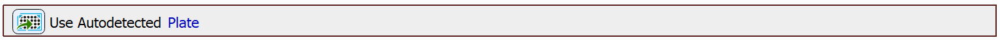
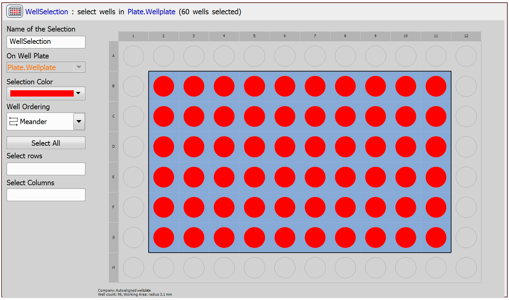
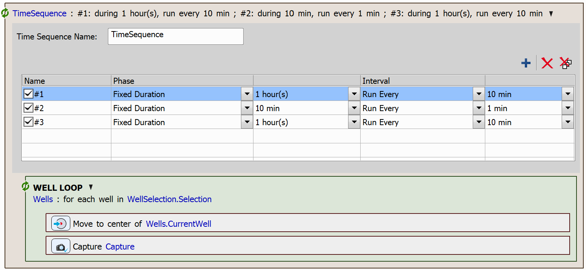

# Time Sequence

In this example, we will demonstrate the use of a task capable of chaining acquisition time-phases and phases of different types. We will use this task to create a simple JOB, which will capture wells in a well plate in a time sequence consisting of three phases. In the first phase of the time sequence, the acquisition will be quite slow. In the second phase, it will be faster, and in the third phase, it will revert to being slow again.

## Setting up the JOB

First, create the `Use Autodetected Plate` task. 

Next, create a well selection using the `Select Wells` task. We have selected the following wells for acquisition:

Then, define the time sequence using the `Time Sequence` task. This task allows you to define multiple time-lapse sequences that run consecutively, each with its own duration and interval. In this example, the first and last phases are set to run for one hour with a 10-minute interval, while the second phase is configured to run for 10 minutes with a 1-minute interval.

In each iteration of the time sequence, we loop over the well selection using the `Loop over Wells` task, where we move to the center of the wells using the `Move to Well Center` task and capture an image using the `Capture Current OC` task.

JOB file: [[Download link](https://laboratory-imaging.github.io/JOBS-examples/NIS_v6.10/27-Time_sequence/27-TimeSequence.bin)] [[View as html](https://laboratory-imaging.github.io/JOBS-examples/NIS_v6.10/27-Time_sequence/27-TimeSequence.html)]