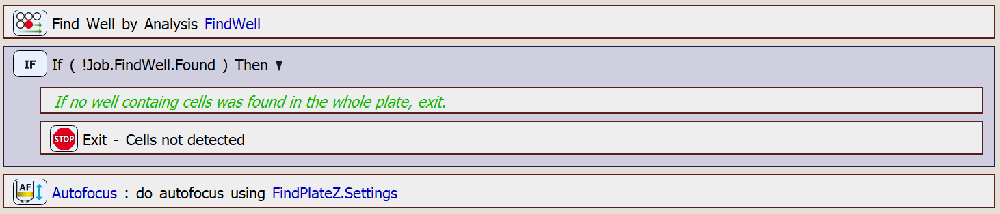

# Find Well containing Cells using Continuous Scan and Find Focus Position

In this example, we will create a JOB designed to focus on a well containing cells. The process involves detecting cell presence during a continuous scan and repeating the process if autofocus on the well fails.

This JOB is a part of the procedure triggered by clicking **View → Sample Navigation → Well Plate → Overview**. It is specifically responsible for managing the focusing part of the procedure.

## Setting up the JOB

First, create the `Use Autodetected Plate` task. 

Then, create autofocus settings using the `Fast Autofocus Settings` task.

Then, create a full well selection using the `Empty/Full Well Selection` task.

To be able to go through the well plate sequentially, we need to disable sorting of the selection. Otherwise, each time a well is removed, the traversal path would be recalculated, resulting in excessive stage movements. To do this, we will use the `Expression` task, in which we will set the *Sort* parameter of the `Remove Well from Selection` task to false (0). The `Remove Well from Selection` will be used later in the JOB. The *Sort* parameter is not visible in the task's GUI.

Next, we will begin searching for a well containing cells, repeating the process until we successfully locate a well and perform autofocus on it. For this, we will use the `Repeat N times` task, with an undefined numer of iterations.

First, we will try to find the well during continuous scan using the `Find Well by Analysis` task (see the [Find Well Containing Cells during Continuous Scan](../16-Find_well/README.md) example for more details on this task). If there was no well found in the whole plate, the job stops. If a well was found, we try autofocusing using the `Autofocus` task.

If autofocus fails, the wells already searched are removed from the selection, and the process is repeated in the next iteration with the updated selection. To remove the searched wells, a temporary full selection is created. We will copy the current selection in which we search into this temporary selection using the `Copy Well Selection` task. We will then loop over the temporary selection (`Loop over Wells`) and remove the appropriate wells in the current selection for searching using the `Remove Well from Selection` task. We keep removing wells until we reach the well in which cells were last found - in that case we terminate the well loop using the `Break` task.

The use of a temporary selection is necessary because directly modifying a selection while iterating over it results in undefined behavior. The selection modification is implemented in the *RemoveSearchedWells* block:

If, after removing the wells, no wells remain in the selection, the job will fail and terminate execution. And, if the autofocus on cells was successful, we break from the `Repeat N times` loop, allowing the JOB to continue execution. 

The whole main loop looks as follows:

JOB file: [[Download link](https://laboratory-imaging.github.io/JOBS-examples/NIS_v6.10/28-Detect_wells_focus/28-DetectWellsFocus.bin)] [[View as html](https://laboratory-imaging.github.io/JOBS-examples/NIS_v6.10/28-Detect_wells_focus/28-DetectWellsFocus.html)]