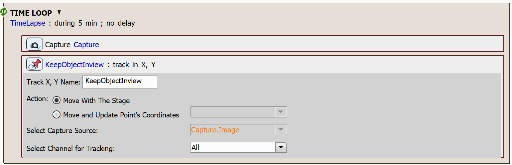
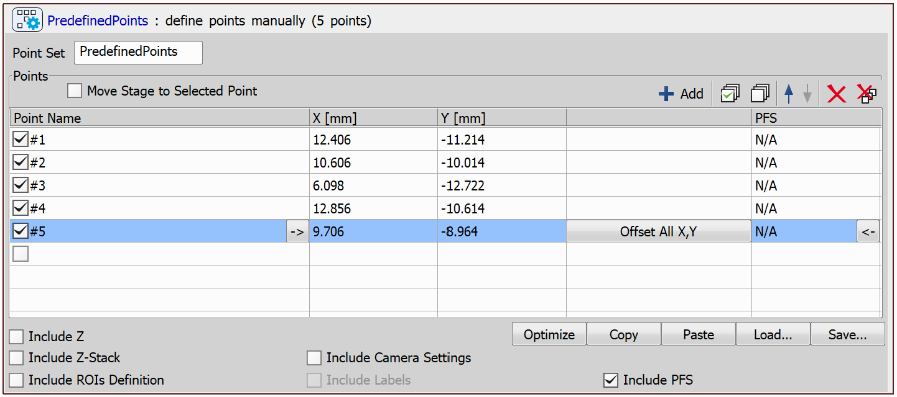
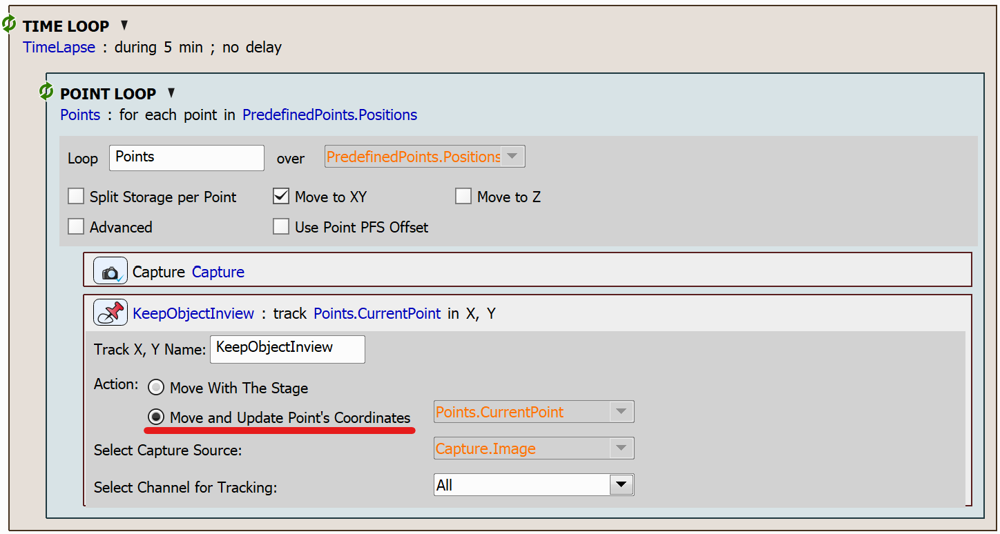

# Keep Object in View

In this example, we will create two simple JOBs that use a task to identify an object of interest based on the correlation between the previous and the next frame. This task always keeps the object in the center of view using the microscope stage to compensate for the object's motion.

One of the JOBs will only move the stage to keep the object in the center of view, while the second JOB will capture a set of images at a predfined point positions and update the coordinates of these points based on the object's movement.

One use case for this task is to keep a moving cell in the center of the field of view while capturing a time lapse.

> [!NOTE]
> See also [Follow a moving object with stage: keep object in view](../42-Following_moving_object/README.md)

## Setting up the JOBs

### Only Move with Stage while Following the Object

To set up the JOB which only moves the stage, create a time lapse using the `Time Lapse` task. In each iteration of the time lapse, capture an image (`Capture Current OC`) and use the `Keep Object In View` task.

JOB file: [[Download link](https://laboratory-imaging.github.io/JOBS-examples/NIS_v6.10/29-Keep_object_in_view/29-KeepObjectInView.bin)] [[View as html](https://laboratory-imaging.github.io/JOBS-examples/NIS_v6.10/29-Keep_object_in_view/29-KeepObjectInView.html)]

### Update Point Set while Following the Object

To create a JOB which also updates point coordinates while following an object, first create a point set and fill it with initial values using the `Predefined Points` task.

Next, we will create a time lapse using the `Time Lapse` task. In each iteration of the time lapse, we will loop through the defined points using the `Loop over Points` task, where we will capture an image (`Capture Current OC`) and use the `Keep Object In View` task. In this case, select the *Move and Update Point's Coordinates* option:

 JOB file: [[Download link](https://laboratory-imaging.github.io/JOBS-examples/NIS_v6.10/29-Keep_object_in_view/29-KeepObjectInViewPoints.bin)] [[View as html](https://laboratory-imaging.github.io/JOBS-examples/NIS_v6.10/29-Keep_object_in_view/29-KeepObjectInViewPoints.html)]

