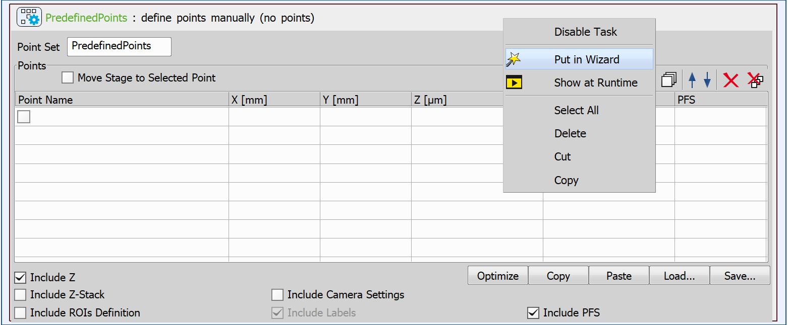
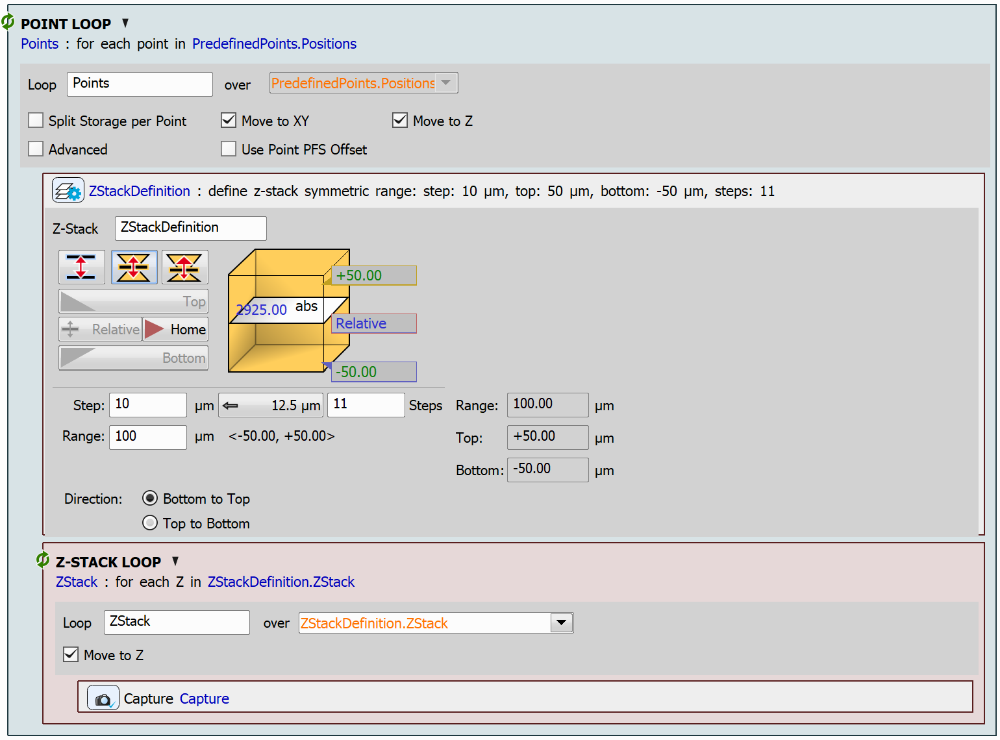

# Z-Stack on Predefined Points

In this example, we will create a simple JOB allowing the user to define a set of points at the beginning of the JOB execution. The JOB will then create a relative range z-stack at each of the points and capture the z-stack.

## Setting up the JOB

We will start by creating the `Predefined Points` task. This task's GUI is very similar to the one in **View → Acquisition Controls → ND Acquisition**. We will not add any points to the point set just yet. Instead, we will configure this task to appear in the wizard interface at the start of the job. To achieve this, right-click on the task header and select *Put in Wizard*:

Additionally, enable the *Include Z* parameter in the task.

Then, define a point loop using the `Loop over Points` task. Enable the *Move to XY* and *Move to Z* parameters.

In the loop, create a z-stack definition using the `Define Z-Stack` task. Here, specify the parameters of the z-stack, we used a relative symmetric range.

Finally, inside the point loop create the `Z-Stack Loop` task. Inside this innermost loop, use the `Capture Current OC` task to capture the z-stack.

JOB file: [[Download link](https://laboratory-imaging.github.io/JOBS-examples/NIS_v6.10/30-Predefined_points_zstack/30-PredefinedPointsZStack.bin)] [[View as html](https://laboratory-imaging.github.io/JOBS-examples/NIS_v6.10/30-Predefined_points_zstack/30-PredefinedPointsZStack.html)]

