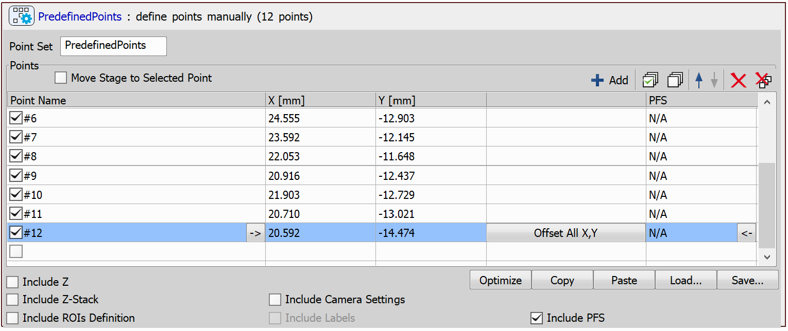
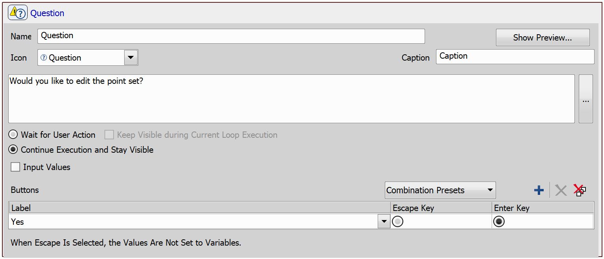
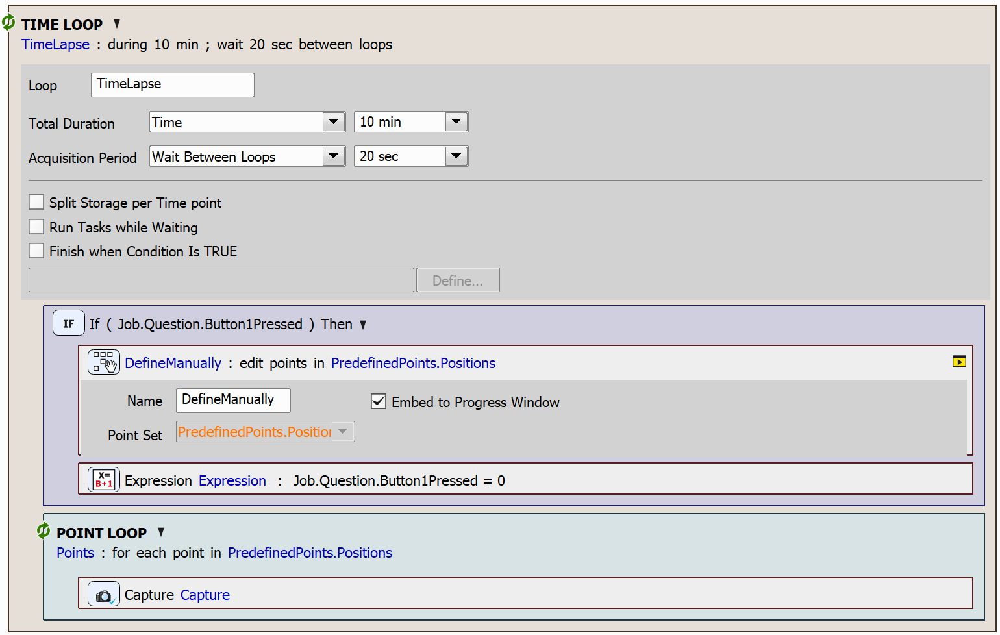

# Edit Points Manually During Time-Lapse

In this example, we will demonstrate how to set up a JOB that captures points in a time-lapse sequence with interactive updates. This JOB will allow manual adjustment of points at the beginning of each time-lapse loop, if a request was made during the preceding loop.

## Setting up the JOB

We will start by using the `Predefined Points` task, which allows you to fill in the initial set of points to be captured. 

Next, we will add the `Question` task. This task will be configured to always remain visible in the progress window without blocking the JOB execution. To achieve this, select the *Continue Execution and Stay Visible* option. Inside this task, we will create a button labeled "*Yes*".

Since we are capturing the points in a time-lapse, we will include the `Time Lapse` task. At the start of each iteration of the time loop, we will determine whether the *Yes* button was pressed by using the `Expression` task and evaluating the *Button1Pressed* parameter in the `Condition (If)` task.

If the button was pressed, we will use the `Add/Edit Points Manually`. This task embeds a dialog in the progress window, allowing users to manually edit the point set.

After this, we will also reset the *Button1Pressed* parameter to 0 (false) to prepare for the next iteration.

Finally, we will loop through all the (potentially updated) points using the `Loop over Points` task and capture each point using the `Capture Current OC` task.

JOB file: [[Download link](https://laboratory-imaging.github.io/JOBS-examples/NIS_v6.10/31-Edit_points_manually/31-EditPointsManually.bin)] [[View as html](https://laboratory-imaging.github.io/JOBS-examples/NIS_v6.10/31-Edit_points_manually/31-EditPointsManually.html)]