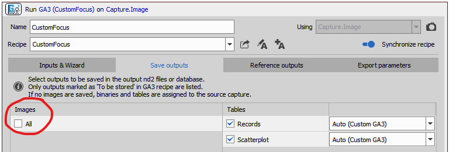

# Move to custom focus plane

The goal of this example is to show how to use GA3 to calculate custom focus plane. Here we will use the built-in "focus criteria" node in GA3 and customize only how we get the final position from a vector of focus criteria. Usually the plane with highest criterion value is taken.

Here we will assume a special case where we have a sample that has two peaks in focus criterion and will yield the middle between them. For example yeast and some glass chambers can exhibit this.

> [!NOTE]
> This example is shown on simulated devices - it doesn't require any real hardware for trying it out.

## Contents
- [Hardware setup](#hardware-setup)
- [Calculate custom focus plane and move to it](#calculate-custom-focus-plane-and-move-to-it)
- [Perform AF in each well and then run imaging](#perform-af-in-each-well-and-then-run-imaging)

## Hardware setup

[Setup a Nikon Ti2 Simulator](../00-Common/Simulated_ti2_microscope_with_camera.md)

### Camera File simulator setup

For camera simulator we will use an artificial two-foci z-stack:

[fluo-agnor-two-foci-zstack.nd2](fluo-agnor-two-foci-zstack.nd2)

Open it in NIS Elements and set it into the camera simulator by clicking on "Load current ND" in the Camera Simulator settings. 


Then, setup the rest of the acquisition settings:

- select the D-LEDI,
- check the correct file in the camera simulator,
- select the 60x lens and
- select the DAPI filter cube in the upper turret.


| :exclamation: set |  value         |
| ----------------- | -------------- |
| Calibration       | 0.18 µm/px     |
| Objective         | Plan Apo λ 60x |

## Calculate custom focus plane and move to it

This example wil show how to use 
- GA3 to find a Z-position and
- use it in JOBS.


### 1. Run a Z-stack

Create a simple JOB that acquires a Z-stack. In the Z-Stack definition task select the number of *steps* to match our two-foci z-stack frames (that is 13). Also set the home position to some absolute value that we can later check in the results. Here, for example 500 µm.


The JOB is [0-AcquireZStack.bin](0-AcquireZStack.bin).

> [!NOTE]
> Before running the JOB make sure to click the "Reset Frame Position" button in the camera simulator.

Run the job and open the z-stack.

### 2. Create a GA3 recipe to plot the focus

Create a new GA3 recipe (menu: Image -> New GA3 recipe...).

First we will calculate the criteria for every z-slice and plot them to see what the sample looks like. Let's add two nodes:
- Focus criteria (in 3D) to calculate the focus and
- Scatterplot to plot the focus criterion in every plane.


In the scatterplot dialog select the data on axes as follows:
- "Whole frame criteria" column on X axis,
- Z coord column on Y axis,
- set "line" to "solid" in the series style for the Z coord and
- click Apply button.


In the graph we can see that there are two peaks in the focus criterion value. An that the middle is at 500 µm.

The GA3 recipe: [FocusScatterplot.ga3](FocusScatterplot.ga3)

### 3. Find the Z coordinate in the middle of two foci

In order to calculate the middle we will take the two rows with highest focus and reduce them to produce a single *mean* row. Dn not forget to connect the result to the SaveTables node.


The results show that the middle is at 500 µm.


The GA3 recipe: [CustomFocus.ga3](CustomFocus.ga3)

### 4. Move to custom focus plane in the JOB

In the JOB we add:
- GA3 task to run the recipe and calculate the focus plane,
- Expression task to move the current Z position to the calculated position and
- Capture task to capture the image at the calculated focus position.

In the GA3 task uncheck All under Images in Save outputs tab as we already save images in the Capture task.



Then, check the MeanZcoord column in the Export parameters tab.


In the Expression task set the Devices.Z to the value we calculated in the GA3 task.

```c
Devices.Z = Job.CustomFocus.Tables.Records.MeanZcoord.First
```


When we run the job we can check if the last frame is acquired at the correct Z. In this example it should be at Z = 500 µm. In fact it is at 499.99 µm which we consider to be correct. 


The final JOB is [1-AcquireZStackForAF.bin](1-AcquireZStackForAF.bin).


## Perform AF in each well and then run imaging

Here, we extend the previous example by doing everything on a well-plate. We first find the custom focus in each well, we save it into the well Z position and then we run a time-lapse over all wells which use it.

Everything stays as it is except:
- the expression, where instead of moving with the Z device directly we set the Z position of the Well (Current well in the loops task).

```c
Job.Wells.CurrentWell.Position.z = Job.CustomFocus.Tables.Records.MeanZcoord.First
```


The final JOB is [2-AcquireWellZStackForAF.bin](2-AcquireWellZStackForAF.bin).