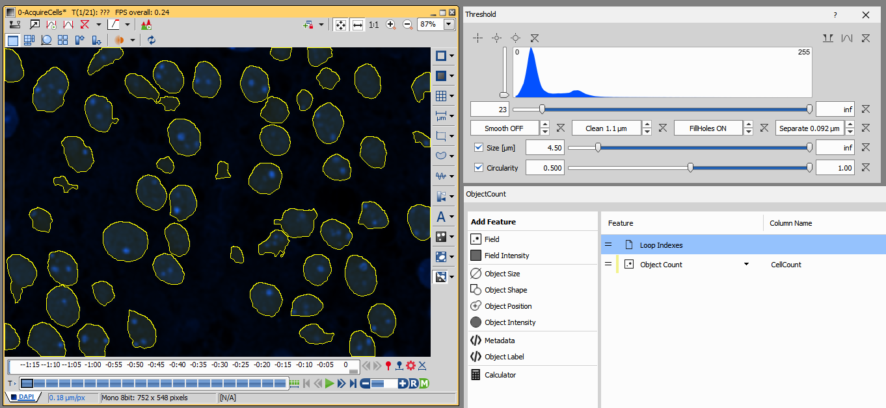
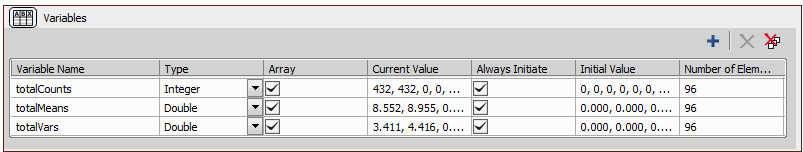
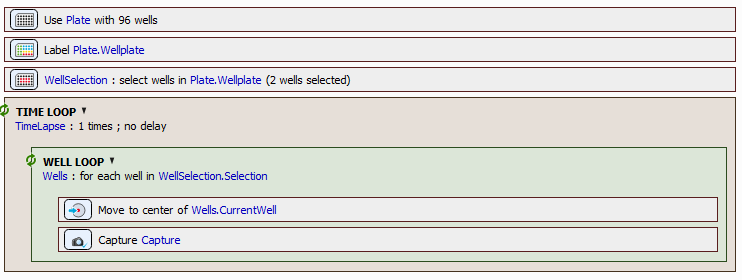

# Acquire until a condition is met

The goal of this example is to run an experiment until a condition is met.

In the following examples we will use  the Number of cells or the Standard Error (SE) of the equivalent diameter feature as the termination condition. There are many other examples which use different condition. Acquire until:
- most of the cells are dead,
- cells are bleached,
- ...

> [!NOTE]
> This example is shown on simulated devices - it doesn't require any real hardware for trying it out.

## Contents
- [Hardware setup](#hardware-setup)
- [Acquire a time-lapse until a given number of cells is reached](#acquire-a-time-lapse-until-a-given-number-of-cells-is-reached)
- [Acquire a time-lapse until a given cell feature statistic is reached](#acquire-a-time-lapse-until-a-given-cell-feature-statistic-is-reached)
- [Stop acquiring wells that reached a given Standard Error (SE)](#stop-acquiring-wells-that-reached-a-given-standard-error-se)
- [Stop acquiring plate when the Z-factor reaches given value](#stop-acquiring-plate-when-the-z-factor-reaches-given-value)

## Hardware setup

[Setup a Nikon Ti2 Simulator](../00-Common/Simulated_ti2_microscope_with_camera.md)

### Camera File simulator setup

For camera simulator we will use an artificial two-frame time-lapse. The second frame is darker version of the first frame.

[synthetic-objects-timelapse.nd2](synthetic-objects-timelapse.nd2)


Open it in NIS Elements and set it into the camera simulator by clicking on "Load current ND" in the Camera Simulator settings.


Then, setup the rest of the acquisition settings:
- select the D-LEDI, 
- check the correct file in the camera simulator,
- select the 60x lens and
- select the DAPI filter cube in the upper turret


| :exclamation: set |  value         |
| ----------------  | -------------- |
| Calibration       | 0.18 µm/px     |
| Objective         | Plan Apo λ 60x |

## Acquire a time-lapse until a given number of cells is reached

Before starting with the GA3 we need a time-lapse to work with. Lets first create a job that will do that. We will later use it as a starting point. This way we are sure that we have the right material for the GA3 recipe.

### 1. Run simple time-lapse with the configuration

Create a simple JOB with only two tasks:
- TimeLoop with Unknown duration (meaning: infinite unless stopped) and
- Capture that uses current settings


Save the JOB and run it. Finish it manually (remember it has infinite duration), after couple of frames are acquired. Then, open the ND2 file by clicking on any row in the JOB results table.


Final JOB: [0-AcquireCells.bin](0-AcquireCells.bin)

### 1. Create a GA3 recipe that counts the number of cells in an image

Now, that we have a time-lapse we can work on the GA3 recipe.

Create a new recipe (menu: Image -> New GA3 recipe...) and
add following nodes:
- Threshold from the Segmentation tab and 
- ObjectCount from the Measurement tab.

Connect them as follows:


Now set the node parameters like in the screenshot:



The final GA3 recipe: [CellCount.ga3](CellCount.ga3)

The resulting Records:


We can see that one frame has 54 and the second has 48 cells.

Final GA3 recipe: [CellCount.ga3](CellCount.ga3)

### 2. Create the JOB that will stop after it acquires 1000 cells

Open the JOB that we created previous section. Start by saving the JOB under different name in order to preserve the original one.

Add the following tasks to it:
- Variables task at the beginning,
- GA3 task after the Capture task,
- Expression task after the GA3 task to accumulate the totalCellCount
- If task to check if the total count is met yet and
- Break task inside the If task block to end the loop.


In the Variables task, add a new variable `totalCellCount` of type int. Check "always initialize" and set the initial value to 0.


In the GA3 task:
- select the CellCount recipe (it should change the name of the task to CellCount too),
- in the "Save outputs" tab uncheck All under Images and 
- in the "Export parameters" tab check CellCount in the "Records" table.

Images below show the relevant tabs.


In the Expression task we will accumulate the totalCellCount variable:

```c
totalCellCount = totalCellCount + Job.CellCount.Tables.Records.CellCount.First
```

Meaning literally: Take the number in `totalCellCount` (initially zero), add the cellCount coming from the GA3 to it and set it back to `totalCellCount` variable.

In order to understand the `Job.CellCount.Tables.Records.CellCount.First` term we can break it down into:
- `Job.CellCount` part which represents the GA3 task named CellCount in this Job,
- `Tables.Records.CellCount` part representing the column CellCount in the Records table and
- `First` part means - take only the first row from the table (we have only one row in the table anyway).


An If task needs an expression so that it can decide at runtime wether it should execute the tasks in the if block or not. The expression evaluates either to 
- *zero* meaning "no" or 
- *non zero* meaning "yes".

In our case we enter the following expression:

```c
totalCellCount >= 1000
```

Meaning: when the variable `totalCellCount` is greater or equal than 1000 (= "yes") execute the tasks inside the if block (that is *break*)  otherwise skip the block.


When the break is executed it will break from the Time lapse loop and effectively end the JOB as there is nothing after the loop task.

We expect the JOB to acquire 20 frames as one frame has around 50 cells. Let's try it out and run the JOB. The results show that the acquisition actually stopped after 20 frames.


Final JOB: [1-Acquire1kCells.bin](1-Acquire1kCells.bin)

## Acquire a time-lapse until a given cell feature statistic is reached

This example builds upon the previous one. But, instead of using the *count* of objects as a statistic for deciding when to stop, it will use slightly more complex one: [Standard Error (SE)](https://en.wikipedia.org/wiki/Standard_error). 

$SE = \Large\sqrt{\frac{\sigma^2}{N}}$ where $\sigma^2$ is *variance* and $N$ is the number of cells.

We will use the *equivalent diameter* as object feature.

> [!NOTE]
> From the NIS Elements help on EqDiameter feature: \
> It is a size feature derived from the object area. It is the diameter of a circle with the same area as the measured object. \
> $EqDiameter = \Large\sqrt{\frac{4*Area}{pi}}$

Since we need the SE to be calculated for all the frames so far we need a formula for adding two variances, the accumulated so far and the current one.

It turns out there is such a formula:

$\Large{n_T = n_l + n_c}$

$\Large{\mu_T = \frac{n_l*\mu_l + n_c*\mu_c}{n_T}}$

$\Large{\sigma_T = \frac{n_l*((\mu_l - \mu_T)^2 + \sigma_l) + n_c*((\mu_c - \mu_T)^2 + \sigma_c)}{n_T}}$

where:
- $n_T$, $n_l$ and $n_c$ is total, last and current count
- $\mu_T$, $\mu_l$ and $\mu_c$ is total, last and current mean
- $\sigma_T$, $\sigma_l$ and $\sigma_c$ is total, last and current variance

We made a convenience macro function to perform this calculation:
```c
int UpdateMeanAndVariance(int* totalN, double* totalMean, double* totalVar, int n, double mean, double* var);
```

Now that we have figured out the statistics, we will reuse the GA3 from the previous example and slightly update it. We need to output three statistics: CellCount (the $n_c$), MeanEqDia (the $\mu_c$) and VarEqDia (the $\sigma_c$). Actually only two, because CellCount we already have. As these statistics are all per frame, we will just add two new columns in the same ObjectCount node:


The final GA3 recipe: [CellCountMeanVar.ga3](CellCountMeanVar.ga3)

In the JOB we will "accumulate" not only the totalCellCount but the totalMean and totalVariance too. As we saw earlier the formulae are quite complex and we have the convenience function that will do it all. Then, we have to:
- create convenience variables n, mean and var to shorten the code,
- update the totalCellCount, totalMean and totalVar variables using the UpdateMeanAndVariance function and
- calculate the SE according to the above SE formula.

```c
int n = Job.CellCount.Tables.Records.CellCount.First;
double mean = Job.CellCount.Tables.Records.MeanEqDia.First;
double var = Job.CellCount.Tables.Records.VarEqDia.First;
UpdateMeanAndVariance(&totalCellCount, &totalMean, &totalVar, n, mean, var);

if (totalCellCount > 0)
{
    SE = sqrt(totalVar/totalCellCount);
}
```

We will modify the JOB from the previous example as follows:
- in Variables task create three new variables totalMean, totalVar and SE,
- in GA3 task add two more columns MeanEqDia and VarEqDia,
- exchange the Expression task for a Macro task and insert the code from above and 
- in the If task change the expression to evaluate the SE.


We want the experiment to stop when the SE drops below 0.1.


Final JOB: [2-AcquireToGivenEqDiaSE.bin](2-AcquireToGivenEqDiaSE.bin)

When we run the JOB we see it has 8 frames and that it needed 408 objects to get the SE to 0.099.


The GA3 for calculating the SE of all Object EqDiameter is straightforward:
- connect the Object Measurement node to binaries and add EqDiameter feature,
- append Accumulate node over time and 
- append Reduce node and select StdErr.


The GA3 recipe to check the result: [CheckSE.ga3](CheckSE.ga3)

## Stop acquiring wells that reached a given Standard Error (SE)

We will further extend the previous example to a well-plate and calculate the SE (and the relevant statistics) for every well. 
In the well loop we will check the calculated SE in every well and skip it if the SE is below the given threshold.
The well loop itself is in the time loop that is already in the JOB.
We have to keep track of the visited wells and stop (break from the time loop) when we are skipping all wells.

We reuse the GA3 recipe from the previous example without any change.

In the JOB we have to make some changes though. 
Lets start with the Variables task where we change all variables to arrays (of 96 elements):
- totalCounts, totalMeans, and totalVars all defined as array of 96 doubles.



Then we modify the rest of the JOB as follows:
- Plate definition task goes below the Variables task,
- insert the Well selection below it and select two wells only,
- the Well loop task goes inside the time loop,
- in the If task insert the Break task.

The Macro has to change a bit too:

- All the `totalCounts[i]`, `totalMeans[i]` and `totalVars[i]` must have an index (they are arrays),
- The index `int i = Job.Wells.Current` refers to current well.
- We calculate SE in the If and directly compare it with the given threshold.

It the calculated SE is less then the threshold we will skip the current well:
```c
Job.Wells.CurrentWell.Skip = 1;
```

```c
int i = Job.Wells.Current;
int n = Job.CellCountMeanVar.Tables.Records.CellCount.First;
double mean = Job.CellCountMeanVar.Tables.Records.MeanEqDia.First;
double var = Job.CellCountMeanVar.Tables.Records.VarEqDia.First;
UpdateMeanAndVariance(totalCounts + i, totalMeans + i, totalVars + i, n, mean, var);

if (totalCounts[i] > 0)
{
   if ((sqrt(totalVars[i]/totalCounts[i])) < 0.1)
   {
      Job.Wells.CurrentWell.Skip = 1;
   }
}
```

> [!Note]
> Currently, the NIS Elements macro has a syntax limitation. Following code is perfectly valid in c but it will not work in the NIS Elements macro:\
> `UpdateMeanAndVariance(&totalCounts[i], &totalMeans[i], &totalVars[i], n, mean, var);` \
> To make it work use the pointer syntax instead:\
> `UpdateMeanAndVariance(totalCounts + i, totalMeans + i, totalVars + i, n, mean, var);`


Finally we check if the well loop still has some valid wells (that is not being skipped).
```c
Job.Wells.ValidCount==0
```

If the valid count goes down to zeo we  break from the time loop.


After we run the example we get the results and can check the SE per well:


Final JOB: [3-AcquireWellToGivenEqDiaSE.](3-AcquireWellToGivenEqDiaSE.bin)

To get below SE < 0.1 it took 8 and 9 frames for the two wells and 384 and 480 objects respectively.
This is because the simulator has two frames - one with more wells than the other - and as we acquired only two wells one had constantly more objects for every capture than the other.


The GA3 for checking the SE had to be slightly modified:
- AccumRecords should be over *all* loops (Time and Well loop) and
- Reduce node should group over multi-point index in order to reduce over it. 


The GA3 recipe to check the result: [CheckWellSE.ga3](CheckWellSE.ga3)


## Stop acquiring plate when the Z-factor reaches given value

Another variation of a stopping condition is accumulated plate [Z-factor](https://en.wikipedia.org/wiki/Z-factor). We capture plate over a time until we reach the given Z-factor.

$Z' = 1 - \Large{\frac{3(\sigma_n + \sigma_p)}{\lvert\mu_n - \mu_p\rvert}}$ 

We will calculate the z-factor for the acquired data so far. For this we will accumulate the means ($\mu$) and variances ($\sigma^2$) for the negative and positive labels supplied from the GA3 recipe.

Let's define a well-plate with one half of the wells labeled "negative" and other half labeled "positive" like this:


Make sure to acquire the wells from both labels (at least two):


Acquire one well-plate with the following JOB:
- the above labeling and well selection,
- time loop with one repetition,
- well loop over the selection,
- move to center and
- capture.



The job is [5-AcquireWellplateForZfactor.bin](5-AcquireWellplateForZfactor.bin)

We will use the acquired image for making the GA3 recipe that will calculate the counts, means and variances for both positive and negative wells. We will use again Equivalent Diameter as in the example above.

Until Accumulate the recipe is the same. We use the Wellplate metadata to extract well-plate metadata like Labeling. We will join the well metadata with accumulated object data using the well column. After Join we will split in two branches:
- One will calculate Z-factor using the built-in node. Just to have a reference value.
- Other will calculate the input values for the calculating Z-factor in JOBS.


In our case the $Z' = -28$ (a poor assay when Z' < 0). 

> [!Note] 
> This value will not improve with $N$ as we have constant data (therefore means and variances) repeating over.


The Reduce node groups the records according to Control and calculates CountOfCells, MeanCellEqDiameter and VarOfCellEqDiameter per each group (negative and positive).


We then sort the two rows alphabetically to make sure negative row is before positive.


The results show why the Z-factor was so poor: the means are very close together compared to their variances.

The GA3 is in [PlateZfactor.ga3](PlateZfactor.ga3)

We can now make the final JOB by adding tasks as follows:
- Variables task at the beginning where we will accumulate `total_n`, `total_mean` and `total_var` for positive and negative,
- GA3 task after the well loop as we need whole well-plate,
- Macro task that will calculate Z-factor from provided data and
- IF task that will exit when we reach Z_factor > 0.5.


Since Z-factor doesn't care about positive negative order we create following variables:


In the GA3 task we uncheck all under Images in the Save outputs tab and check CountOfCells, MeanCellEqDiameter and VarOfCellEqDiameter in the Export parameters tab.


Then in the macro task following macro calculates the Z-factor from the accumulated data.

```c
double n0 = Job.PlateZfactor.Tables.Records.CountOfCells[0];
double n1 = Job.PlateZfactor.Tables.Records.CountOfCells[1];
double mean0 = Job.PlateZfactor.Tables.Records.MeanCellEqDiameter[0];
double mean1 = Job.PlateZfactor.Tables.Records.MeanCellEqDiameter[1];
double var0 = Job.PlateZfactor.Tables.Records.VarOfCellEqDiameter[0];
double var1 = Job.PlateZfactor.Tables.Records.VarOfCellEqDiameter[1];

UpdateMeanAndVariance(&total_n0, &total_mean0, &total_var0, n0, mean0, var0);
UpdateMeanAndVariance(&total_n1, &total_mean1, &total_var1, n1, mean1, var1);

Z_factor = 1 - (3 * (sqrt(total_var0) + sqrt(total_var1)) /  fabs(total_mean0-total_mean1));
```

Question task can be used to monitor the changing of the Z-factor value.


When the JOB is ran it will do all ten repetitions. The Z-factor will be the same all the time as the means and variances do not change.


Clearly, the example should be run on an living sample where there is a chance o Z-factor improvement.

The final job is available in [6-AcquireWellplateToGivenZfactor.bin](6-AcquireWellplateToGivenZfactor.bin)