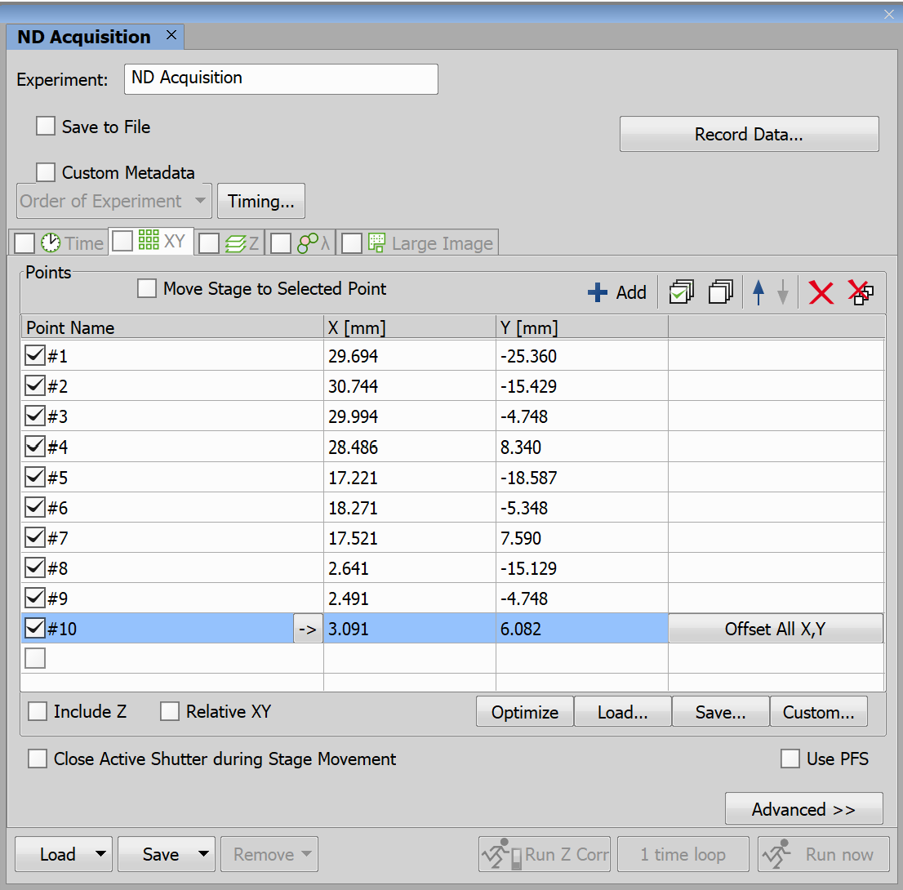
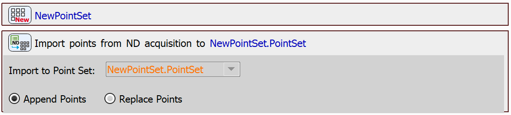
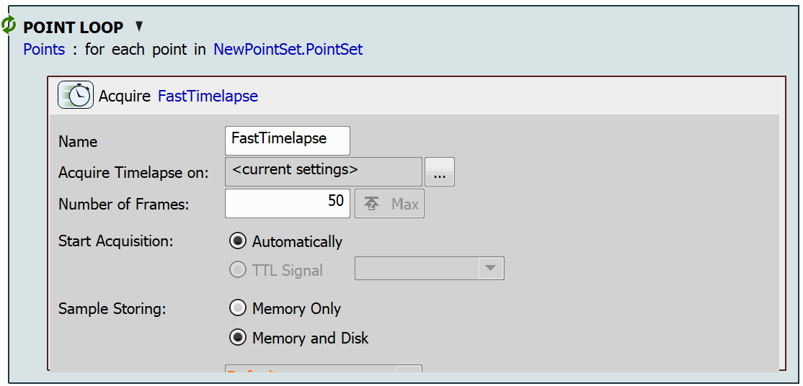

# Import Points from ND Acquisition

This example demonstrates a task that imports a point set defined in ND Acquisition into a JOB. Once the point set is imported, a fast time-lapse will be executed for each point.

> [!NOTE]
> See also [Export Points to ND Acquisition](../36-Export_pts_to_ND/README.md)

## ND Acquisition

To define a point set in ND Acquisition, go to **View → Acquisition Controls → ND Acquisition**. Here, navigate to the *XY* tab. To add the points, position the stage as needed and click "*Add*".

## Setting up the JOB

First, create an empty point set using the `New Point Set` task. Then, use the `Import Point Set from ND` task, to import the points defined in ND Acquisition into the created point set.

Then, we will loop through all the imported points using the `Loop over Points` task and capture a fast time-lapse using the `Fast Timelapse` task.

JOB file: [[Download link](https://laboratory-imaging.github.io/JOBS-examples/NIS_v6.10/35-Import_pts_from_ND/35-ImportPtsFromND.bin)] [[View as html](https://laboratory-imaging.github.io/JOBS-examples/NIS_v6.10/35-Import_pts_from_ND/35-ImportPtsFromND.html)]