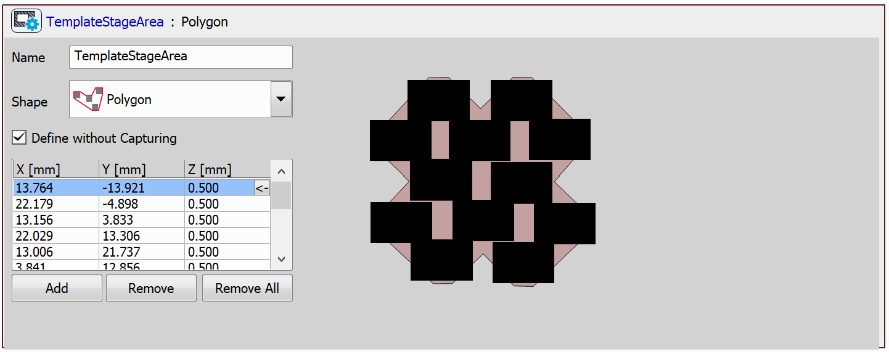
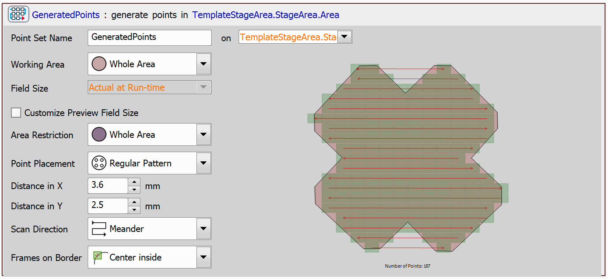
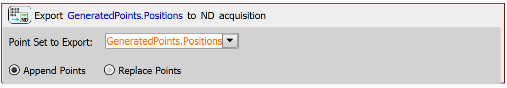
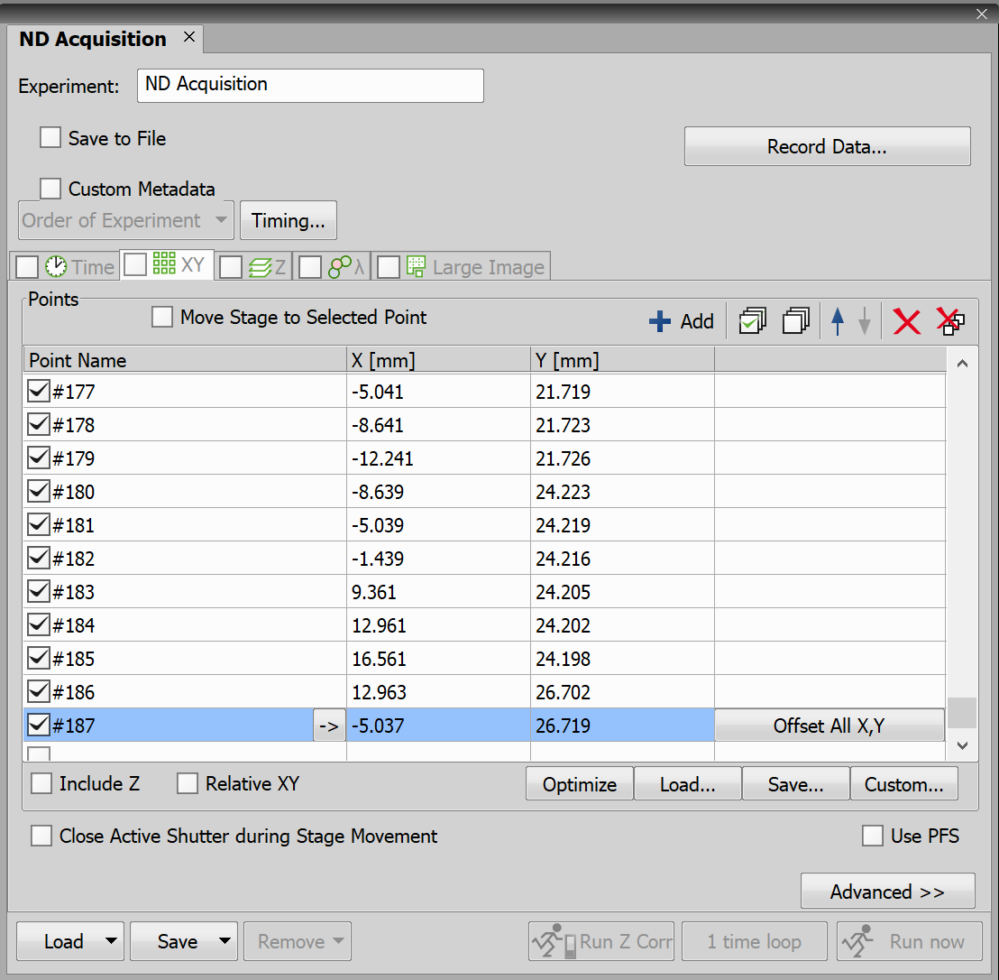
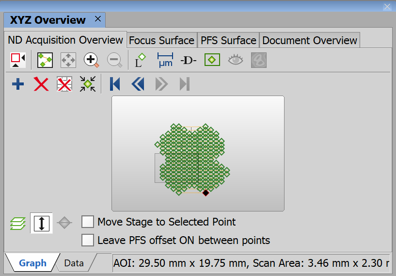

# Export Points to ND Acquisition

This example demonstrates a JOB that defines a stage area, generates points within that area, and exports the generated points to ND Acquisition.

This JOB can serve as a tool to create points within a template-defined area, enabling further work with these points in ND Acquisition.

> [!NOTE]
> See also [Import Points from ND Acquisition](../35-Import_pts_from_ND/README.md)

## Setting up the JOB

First, we will define a stage area where the points will be generated. In this example, the area will have a slightly more complex shape — we will use the *Polygon* shape in the `Define Stage Area` task and select specific points to define it:

Next, we will generate a point set in the defined area using the `Generate Points` task. In this step, we will choose *Whole Area* for the *Area Restriction* parameter, set the *Point Placement* parameter to *Regular Pattern*, and select the *Center inside* option for the *Frames on Border* parameter.

Finally, we can export the generated points to ND Acquisition using the `Export Point Set to ND` task. 

## ND Acquisition

To view the point set in ND Acquisition, go to **View → Acquisition Controls → ND Acquisition**. Here, navigate to the *XY* tab.

You can also view the generated points in **View → Acquisition Controls → XYZ Overview**:

JOB file: [[Download link](https://laboratory-imaging.github.io/JOBS-examples/NIS_v6.10/36-Export_pts_to_ND/36-ExportPtsToND.bin)] [[View as html](https://laboratory-imaging.github.io/JOBS-examples/NIS_v6.10/36-Export_pts_to_ND/36-ExportPtsToND.html)]