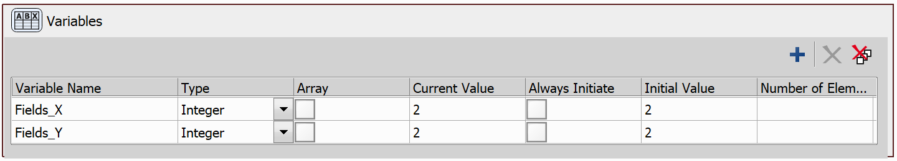
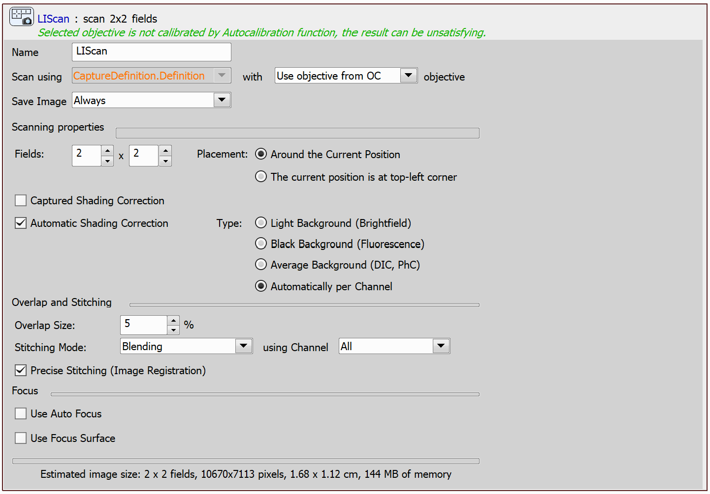

# Scan Large Image

In this example, we will create a simple JOB that scans a Large Image. 

Upon the start of the JOB, we will let the user define the size of the large image to be scanned.

## Setting up the JOB

We will start by creating the `Variables` task to store the values for the number of fields to be scanned by the large image scan. 

We will also create a `Capture Definition` task, which will also be used by the large image scan.

Now, we will allow the user to adjust the field sizes using the `Question` task. This task will display a pop-up window requiring user interaction. In the information text box, we will display the information about the current setting of the number of fields to be scanned and prompt the user to adjust the values as needed. Additionally, we will enable the *Input Values* option and specify the input fields, linking them to the appropriate variables we defined earlier.

Then, we will use the `Expression` task to set the parameters of the large image scan.

Finally, we can use the `Scan Large Image` task. We will configure this task to scan around the current position. 

### Scan Large Image: Parameters

In the `Large Image Scan`, the following parameters can be configured:

**Scan using** - Select a Capture Definition and specify its objective from the dropdown menu on the right.

**Save Image** - Choose whether to save the acquired images.

**Fields** - Define the field dimensions of the large image

**Placement** - *Around the Current Position* places the corners of the fields directly adjacent to the current stage position. *The current position is at top-left corner* uses the stage position as a position of the top-left field.

**Captured Shading Correction** - Shading correction saved with the Optical Configuration can be used. Select the Optical configuration and go to **Acquire → Shading Correction Panel** to capture the shading correction.

**Automatic Shading Correction** - Check this option to perform the shading correction automatically without capturing the shading image. Select the type of correction which best represents the background of your sample image.

**Overlap and Stitching** - This area contains parameters defining the **Overlap Size**, **Stitching Mode** (*Blending* or *Optimal Path*) and the **Channel** which is used for the stitching.  The **Precise stitching (Image Registration)** parameter can be enabled, however, be aware that it increases the computational demands of the task.

**Use Auto Focus** - Enable autofocus and specify where it should be applied (*every n-th Field*, *after a specified stage distance* or *on the Center Tile at Start*).

**Use Focus Surface** - Focuses using the surface defined in the *Focus Surface* tab of the **View → Acquisition Controls → XYZ Overview** panel. See also the [Create Focus Surface on a Slide](../10-Create_focus_surface_slide/README.md) example.

JOB file: [[Download link](https://laboratory-imaging.github.io/JOBS-examples/NIS_v6.10/37-Scan_large_image/37-ScanLargeImage.bin)] [[View as html](https://laboratory-imaging.github.io/JOBS-examples/NIS_v6.10/37-Scan_large_image/37-ScanLargeImage.html)]