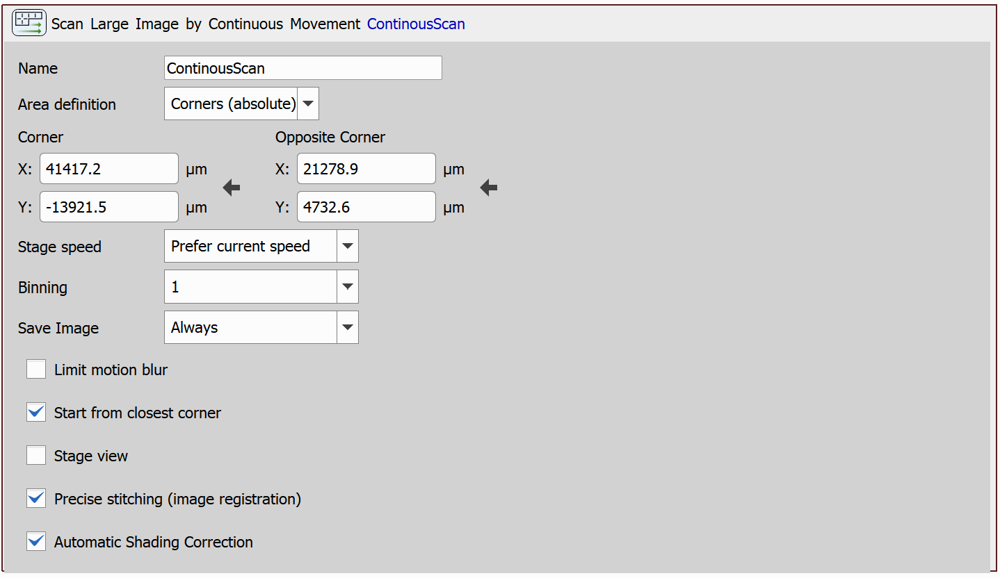

# Scan Large Image by Continuous Movement

This example will demonstrate a task that performs a large image scan by continuous movement. This task requires a Motorized Stage device to be installed in the system.

> [!NOTE]
> Microscopes supported for continuous movement are:
>- Nikon Eclipse Ji Microscope
>- Nikon Ti2-E Microscope (see the [Nikon Ti2 set-up guide](https://github.com/Laboratory-Imaging/documents/blob/main/Ti2_Wellplate_Apps/system_setup_overview_objective.md))

## Setting up the JOB

Use the `Scan Large Image by Continuous Movement` task. Specify the area to be scanned and configure the rest of the parameters. In our case, the task is set up as follows:

### Scan Large Image by Continuous Movement: Parameters

**Area definition**

 - **Position & Size** - Specify a rectangle by origin and size
 - **Corners (absolute)** - Specify a rectangle by opposite corners
 - **Start-End** - Specify the start position and the end position, can be used to scan a single line
 - **Whole stage** - Scan the whole stage
 - **Holder** - Scan the sample holder

**Stage speed**

 - **Prefer current speed** - Respects the stage speed restriction, if there is any (e.g. due to the `Set XY Speed/Accuracy` task).
 - **Maximum speed** - Uses the maximum speed available to achieve the expected result. 

**Binning** - Specifies the degree to which the data size will be reduced during post-processing. A higher binning value results in greater data reduction.

**Limit motion blur** - Causes the speed of the XY stage to be reduced to prevent motion blur in the resulting image.

**Start from closest corner** - Ensures that the scanning will start in the corner of the scanned area which is closest to the current XY position.

**Stage view** - Orientation of the resulting image will be adjusted to match the actual view on the XY stage without the eyepiece or camera.

**Precise stitching (image registration)** - Runs a precise image-registration function to compensate mis-alignment of images. The transitions between tiles of the large image will look better but the processing will take longer. If your system is properly aligned, this function should not be needed.

JOB file: [[Download link](https://laboratory-imaging.github.io/JOBS-examples/NIS_v6.10/38-Scan_large_image_continuous/38-ContinuousScan.bin)] [[View as html](https://laboratory-imaging.github.io/JOBS-examples/NIS_v6.10/38-Scan_large_image_continuous/38-ContinuousScan.html)]