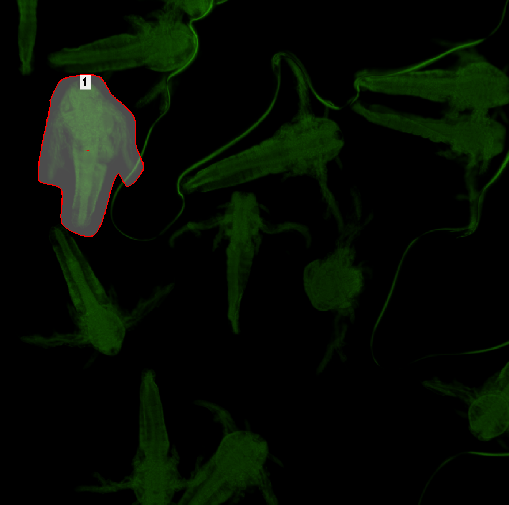

# Draw and Edit Regions

Here are two examples showcasing the usage of the `Draw Regions` and `Edit Regions` tasks. These examples demonstrate how to manually create regions and how to refine them after running an automatic detection method.

The contents of this file are:

- [Draw Regions](#draw-regions): An example on how to use the `Draw Regions` task
- [Edit Regions](#edit-regions): An example on how to use the `Edit Regions` task
- [Simple ROI Editor Controls](#simple-roi-editor-controls): A guide on how to use the Simple ROI editor, which is used by the tasks presented in this text

> [!NOTE]
> See also 
> - [Append Empty Regions and Edit All After Acquisition](../40-Append_empty_regions/README.md)
> - [Use Regions from Sample Navigation](../41-Use_regions_from_sample_nav/README.md)

## Draw Regions

In this example, we will create a JOB that allows the user to create regions in an image captured at low magnification, then captures higher-magnification images of the defined regions.

### Setting up the JOB

First, we will select an objective using the `Select Objective` task. In our case, we selected a 4x objective.

Next, we will capture an image to define the regions using the `Capture Current OC` task. For this instance of the task, we will set the *Save Image to Database* parameter to *Never or Later*, as this image is intended only as a rough overview and may include areas of no particular interest.

Then, we will use the `Draw Regions` task. This task is used to manually draw regions during acquisition.
Once the capture is made, the job is paused and Simple ROI Editor is shown over the Draw Regions window. Once you finish the drawing, click *Continue* to continue the job. Refer to the [Simple ROI Editor Controls](#simple-roi-editor-controls) section for instructions on how to manage the region editor.

In our case, we have created the following regions:

After we have defined the regions, we will switch to a 20x objective.

Now we can create a region loop using the `Loop over Regions` task. In the loop we will first move to the center of the region using the `Move to Region Center` task and perform autofocus at this position using the `Autofocus Long` task. Then, we will generate a point set covering the region using the `Generate Points` task, after that, we will create a point loop using the `Loop over Points` task and capture images at each point within the loop using the `Capture Current OC` task.

JOB file: [[Download link](https://laboratory-imaging.github.io/JOBS-examples/NIS_v6.10/39-Draw_regions/39-DrawRegions.bin)] [[View as html](https://laboratory-imaging.github.io/JOBS-examples/NIS_v6.10/39-Draw_regions/39-DrawRegions.html)]

## Edit Regions

In this example, we will create a JOB that automatically detects regions using a GA3 analysis and then enables the user to manually refine these regions.

### Setting up the JOB

First, we will select an objective using the `Select Objective` task. In our case, we selected a 4x objective.

Next, we will capture an image to define the regions using the `Capture Current OC` task. For this instance of the task, we will set the *Save Image to Database* parameter to *Never or Later*, as this image is intended only as a rough overview and may include areas of no particular interest.

Then, we will create an empty region list using the `Region List` task.

Then, we will use the `General Analysis 3` task to determine the areas of interest. For the GA3 analysis, we will use the following recipe:

In this example, the GA3 analysis identified the following areas of interest:

It is important to select the previously created `Region List` as the reference output in the **Reference outputs → Region Lists → RegionList** dropdown menu.

Next, we will use the `Edit Regions` task. We will edit the region list filled by the GA3 analysis. Once you finish the editing, click *Continue* to continue the job. Refer to the [Simple ROI Editor Controls](#simple-roi-editor-controls) section for instructions on how to manage the region editor.

After we have edited the regions, we will switch to a 20x objective.

Now we can create a region loop using the `Loop over Regions` task. In the loop we will first move to the center of the region using the `Move to Region Center` task and perform autofocus at this position using the `Autofocus Long` task. Then, we will generate a point set covering the region using the `Generate Points` task, after that, we will create a point loop using the `Loop over Points` task and capture images at each point within the loop using the `Capture Current OC` task.

JOB file: [[Download link](https://laboratory-imaging.github.io/JOBS-examples/NIS_v6.10/39-Draw_regions/39-EditRegions.bin)] [[View as html](https://laboratory-imaging.github.io/JOBS-examples/NIS_v6.10/39-Draw_regions/39-EditRegions.html)]

GA3 file: [[Download link](https://laboratory-imaging.github.io/JOBS-examples/NIS_v6.10/39-Draw_regions/detectarea.ga3)]

# Simple ROI Editor Controls

When tasks such as `Draw Regions` or `Edit Regions` are executed, the Simple ROI Editor is displayed, allowing the user to define regions of interest.

## The basic workflow with the ROI editor:

1. Select the desired ROI shape.
2. Draw the ROIs.
3. Click the Continue button to finalize and close the toolbar, and continue with the JOB execution.

The ROI Editor supports creating multiple regions and provides the following toolbar:

## Available Tools & Controls:

Here is the list of the tools available for defining ROIs. In order to draw a ROI shape in the opened document, click the respective icon. 

### Tools and Controls Table

<!--
| Tool             | Mode                      | Description |
|------------------|---------------------------|-------------|
| **Pointing**     | -                         | The Pointing tool switches the current tool to a pointer mode. In this mode, you can select, move, and reshape the ROIs. |
| **Rectangle**    | -                         | For drawing rectangular regions. Select the desired way to draw a rectangle from the dropdown menu. |
|                  | **Rectangle**             | Hold down the left mouse button and drag to draw the rectangle. After releasing, the rectangle will be added automatically. |
|                  | **Square**                | Hold down the left mouse button and drag to draw the square. After releasing, the square will be added automatically. |
| **Ellipse**      | -                         | For creating elliptical regions. Select the desired way to draw an ellipse from the dropdown menu. |
|                  | **Circle**                | Hold down the left mouse button and drag to draw the circle. After releasing, the circle will be added automatically. |
|                  | **3pt Circle**            | Click 3 times to add 3 points on the circumference of the circle. After adding the 3rd point, the shape will be added automatically. |
|                  | **Npt Circle**            | Click as many times as needed to place points. When done, right-click to add a circle that best fits the points. |
|                  | **Ring ROI**              | Hold down the left mouse button and drag to draw a circle. After releasing, move the mouse to draw a second circle. Then, click the left mouse button to confirm the second circle. After that, a ring will be created and added. |
|                  | **Ellipse**               | Hold down the left mouse button and drag to draw a circle. After releasing, you can reshape the circle to an ellipse. Then, click the right mouse button to confirm. |
|                  | **4pt Ellipse**           | Click 4 times to add 4 points on the circumference of the ellipse. After adding the 4th point, the shape will be added automatically. |
| **Polygon**      | -                         | For drawing custom-shaped polygons. To draw a polygon, click the left mouse button to gradually add vertices. To finish drawing, click the right mouse button - a vertex will be added at the current mouse position and an edge will be added between this vertex and the first added vertex. |
| **Bezier**       | -                         | For drawing bezier curves. To draw a bezier curve, click the left mouse button to gradually add control points. To finish drawing, click the right mouse button - a control point will be added at the current mouse position and will be connected with the first added control point. |
| **Auto Detect**  | -                         | Automatically detects regions of interest based on the image. Detects areas containing similar pixels. Click the left mouse button in the area of interest, and the region(s) will appear based on the segmentation settings. Then, click the right mouse button to confirm and add the region(s). |
| **Draw Holes**   | -                         | Creates holes within existing regions. To create a hole, select the option and then select a way to draw a shape, any of the available options. Draw the shape and it will create a hole in the ROIs with which it collides. |
| **Connect**      | -                         | Joins overlapping regions together. To use this tool, switch to the Pointing tool, hold the Ctrl key, click on the ROIs you want to connect, and then click the Connect button. |
| **Clear**        | -                         | Deletes all existing regions. |
| **Undo/Redo**    | -                         | Steps backward or forward in your editing actions. |
-->

### Pointing

The *Pointing* tool switches the current tool to a pointer mode. In this mode, you can select, move, and reshape the ROIs.

### Rectangle

For drawing rectangular regions. Select the desired way to draw a rectangle from the dropdown menu. The following options are available:

- **Rectangle** - Hold down the left mouse button and drag to draw the rectangle. After releasing, the rectangle will be added automatically.
- **Square** - Hold down the left mouse button and drag to draw the square. After releasing, the square will be added automatically.

   
   

   Fig.: An example of a Rectangular ROI
   

###  Ellipse

For creating elliptical regions. Select the desired way to draw an ellipse from the dropdown menu. The following options are available:

- **Circle** - Hold down the left mouse button and drag to draw the circle. After releasing, the circle will be added automatically.
- **3pt Circle** - Click 3 times to add 3 points on the circumference of the circle. After adding the 3rd point, the shape will be added automatically. 
- **Npt Circle** - Click as many times as needed to place points. When done, right-click to add a circle that best fits the points.
- **Ring ROI** - Hold down the left mouse button and drag to draw a circle. After releasing, move the mouse to draw a second circle. Then, click the left mouse button to confirm the second circle. After that, a ring will be created and added.
- **Ellipse** - Hold down the left mouse button and drag to draw a circle. After releasing, you can reshape the circle to an ellipse. Then, click the right mouse button to confirm.
- **4pt Ellipse** - Click 4 times to add 4 points on the circumference of the ellipse. After adding the 4th point, the shape will be added automatically. 

   
   

   Fig.: An example of a Circular ROI
   

### Polygon

For drawing custom-shaped polygons. To draw a polygon, click the left mouse button to gradually add vertices. To finish drawing, click the right mouse button - a vertex will be added at the current mouse position and an edge will be added between this vertex and the first added vertex.

   
   

   Fig.: An example of a Polygonal ROI
   

### Bezier

For drawing bezier curves. To draw a bezier curve, click the left mouse button to gradually add control points. To finish drawing, click the right mouse button - a control point will be added at the current mouse position and will be connected with the first added control point.

   
   

   Fig.: An example of a Bezier ROI
   

### Auto Detect, Auto Detect All

Automatically detects regions of interest based on the image. Detects areas containing similar pixels. Click the left mouse button in the area of interest, and the region(s) will appear based on the segmentation settings. Then, click the right mouse button to confirm and add the region(s).

   
   
   

   Fig.: An example of the Auto Detect and Auto Detect All functionality
   

### Draw Holes

Creates holes within existing regions. To create a hole, select the option and then select a way to draw a shape, any of the available options. Draw the shape and it will create a hole in the ROIs with which it collides.

   
   

   Fig.: An example of a Polygon ROI with a polygonal hole
   

### Connect

Joins overlapping regions together. To use this tool, switch to the *Pointing* tool, hold the Ctrl key, click on the ROIs you want to connect, and then click the *Connect* button.

   
   
   
   

   Fig.: An example of a Polygon and Bezier ROIs being selected and connected
   

### Clear

Deletes all existing regions.

### Undo, Redo

Steps backward or forward in your editing actions.
