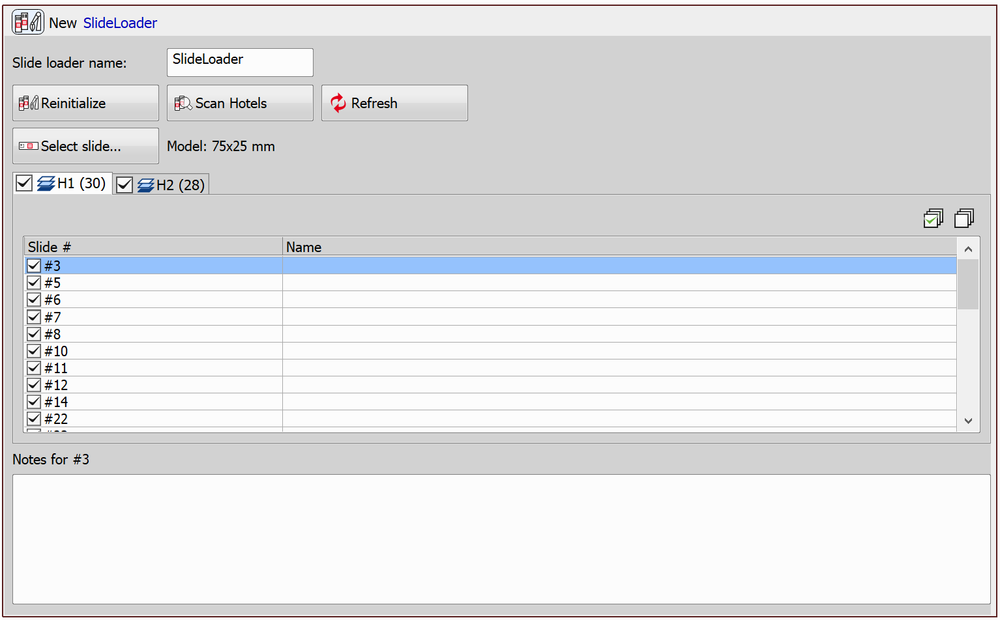
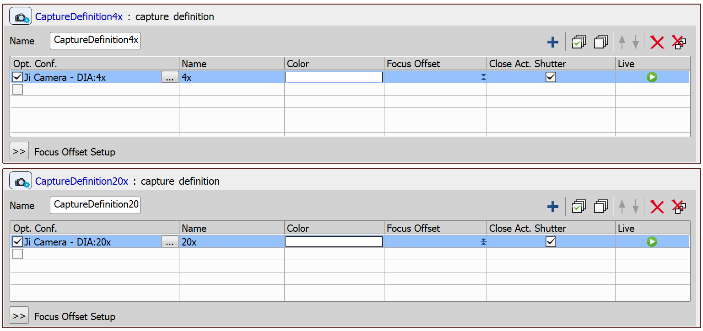
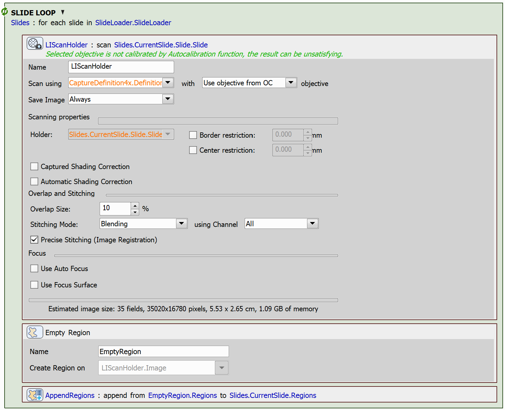
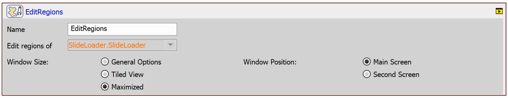
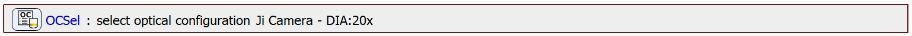
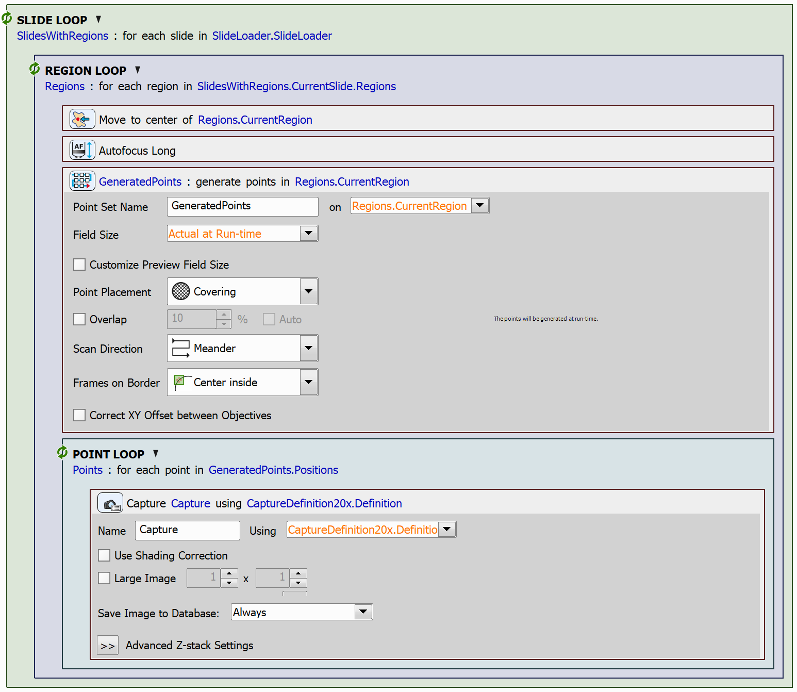

# Append Empty Regions and Edit All After Acquisition

In this example, we will show how to append one region list to another and demonstrate how to create an empty region, highlighting its practical applications.

In the JOB, we will generate overviews for a series of slides. Once all the slides are scanned, the user will define the regions of interest (ROIs) in a single step, avoiding the need to draw ROIs after scanning each individual slide. This approach can be helpful when dealing with a large number of slides, allowing the system to handle the scanning process autonomously while the user can focus on other tasks, returning later to define the ROIs once the scanning is complete.

> [!NOTE]
> See also 
> - [Draw and Edit Regions](../39-Draw_regions/README.md)
> - [Use Regions from Sample Navigation](../41-Use_regions_from_sample_nav/README.md)

## Setting up the JOB

First, create the `Slide Loader` task. This task requires a slide loader device to be connected to your system. See the [Use Slide Loader and Advanced Slide Loop](../25-Slide_loader_advanced_loop/README.md) example on details how to initialize the task.

Next, create two capture definitions using the `Capture Definition` task. One capture definition will use low magnification for scanning the slide overview, while the other will use higher magnification to capture the ROIs with greater detail.

Next, we will iterate through the slides loaded by the slide loader using the `Loop over Slides` task and scan each slide with the 4x objective using the `Scan Large Image in Slide/Well/Area` task. Once scanned, we will create an empty region and link it to the large image using the `Empty Region` task. Finally, we will append this empty region to the current slide's region list using the `Append Region List to Region List` task.

After this loop, we will use the `Edit Regions` task to define the regions in the slides. See [Draw and Edit Regions →  Simple ROI Editor Controls](../39-Draw_regions/README.md#simple-roi-editor-controls) on details how to use the ROI drawing interface.

Then, we will select the 20x objective optical configuration using the `Select Optical Configuration` task.

Finally, after defining the regions for each slide, we will iterate through the slides' regions. To do so, we will first use the `Loop over Slides` task, in which we will nest the `Loop over Regions` task. In the inner loop, we will first move to the center of the region using the `Move to Region Center` task and perform autofocus at this position using the `Autofocus Long` task. Then, we will generate a point set covering the region using the `Generate Points` task, after that, we will create a point loop using the `Loop over Points` task and capture images at each point within the loop using the `Capture` task.

JOB file: [[Download link](https://laboratory-imaging.github.io/JOBS-examples/NIS_v6.10/40-Append_empty_regions/40-AppendEmptyRegions.bin)] [[View as html](https://laboratory-imaging.github.io/JOBS-examples/NIS_v6.10/40-Append_empty_regions/40-AppendEmptyRegions.html)]