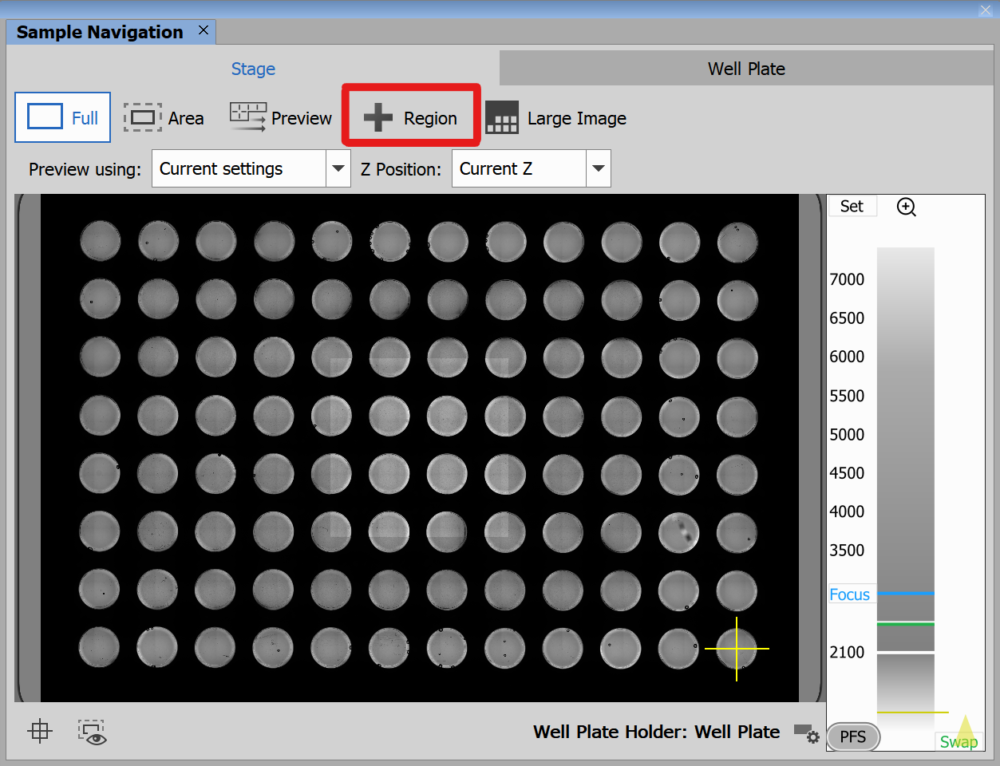
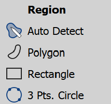
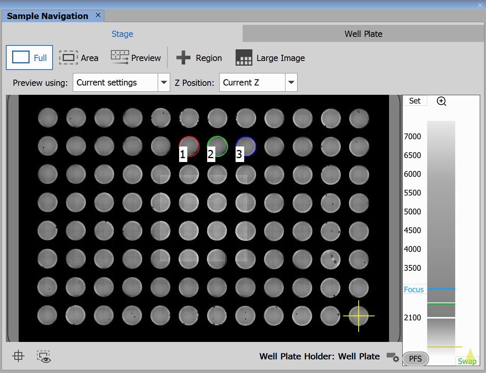
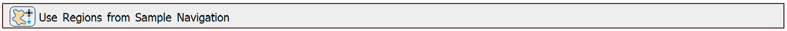
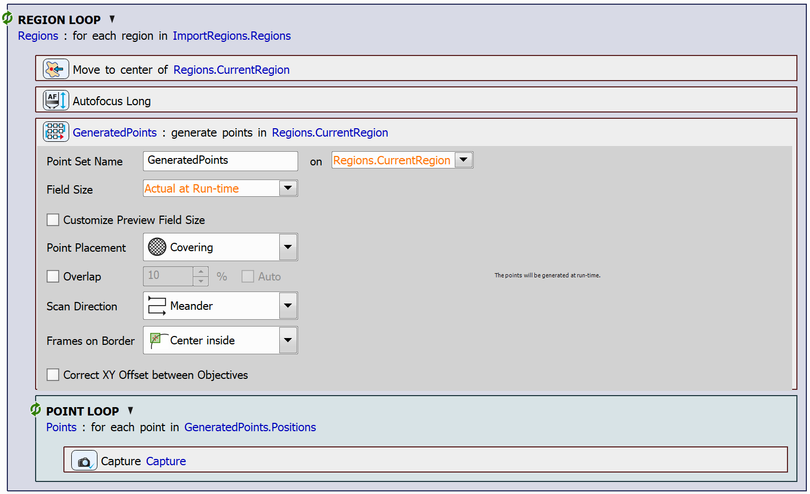

# Use Regions from Sample Navigation

This example shows how to import regions created in Sample Navigation and use them within a JOB. The JOB will scan an overview of these regions.

> [!NOTE]
> See also 
> - [Draw and Edit Regions](../39-Draw_regions/README.md)
> - [Append Empty Regions and Edit All After Acquisition](../40-Append_empty_regions/README.md)

## Creating Regions in Sample Navigation

Open the Sample Navigation window from **View → Acquisition Controls → Sample Navigation** and navigate to the *Stage* tab. Here, click the *Region* button:

This button opens a dialog where you can select the ROI type to draw:

Please, see the [Simple ROI Editor Controls](../39-Draw_regions/README.md#simple-roi-editor-controls) for details on how to use the available tools.

In this example, we used the *3 Pts. Circle* option to draw the following regions:

## Setting up the JOB

To import the regions defined in Sample Navigation into the JOB, use the `Use Regions from Sample Navigation` task:

Then we will create a region loop using the `Loop over Regions` task. In the loop we will first move to the center of the region using the `Move to Region Center` task and perform autofocus at this position using the `Autofocus Long` task. Then, we will generate a point set covering the region using the `Generate Points` task, after that, we will create a point loop using the `Loop over Points` task and capture images at each point within the loop using the `Capture Current OC` task.

JOB file: [[Download link](https://laboratory-imaging.github.io/JOBS-examples/NIS_v6.10/41-Use_regions_from_sample_nav/41-UseRegionsFromSampleNav.bin)] [[View as html](https://laboratory-imaging.github.io/JOBS-examples/NIS_v6.10/41-Use_regions_from_sample_nav/41-UseRegionsFromSampleNav.html)]