# Follow a moving object with stage (keep object in view)

The goal of this example is to track an object in real-time and keeping it in view by moving the stage.

> [!NOTE]
This example is shown on simulated devices - it doesn't require any real hardware for trying it out.

## Contents

- [Hardware setup](#hardware-setup)
- [Simple acquisition JOB](#simple-acquisition-job)
- [Simple JOB that follows the object (absolute)](#simple-job-that-follows-the-object-absolute)
- [Improved JOB that follows the object (relative)](#improved-job-that-follows-the-object-relative)
- [Extended JOB that follows the object in wells](#extended-job-that-follows-the-object-in-wells)

## Hardware setup

[Setup a Nikon Ti2 Simulator](../00-Common/Simulated_ti2_microscope_with_camera.md)

### Camera File simulator setup

For the camera simulator we will use an artificial time-lapse:
[bouncing_ball.nd2](bouncing_ball.nd2)

This is the maximum intensity projection of the bouncing ball: a ball moves from right to left with a bouncing effect.

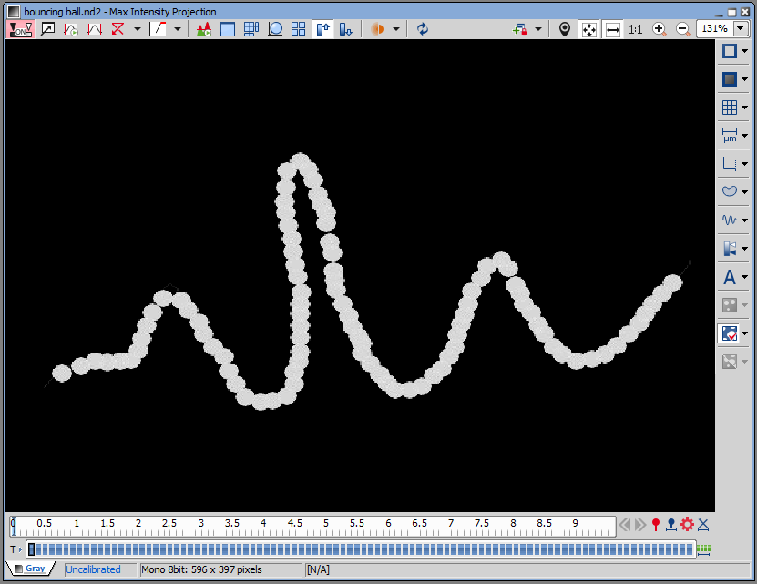

Set the movie into the camera simulator (click on "Load current ND").

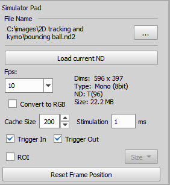

| :exclamation: set |  value       |
| ----------------  | ------------ |
| Calibration       | 1.61 µm/px   |
| Objective         | Achromat 10x |

## Simple acquisition JOB

Let's create a simple time-lapse acquisition JOB (menu: HCA/JOBS -> Create New JOB...)

With following tasks:
- Time loop task: set the Total Duration to "Number of Loops" and 96 (the length of the bouncing ball movie),
- Capture task.

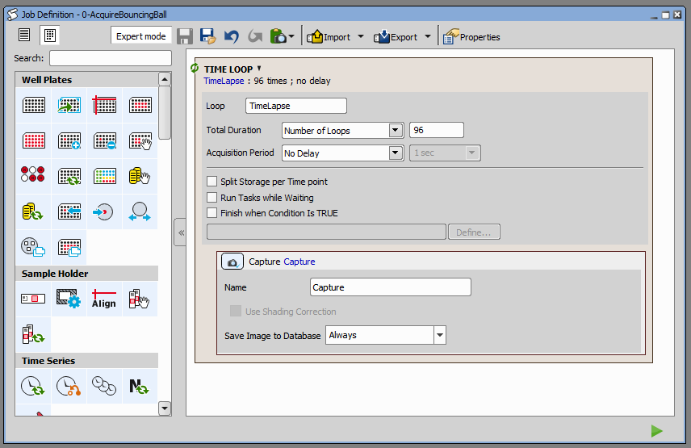

> [!NOTE]
> Remember 
> - to click the "Reset Frame Position" button before running experiments.
> - to set the stage position roughly in the middle of the scan area.

Run it, check the preview and in the results go to the Grid view and enable Statistics. 
After scrolling to the right you can see from the X and Y stage coordinates (and statistics) that the stage is not moving.

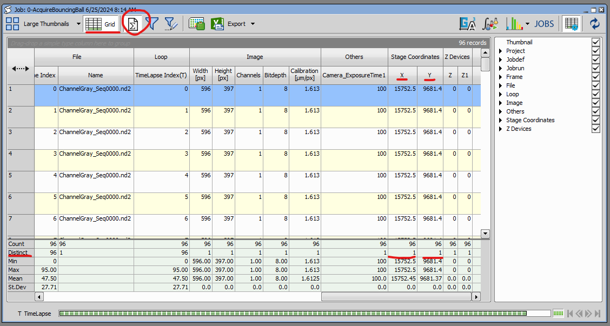

The final JOB: [0-AcquireBouncingBall.bin](0-AcquireBouncingBall.bin)

## Simple JOB that follows the object (absolute)

### 1. Create a GA3 recipe

In order to track the object we have to get its absolute stage coordinates. For this we will use the GA3 on the acquired time lapse.

In the GA3 recipe (menu: Image -> New GA3 recipe...) use following nodes:

- Bright spots: to segment the object,
- Select largest object: to make sure there is only one object,
- Object measurement: to measure objects' absolute position X and Y

We save everything (by connecting the nodes to save nodes): original image, detected binary object (for validation) and the object coordinates.

We connected BrightSpots node to "Fluo" (meaning all fluorescence channels) because we want to be very generic about the inputs. 
BrightSpots node makes average intensity if the channel has more components. For different modality (e.g. brightfield) the threshold may be more appropriate.

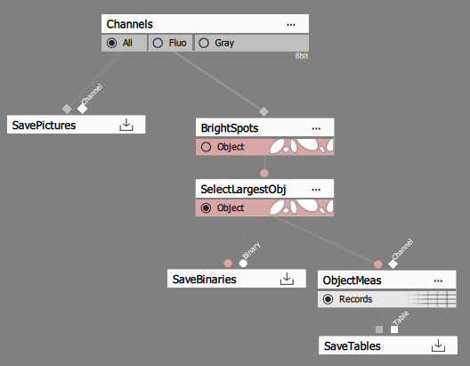

Set the spot detection quality generously in order not to lose any frame.

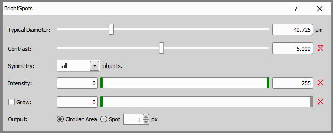

And finally measure the Absolute position of the object.

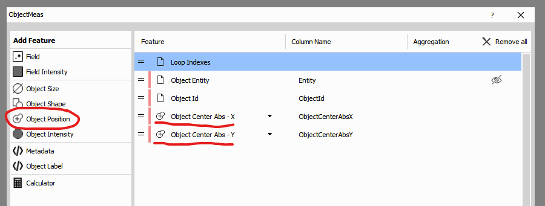

This should be the resulting table:

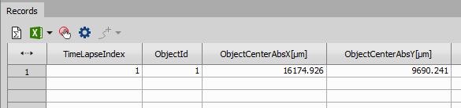

Final GA3 recipe: [FollowBouncingBall.ga3](FollowBouncingBall.ga3)

### 2. Use the GA3 recipe in JOBS

Open the previous JOB and save it under a different name in order to preserve the original JOB.

We will add three new tasks:
- GA3 task: to run the recipe after each acquired frame,
- Expression (ExpressionX): to move the stage in X and
- Expression (ExpressionY): to move the stage in Y.

#### The GA3 task

- Make sure the right recipe is selected (by default it is the last one). The name of the task should change to the name of the recipe.
- In the Save outputs tab uncheck the All under Images as we don't want to save the original image here (capture task saves it).
- In The Export parameters tab check the object position columns we measured (we don't need other columns).

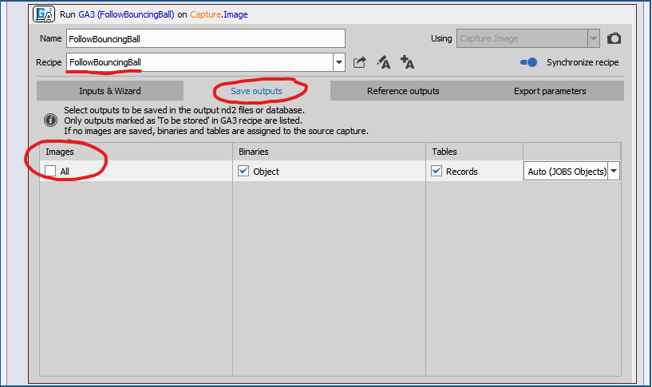

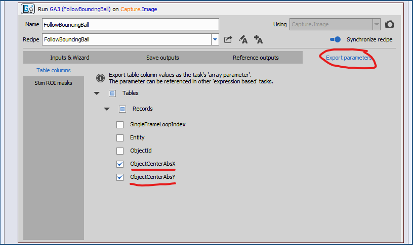

#### The ExpressionX task

After inserting the task rename it to "ExpressionX".

Then use the GUI as calculator:
- Select the X (X Coord) under Devices and click insert. It will add it into the expression below.
- Click the equal (=) symbol button. 
- Select the First in the tree as shown and click insert. The expression should be complete as shown.

or paste the following expression:
```c
Devices.X=Job.FollowBouncingBall.Tables.Records.ObjectCenterAbsX.First
```

The expression says:
> Assign the value "Job.FollowBouncingBall.Tables.Records.ObjectCenterAbsX.First" into "Devices.X"

To further break it:
- `Job.FollowBouncingBall` part represents the GA3 task,
- `Tables.Records.ObjectCenterAbsX` part is the column (an Array of numbers) we exported from the GA3 task,
- `First` part says that we want the first value of the column (or Array) and
- `Devices.X=` is just a convenient way to move the stage by setting the stage X coordinate.

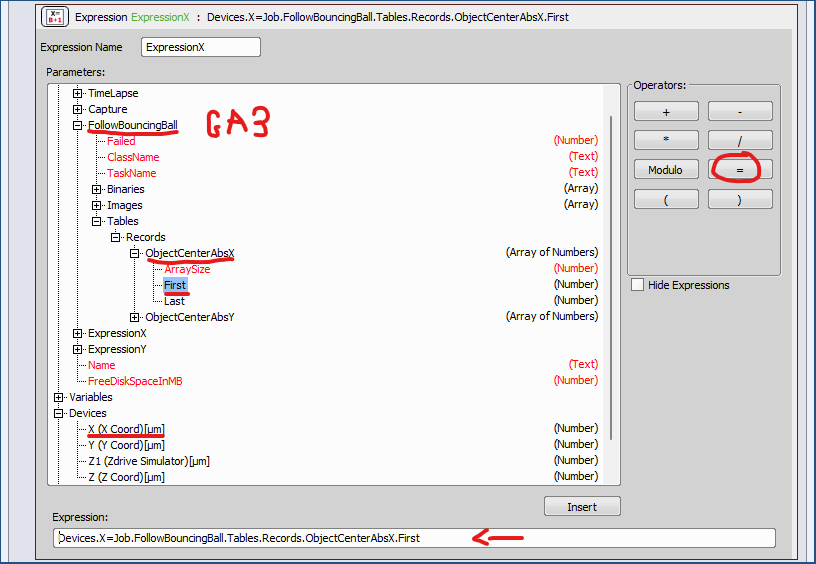

#### The ExpressionY task

Do exactly the same but replace the X with Y:
- rename the task to ExpressionY and 
- paste the following expression where we replaced X with Y (in Devices.**Y** and ObjectCenterAbs**Y**).

```c
Devices.Y=Job.FollowBouncingBall.Tables.Records.ObjectCenterAbsY.First
```

The final JOB should look like this:

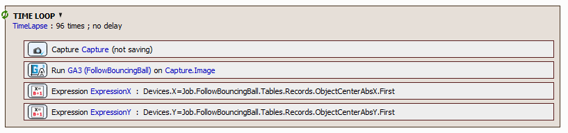

Display the XYZ Overview and run the JOB.
In the progress widow observe the preview for the correct detection and in the XYZ Overview for the stage movement. 

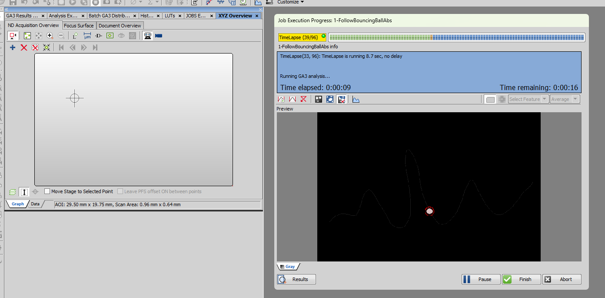

Finally, verify that the X and Y stage coordinates are changing.

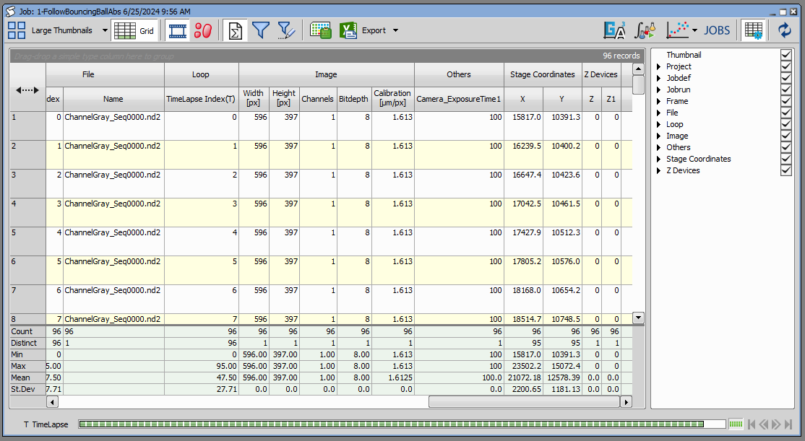

> [!IMPORTANT]
> Because we are running everything on simulators and hence there is no real stage movement affecting the image being captured the coordinates are **wrong**!
> However, if the same JOB and GA3 is run on real hardware with a moving object all will be fine. The images will show the object always in the middle of the frame (or near) 
> and the frame coordinates will show the stage movement as they try to correct for the object motion.
> With simulators we can just observe that the stage is moving. Later we will show that the movement is correct.

The final JOB : [1-FollowBouncingBallAbs.bin](1-FollowBouncingBallAbs.bin)

## Improved JOB that follows the object (relative)

The previous JOB tracks the object in such a way (absolute) that it moves the object into the center of the frame. Actually it moves with the stage so that the coordinate is in the center of the frame. 
This may result in a jump after the first frame if the object was not in the middle of the frame at the beginning. 
However, in most practical scenarios this shouldn't be the case as operators will naturally move the object of interest to the center of the frame.

In the following text we will show how to move relatively from the previous position. In order to do it we will introduce two new tasks into the JOB:
- Variables: to store the position of the object in the previous frame and
- Macro: where we will calculate the relative movement of the stage and do the move.

The GA3 recipe remains the same.

#### Variables task

Lets add three variables into the task:
- prevX: of type double for previous object X position
- prevY: of type double for previous object Y position
- prevValid: of type int to indicate if the prevX and prevY are valid (0 or 1)

Check "Always initiate" and set the initial value to zero (0) for all variables.

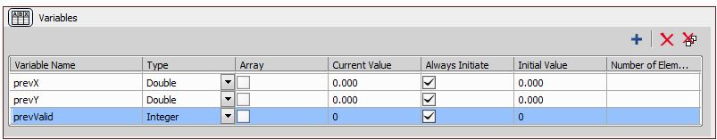

#### Macro task

In the Macro task, paste the following code:

```c
double deltaX = 0.0;
double deltaY = 0.0;

if (prevValid)
{
   deltaX = Job.FollowBouncingBall.Tables.Records.ObjectCenterAbsX.First - prevX;
   deltaY = Job.FollowBouncingBall.Tables.Records.ObjectCenterAbsY.First - prevY;
   
   Devices.X = Devices.X + deltaX;
   Devices.Y = Devices.Y + deltaY;
}

prevX = Job.FollowBouncingBall.Tables.Records.ObjectCenterAbsX.First;
prevY = Job.FollowBouncingBall.Tables.Records.ObjectCenterAbsY.First;
prevValid = 1;
```

Let's break it down:
1. Declare two variables deltaX and deltaY and set them to zero (0).
2. If we have a previous position (prevValid is not zero), everything between the '{' and '}' (called a *block*) will be executed. Otherwise (prevValid *is* zero) the whole block will be skipped. 
Inside the block we calculate the relative movement (deltaX and deltaY). Then we move the stage *by* deltaX and deltaY. 
We move *by* literally by taking the current position (Devices.X and Devices.Y), adding the relative movement (deltaX and deltaY) to it and setting it back as the current position to (Devices.X and Devices.Y).
3. We save the the object position to prevX and prevY and set prevValid to 1.


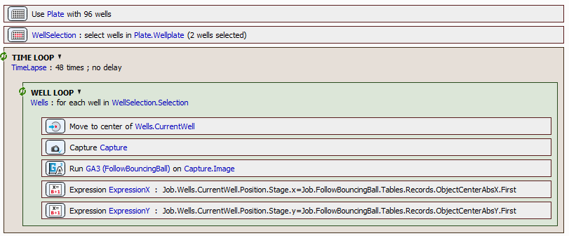

If we run the JOB everything should look like with the previous one except that the stage may hit its limits (see then important box below).

The final JOB : [2-FollowBouncingBallRel.bin](2-FollowBouncingBallRel.bin)

> [!IMPORTANT]
> Because we are running everything on simulators and hence there is no real stage movement affecting the image being captured the coordinates are **wrong**!
> However, if the same JOB and GA3 is run on real hardware with a moving object all will be fine. The images will show the object always in the middle of the frame (or near) 
> and the frame coordinates will show the stage movement as they try to correct for the object motion.
> With simulators we can just observe that the stage is moving.

In order to prove that the stage is following the object correctly we can compensate for the fact that the image is not reacting to the motion by tweaking the prevX and prevY variables.

```c
// !!! Add deltaX and deltaY ONLY when using simulator. Otherwise on real hardware remove it !!!
prevX = Job.FollowBouncingBall.Tables.Records.ObjectCenterAbsX.First + deltaX;
prevY = Job.FollowBouncingBall.Tables.Records.ObjectCenterAbsY.First + deltaY;
```

The JOB with corrected coordinates for the simulator: [3-FollowBouncingBallRelCorrectedForSimulator.bin](3-FollowBouncingBallRelCorrectedForSimulator.bin)

| :exclamation: Remember to *remove* the "+ deltaX" and  "+ deltaY" when using real hardware |
| ------------------------------------------------------------------------------------------ |

After the 'fix' corrected X, Y stage coordinates are reflecting only the object motion.

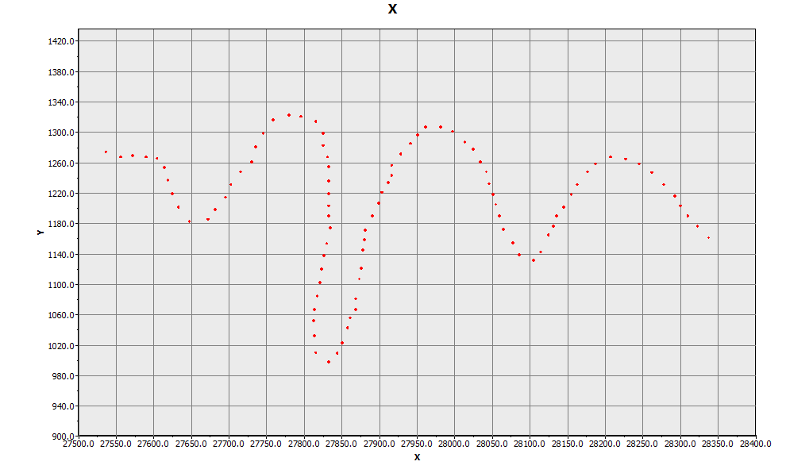

Versus the uncorrected X, Y coordinates where the object motion is compensated twice and accumulated until it hits the stage limit!

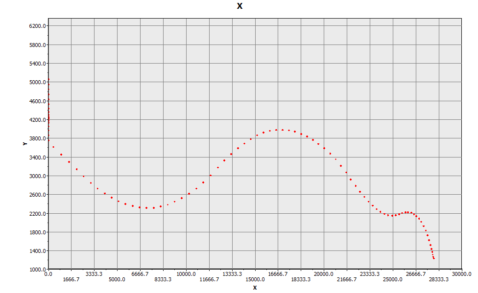

## Extended JOB that follows the object in wells

### absolute

For absolute version of the JOB we have to add two tasks relevant to the well-plate, a well loop and to slightly modify the expressions.

Specifically:
- We add plate definition at the beginning and select a plate (e.g. 96-well plate).
- After the plate definition task we add a well selection and select only two wells.
- Change the Total duration number of loops in the Time loop to 48 (because we have 96 frames in the ND2 file in the camera simulator).
- Inside the Time loop we add a well loop.
- Inside the Well loop we add the move to center task and all the remaining tasks (Capture, GA3, ExpressionX, ExpressionY).
- We modify the expression in ExpressionX and ExpressionY as follows:

ExpressionX:
```c
Job.Wells.CurrentWell.Position.Stage.x=Job.FollowBouncingBall.Tables.Records.ObjectCenterAbsX.First
```

ExpressionY:
```c
Job.Wells.CurrentWell.Position.Stage.y=Job.FollowBouncingBall.Tables.Records.ObjectCenterAbsY.First
```

Instead of moving the stage directly, we store the new position within the well. 
The stage will move to the new position during the Move to center task next time it goes around.

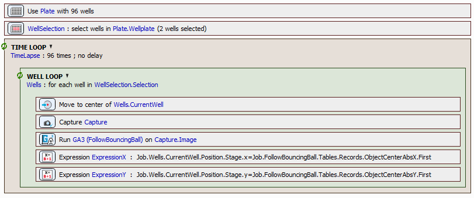

The final JOB : [4-FollowBouncingBallInWellsAbs.bin](4-FollowBouncingBallInWellsAbs.bin)

### relative

For relative version of the JOB we must create and store the prevX, prevY and prevValid variables for each well. 
As we have at maximum 96 wells (in this example) we will create arrays of size 96 for all variables called lastX, lastY and lastValid.
We will initialize the variables as shown below.

> [!NOTE]
> You can set the same value to all array elements be writing just one value. It will get copied automatically to all elements.

Insert the Variables task at the beginning of the JOB and define lastX, lastY and lastValid as follows:

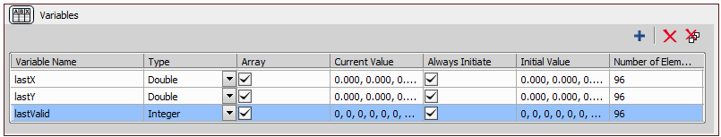

In the macro, replace:
- the prevX, prevY and prevValid with lastX[wellIndex], lastY[wellIndex] and lastValid[wellIndex] respectively and
- Devices.X and Devices.X with Job.Wells.CurrentWell.Position.Stage.x and Job.Wells.CurrentWell.Position.Stage.y

Here is how it should look like:
```c
double deltaX = 0.0;
double deltaY = 0.0;
int wellIndex = Job.Wells.Current;

if (lastValid[wellIndex])
{
   deltaX = Job.FollowBouncingBall.Tables.Records.ObjectCenterAbsX.First - lastX[wellIndex];
   deltaY = Job.FollowBouncingBall.Tables.Records.ObjectCenterAbsY.First - lastY[wellIndex];
   
   Job.Wells.CurrentWell.Position.Stage.x = Job.Wells.CurrentWell.Position.Stage.x + deltaX;
   Job.Wells.CurrentWell.Position.Stage.y = Job.Wells.CurrentWell.Position.Stage.y + deltaY;
}

lastX[wellIndex] = Job.FollowBouncingBall.Tables.Records.ObjectCenterAbsX.First;
lastY[wellIndex] = Job.FollowBouncingBall.Tables.Records.ObjectCenterAbsY.First;
lastValid[wellIndex] = 1;
```

And the whole JOB:

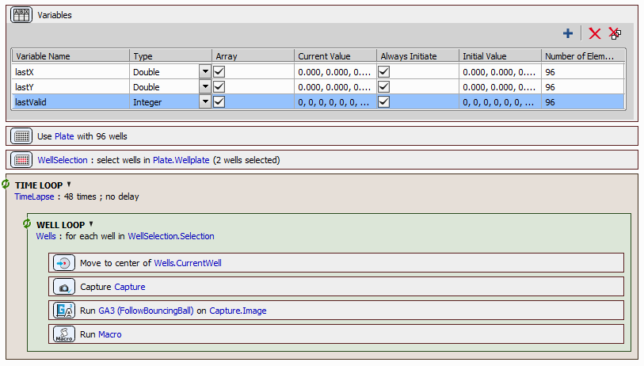

The final JOB : [5-FollowBouncingBallInWellsRel.bin](5-FollowBouncingBallInWellsRel.bin)

> [!IMPORTANT]
> Because we are running everything on simulators and hence there is no real stage movement affecting the image being captured the coordinates are **wrong**!
> However, if the same JOB and GA3 is run on real hardware with a moving object all will be fine. The images will show the object always in the middle of the frame (or near) 
> and the frame coordinates will show the stage movement as they try to correct for the object motion.
> With simulators we can just observe that the stage is moving.

Same as above: In order to prove that the stage is following the object correctly we can compensate for the fact that the image is not reacting to the motion by tweaking the prevX and prevY variables.

```c
// !!! Add deltaX and deltaY ONLY when using simulator. Otherwise on real hardware remove it !!!
lastX[wellIndex] = Job.FollowBouncingBall.Tables.Records.ObjectCenterAbsX.First + deltaX;
lastY[wellIndex] = Job.FollowBouncingBall.Tables.Records.ObjectCenterAbsY.First + deltaY;
```

The JOB with corrected coordinates for simulator: [6-FollowBouncingBallInWellsRelCorrectedForSimulator.bin](6-FollowBouncingBallInWellsRelCorrectedForSimulator.bin)

| :exclamation: Remember to *remove* the "+ deltaX" and  "+ deltaY" when using real hardware |
| ------------------------------------------------------------------------------------------ |

After the fix, the corrected X, Y stage coordinates are reflecting only tho object motion.

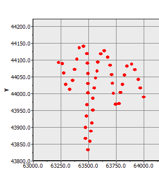 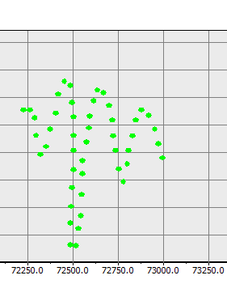

Versus the uncorrected X, Y coordinates, where the object motion is compensated twice and accumulated until it hits stage limit!

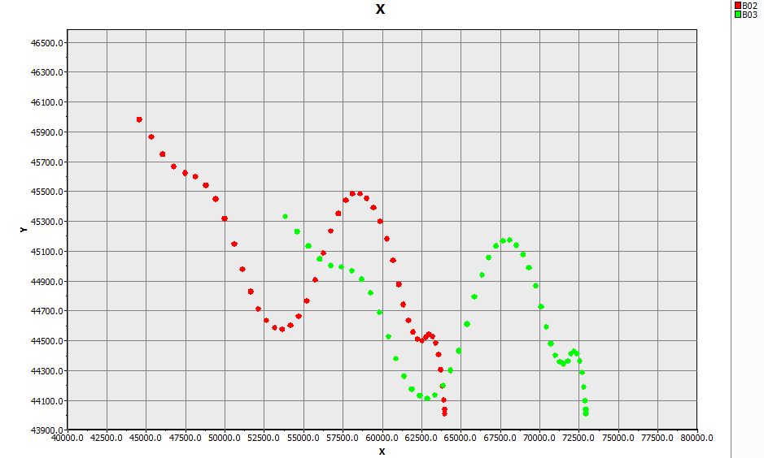

