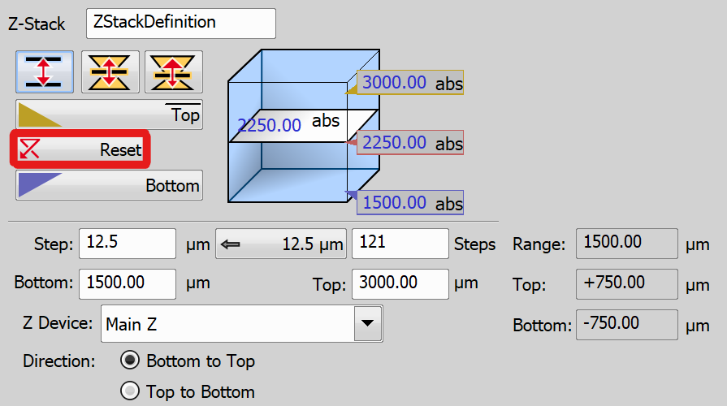

# Z-Stack Definition Options

This example will demonstrate several ways to define a Z-stack with the use of different tasks.

The tasks presented in this file are:

- [Define Z-Stack](#define-z-stack) → [JOB setup](#setting-up-the-job)
    - [Defined by top and bottom](#defined-by-top-and-bottom)
    - [Symmetric mode defined by range](#symmetric-mode-defined-by-range)
    - [Asymmetric mode defined by range](#asymmetric-mode-defined-by-range)
- [Z-Stack Bottom and Top](#z-stack-bottom-and-top) → [JOB setup](#setting-up-the-job-1)
- [Z-Stack Piezo from Bottom](#z-stack-piezo-from-bottom) → [JOB setup](#setting-up-the-job-2)
- [Z-Stack by Expression](#z-stack-by-expression) → [JOB setup](#setting-up-the-job-3)

## Define Z-Stack

The `Define Z-Stack` task offers full control over the Z-stack setup. There are three modes to define the Z-stack:

- [Defined by top and bottom](#defined-by-top-and-bottom)
- [Symmetric mode defined by range](#symmetric-mode-defined-by-range)
- [Asymmetric mode defined by range](#asymmetric-mode-defined-by-range)

### Defined by top and bottom

#### 1. Click the *Defined by top and bottom* button

   

#### 2. Define the Z-range of interest:

- Move the Z drive to the top position and press the *Top* button
- Move the Z drive to the bottom position and press the *Bottom* button

Both values can be adjusted in the *Bottom* and *Top* fields below.

   

#### 3. Enter the *Step* size in µm or specify the number of *Steps* to be captured

Enter the *Step Size* in micrometers (µm), which defines the distance between adjacent steps, or specify the total number of steps to be captured.

   

In this mode, the *Home* position is automatically set to the middle step (e.g., the third step out of a total of five steps). Selecting *Reset* will clear the settings for the *Top*, *Home*, and *Bottom* positions.

   

Note that the final Z-position (*Top* or *Bottom*) may slightly deviate from the user-defined settings based on the direction of Z-acquisition. To ensure precise control, you can choose to preserve either the *Top* or *Bottom* position. Right-click on the respective button (*Top* or *Bottom*) and select either *Keep Exact Top Position* or *Keep Exact Bottom Position*. The preserved position is visually indicated by underlining or overlining the corresponding button label.

   

### Symmetric mode defined by range

*Required value: range*

#### 1. Click the *Symmetric mode defined by range* button

   

#### 2. Move the Z drive to the absolute *Home* position (the center of your Z series) and click *Home*

If you are unsure of the exact center position, you can switch to *Relative* mode. In this mode, the *Home* position will be set based on the current Z position just before starting the acquisition.

   

#### 3. Specify the range from the *Home* position

Adjust the *Step Size* in micrometers (µm), which defines the distance between adjacent steps. For a recommended value, click *Use Suggested Step Size*. Alternatively, enter the total number of steps to be captured within this range or specify the range directly using the *Range* field.

   

### Asymmetric mode defined by range

#### 1. Click the *Asymmetric mode defined by range* button

   

#### 2. Move the Z drive to the absolute home position (center of your Z series) and click  Home.

If you are unsure of the exact center position, you can switch to *Relative* mode. In this mode, the *Home* position will be set based on the current Z position just before starting the acquisition.

   

#### 3. Specify the range from the *Home* position by entering the *Below* and *Above* values

Adjust the *Step Size* in micrometers (µm), which defines the distance between adjacent steps. For a recommended value, click *Use Suggested Step Size*. Alternatively, enter the total number of steps to be captured within this range or specify the *Below* and *Above* values directly.

   

### Setting up the JOB

In the JOB, we will use the *Symmetric mode defined by range* option to define the Z-stack:

Then, we will loop through the Z-stack using the `Z-Stack Loop` task and capture the images using the `Capture Current OC` task.

JOB file: [[Download link](https://laboratory-imaging.github.io/JOBS-examples/NIS_v6.10/43-Z_stack_definitions/43-ZStackDefine.bin)] [[View as html](https://laboratory-imaging.github.io/JOBS-examples/NIS_v6.10/43-Z_stack_definitions/43-ZStackDefine.html)]

<!--  --------------------------------------------------------------------------------------------------   -->

## Z-Stack Bottom and Top

The `Z-Stack Bottom and Top` task defines the Z-stack by its bottom and top position, much like was shown in the [Defined by top and bottom](#defined-by-top-and-bottom) section.

#### 1. Define the Z-range of interest:

- Move the Z drive to the top position and press the *Top* button
- Move the Z drive to the bottom position and press the *Bottom* button

   

#### 2. Enter the *Step Size*

Enter the *Step Size* in micrometers (µm), which defines the distance between adjacent steps. For a recommended value, click *Use Suggested Step Size*.

   

### Setting up the JOB

In the JOB, we will use the following settings to define the Z-stack:

Then, we will loop through the Z-stack using the `Z-Stack Loop` task and capture the images using the `Capture Current OC` task.

JOB file: [[Download link](https://laboratory-imaging.github.io/JOBS-examples/NIS_v6.10/43-Z_stack_definitions/43-ZStackBottomTop.bin)] [[View as html](https://laboratory-imaging.github.io/JOBS-examples/NIS_v6.10/43-Z_stack_definitions/43-ZStackBottomTop.html)]

<!--  --------------------------------------------------------------------------------------------------   -->

## Z-Stack Piezo from Bottom

The `Z-Stack Piezo from Bottom` task defines a Z-Stack by a relative range around the current Z position using only the Piezo Z drive. In the task's settings, specify the *Distance* and *Step Size*. For a recommended value, click *Use Suggested Step Size*.

   

### Setting up the JOB

In the JOB, we will use the following settings to define the Z-stack:

Then, we will loop through the Z-stack using the `Z-Stack Loop` task and capture the images using the `Capture Current OC` task.

JOB file: [[Download link](https://laboratory-imaging.github.io/JOBS-examples/NIS_v6.10/43-Z_stack_definitions/43-ZStackPiezoBottom.bin)] [[View as html](https://laboratory-imaging.github.io/JOBS-examples/NIS_v6.10/43-Z_stack_definitions/43-ZStackPiezoBottom.html)]

<!--  --------------------------------------------------------------------------------------------------   -->

## Z-Stack by Expression

The `Z-Stack by Expression` task defines a Z-Stack using absolute coordinates or variables available in NIS-Elements. Use the [...] button to insert variables into the corresponding edit box, or write directly into the input field.

   

### Setting up the JOB

In the JOB, we will first define the variables to use to define the range of the Z-stack as well as the step:

Next, we will use these variables in the `Z-Stack by Expression` task:

Then, we will loop through the Z-stack using the `Z-Stack Loop` task and capture the images using the `Capture Current OC` task.

JOB file: [[Download link](https://laboratory-imaging.github.io/JOBS-examples/NIS_v6.10/43-Z_stack_definitions/43-ZStackExpression.bin)] [[View as html](https://laboratory-imaging.github.io/JOBS-examples/NIS_v6.10/43-Z_stack_definitions/43-ZStackExpression.html)]

