# Working with Macro Variables and Python Variables in JOBs

Author : Andrii Rogov

## Table of Contents
- [Working with Macro Variables and Python Variables in JOBs](#working-with-macro-variables-and-python-variables-in-jobs)
  - [Table of Contents](#table-of-contents)
  - [Overview](#overview)
    - [Value in Microscopy Applications](#value-in-microscopy-applications)
    - [Learning Resources](#learning-resources)
  - [Prerequisites](#prerequisites)
  - [Setup Instructions](#setup-instructions)
    - [Hardware Setup](#hardware-setup)
    - [Camera File Simulator Setup](#camera-file-simulator-setup)
  - [Workflow Configuration](#workflow-configuration)
    - [Creating JOBs Macro Variables](#creating-jobs-macro-variables)
      - [1. Targetcellcount Variable](#1-targetcellcount-variable)
      - [2. info Variable](#2-info-variable)
    - [Setting Up the Workflow](#setting-up-the-workflow)
      - [Step 1: Add Capture Definition and Macro Command](#step-1-add-capture-definition-and-macro-command)
      - [Step 2: Configure Well Loop](#step-2-configure-well-loop)
    - [Python Task Configuration](#python-task-configuration)
      - [Step 1: Add Python Task](#step-1-add-python-task)
      - [Step 2: Create Python Variable](#step-2-create-python-variable)
  - [Implementation](#implementation)
    - [Python Code Implementation](#python-code-implementation)
      - [2. Working with Python and JOBs Variables](#2-working-with-python-and-jobs-variables)
      - [3. Debugging and Monitoring](#3-debugging-and-monitoring)
      - [4. Real-time Visualization](#4-real-time-visualization)
      - [5. Accessing Python Variables in JOBs](#5-accessing-python-variables-in-jobs)
      - [6. Monitoring with Question Tasks](#6-monitoring-with-question-tasks)
  - [Expected Results](#expected-results)

---

## Overview

The goal of this example is to demonstrate how to:
- Access standard macro JOBs variables inside Python scripts
- Create Python variables for acquisition and processing logic
- Access Python variables inside the main JOBs script
- Display real-time data visualization using matplotlib

**Workflow Summary:** 

- Scan a wellplate
- acquire images 
- count cells
- show the count in real-time display with the target count.

> **Note:** This example is created using the `2d-cells.nd2` file simulator and can be used offline with a simulator or on real hardware.

### Value in Microscopy Applications 

- Real time information and data display as a text and as a plot

### Learning Resources

> **Important:** This example is a modification of a workflow used in the LMS (Nikon Learning Management) Feedback Microscopy course (Video 1.7 Wellplate Cell Count). If you are unfamiliar with JOBs macro variables and macro commands, it is recommended to follow the course first.

- **How to register for LMS:** [Nikon e-learning](https://www.microscope.healthcare.nikon.com/resources/e-learning)
- **JOBs Feedback Microscopy course:** [JOBS Feedback Microscopy](https://training.nikoninstruments.com/#/online-courses/fa56d3c2-79b1-451c-a0dc-8c48a0db2492)
- **Full JOBs A-Z curriculum:** [JOBs A-Z curriculum](https://training.nikoninstruments.com/#/curricula/a413e7a8-6f95-4332-996b-12803c391ecf)

---

## Prerequisites

Before starting this tutorial, ensure you have:
- **Software:** NIS Elements with JOBs module
- **Hardware:** Compatible microscope system (or simulator)
- **Sample File:** `2d-cells.nd2` file (attached)
- **Python Knowledge:** Basic understanding of Python syntax
- **JOBs Knowledge:** Familiarity with macro variables and commands

---

## Setup Instructions

### Hardware Setup

Please follow video 1.2 "Setup" from the JOBs microscopy course if you need guidance on setting up NIS Elements with camera file simulator.

**Alternative:** You can use this workflow with real hardware if you have an appropriate sample.

---

### Camera File Simulator Setup

1. Use the attached `2d-cells.nd2` file. The channel name is "Mono". 
2. Set the 10x objective
3. Configure the simulator as shown below:

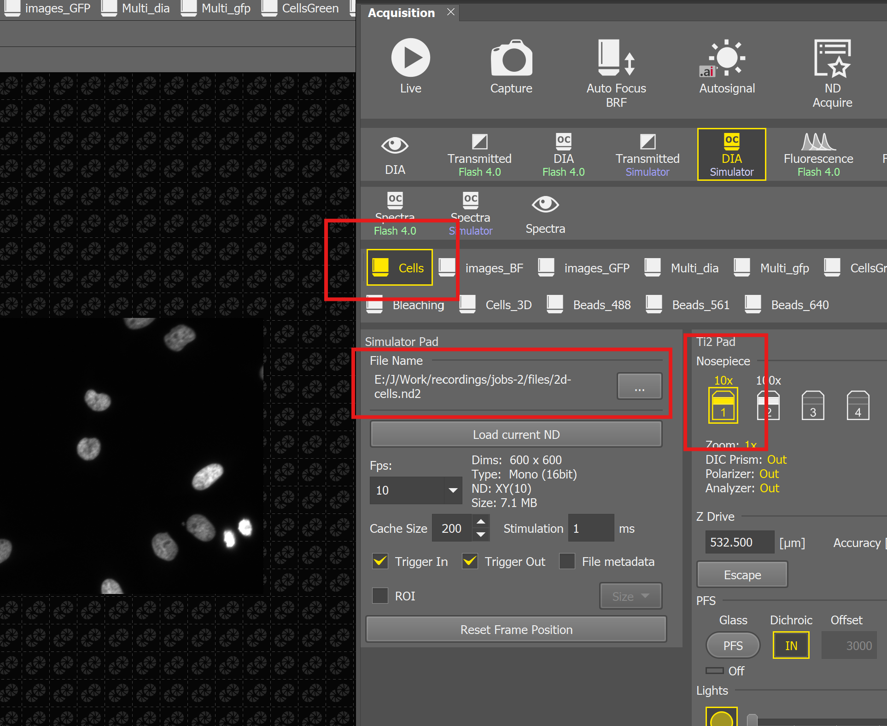

---

## Workflow Configuration

### Creating JOBs Macro Variables

Create two essential JOBs macro variables:

#### 1. Targetcellcount Variable
- **Purpose:** Input for the Python script (can be integrated into a wizard for user input)
- **Type:** Integer/Double
- **Usage:** Defines the desired target cell count 

#### 2. info Variable
- **Purpose:** Placeholder for Python output and debugging information
- **Type:** String
- **Usage:** Displays dynamic information from Python script

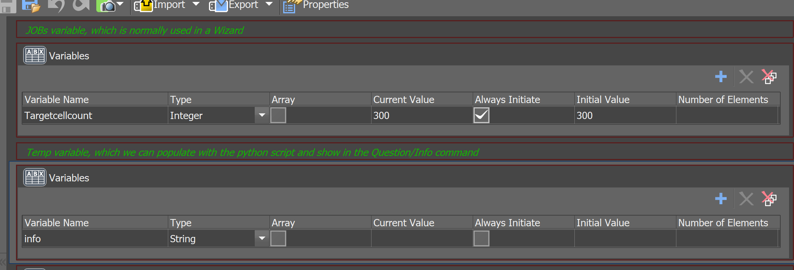

---

### Setting Up the Workflow

#### Step 1: Add Capture Definition and Macro Command
Add a macro command containing code to show the "JOBs HTML Progress window" for displaying custom information (live cell count).

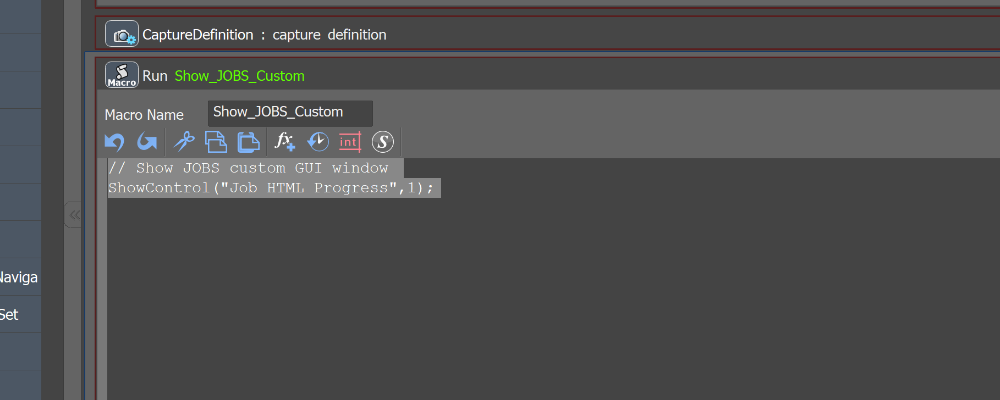

#### Step 2: Configure Well Loop
Use a well loop to iterate over your well selection and add an Expression command to access JOBs memory and get the exact name of the cell count from analysis.

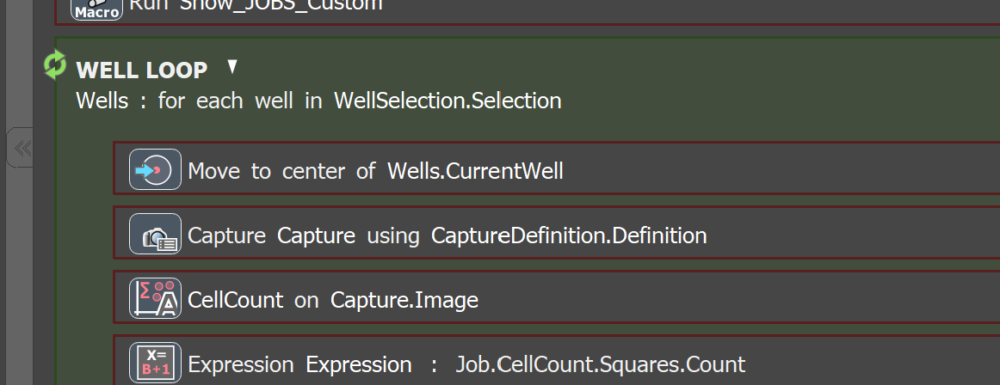

---

### Python Task Configuration

#### Step 1: Add Python Task
Add the Python task to your workflow.

#### Step 2: Create Python Variable
Create a Python variable with the following specifications:
- **Name:** `pyvar`
- **Type:** Double
- **Purpose:** Store cell count data for inter-task communication

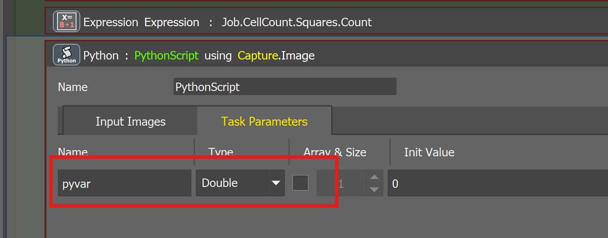

---

## Implementation

### Python Code Implementation

Here's the complete Python code with detailed comments:

```python
```python
# IMPORTANT: 'limjob' must be imported exactly like this (not 'from' nor 'as')
import limjob
import base64
import io
import matplotlib
import matplotlib.pyplot as plt
import numpy as np

# Global variables for tracking data across iterations
times = []
counts = []
t = 0

def figToHtml(fig: plt.Figure, width: float, height: float, dpi: float) -> str:
    """
    Transforms matplotlib figure to HTML with inline PNG image.
    
    Args:
        fig: Matplotlib figure object
        width: Figure width in inches
        height: Figure height in inches
        dpi: Dots per inch for image quality
    
    Returns:
        HTML string with embedded base64-encoded image
    """
    fig.set_figwidth(width)
    fig.set_figheight(height)
    file = io.BytesIO()
    fig.savefig(file, dpi=dpi)
    b64 = base64.b64encode(file.getvalue())
    return f''

def run(imgs: tuple[limjob.Image], Job: limjob.JobParam, macro: limjob.MacroParam, ctx: limjob.RunContext):
    """
    Main execution function called by JOBs for each iteration.
    
    Args:
        imgs: Tuple of acquired images
        Job: JOBs parameter object for accessing task parameters
        macro: Macro parameter object for accessing macro variables
        ctx: Runtime context object
    """
    global times, counts, t
    
    # Access macro variable defined in JOBs with "macro."
    cell_target = macro.Targetcellcount
    
    # Assign current cell count to Python variable
    # This makes the value available in JOBs scope through macro and Question commands
    

    # !!! Check the name of the channel and the JOB cell count analysis variable . In the example setup the channel name is "Mono". 
    Job.PythonScript.pyvar = Job.CellCount.Mono.Count
    
    # Update info variable with current iteration status
    # Using f-string for dynamic text output to display in JOBs
    macro.info = f"Current iteration: {t} | Current count: {Job.PythonScript.pyvar}"
    
    # Store data for plotting
    times.append(t)
    counts.append(Job.PythonScript.pyvar)
    
    # Increment iteration counter
    t += 1
    
    # Create matplotlib visualization
    plt.clf()  # Clear previous plot
    with matplotlib.style.context('default', True):
        fig, ax = plt.subplots()
        ax.set_title('Cell Count Analysis')
        
        # Bar chart for individual frame counts
        ax.bar(times, counts, alpha=0.7, label="Frame cell count")
        
        # Line plot for cumulative count
        cumulative = np.cumsum(counts)
        ax.plot(times, cumulative, 'x-', color='red', linewidth=2, label="Cumulative cell count")
        
        # Target line
        if times:  # Only draw if we have data points
            ax.plot([times[0], times[-1]], [cell_target, cell_target], 
                   '--', color='green', linewidth=2, label="Target cell count")
        
        # Formatting
        ax.set_xlabel('Time Point')
        ax.set_ylabel('Cell Count')
        ax.legend()
        ax.grid(True, alpha=0.3)
        
        # Convert to HTML and assign to progress window
        Job.ProgressHtml = figToHtml(fig, 10, 5, 90)
```


```


---

### Key Concepts

#### 1. Accessing Macro Variables in Python
To access a JOBs macro variable inside the Python script add "macro." at the beginning :

```python
cell_target = macro.Targetcellcount
```

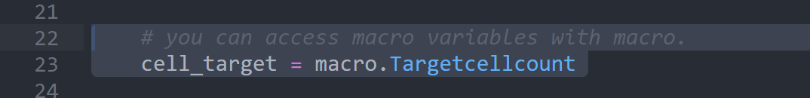

#### 2. Working with Python and JOBs Variables
Access both Python variables and JOBs analysis outputs:

```python
# !!! Check the name of the channel and the JOB cell count analysis variable . In the example setup the channel name is "Mono". 
Job.PythonScript.pyvar = Job.CellCount.Mono.Count
```

#### 3. Debugging and Monitoring
Use the `info` macro variable for debugging output:

```python
# Python excels at converting variables to strings
macro.info = f"Current iteration: {t} | Status: Processing"
```

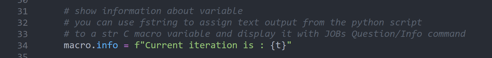

#### 4. Real-time Visualization
Use matplotlib with the `figToHtml()` function to create dynamic plots:

```python
# Transform matplotlib figure to HTML for JOBs display
Job.ProgressHtml = figToHtml(fig, 10, 5, 90)
```

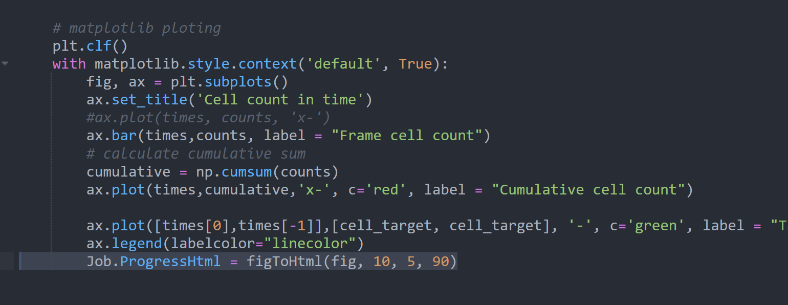

#### 5. Accessing Python Variables in JOBs
Use Expression tasks to locate Python variables within JOBs:

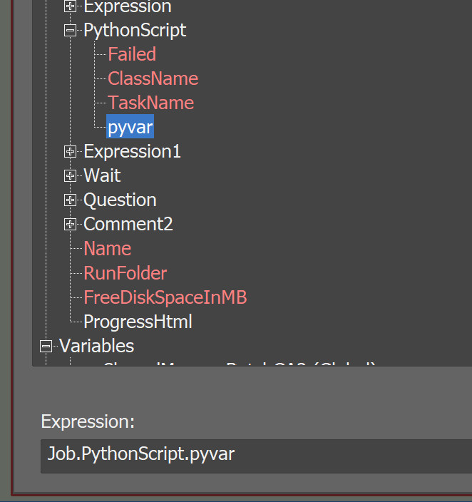

#### 6. Monitoring with Question Tasks
Use Question tasks to monitor Python variables and output:

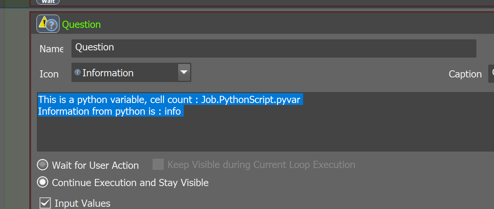

---

## Expected Results

When the workflow runs successfully, you should see:

1. **Real-time Plot:** Dynamic bar chart showing individual frame counts
2. **Cumulative Line:** Red line showing total accumulated cell count
3. **Target Line:** Green line indicating the target threshold
4. **Info Display:** Current iteration and status information
5. **Progress Window:** HTML-formatted plot updating with each iteration


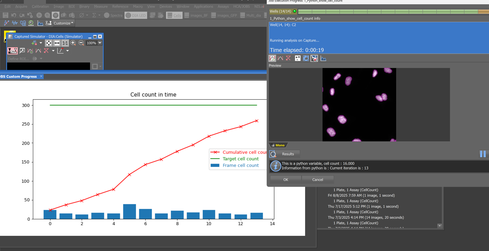

---

