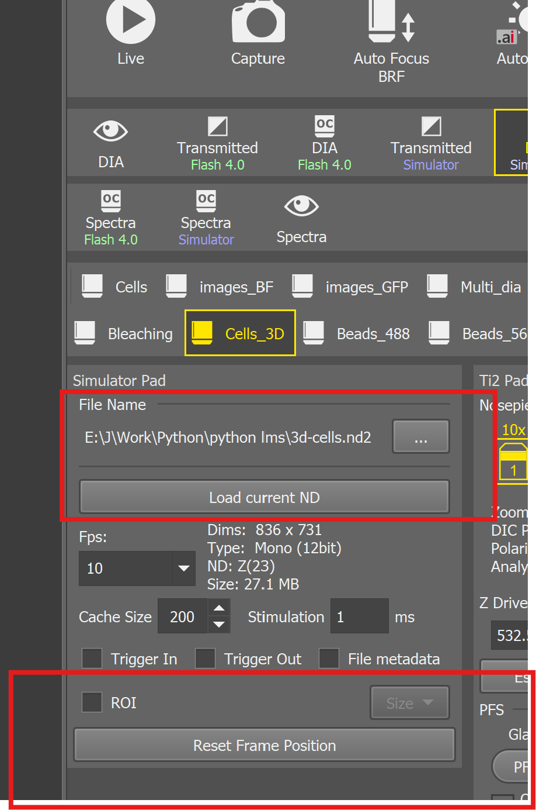
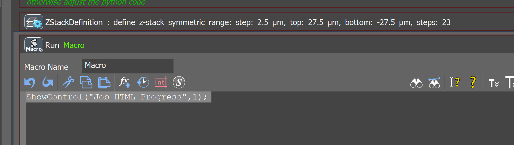
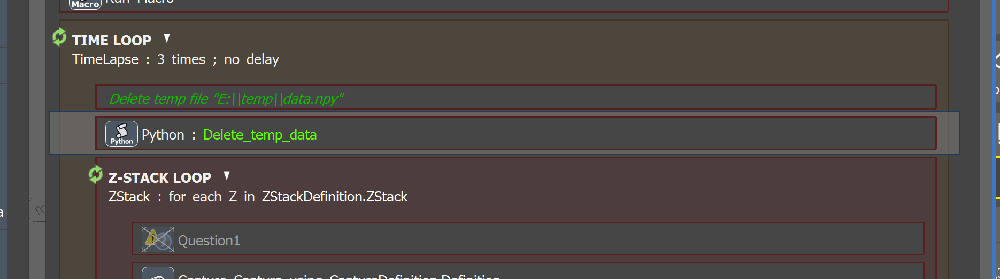
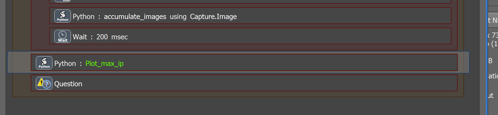
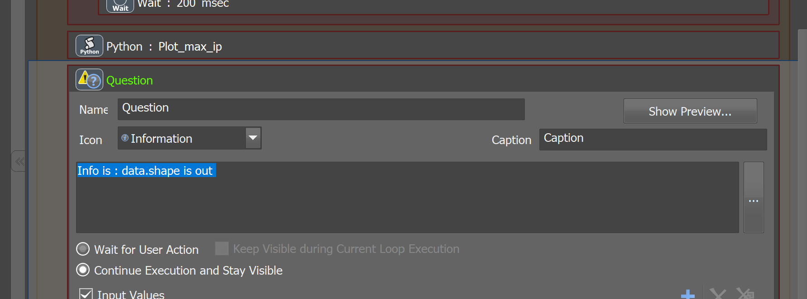
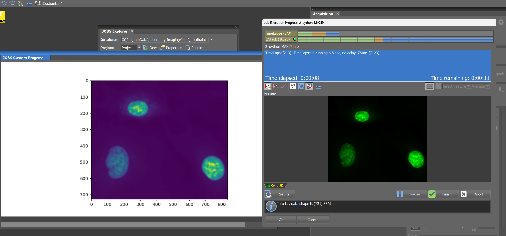

# Working with Image Data Inside Python Code in JOBs

Author : Andrii Rogov

## Table of Contents

- [Working with Image Data Inside Python Code in JOBs](#working-with-image-data-inside-python-code-in-jobs)
  - [Table of Contents](#table-of-contents)
  - [Overview](#overview)
    - [Value in Microscopy Applications](#value-in-microscopy-applications)
    - [Learning Objectives](#learning-objectives)
    - [Workflow Summary](#workflow-summary)
    - [Learning Resources](#learning-resources)
  - [Prerequisites](#prerequisites)
  - [Setup Instructions](#setup-instructions)
    - [Hardware Setup](#hardware-setup)
    - [Camera File Simulator Setup](#camera-file-simulator-setup)
  - [Implementation Steps](#implementation-steps)
    - [Step 1: Display JOBs HTML Progress Window](#step-1-display-jobs-html-progress-window)
    - [Step 2: Clean Up Temp Folder Before Z-Stack](#step-2-clean-up-temp-folder-before-z-stack)
    - [Step 3: Capture and Process Images in Z-Loop](#step-3-capture-and-process-images-in-z-loop)
    - [Step 4: Display Final MAXIP Result](#step-4-display-final-maxip-result)
    - [Step 5: Monitor Processing with Debugging Information](#step-5-monitor-processing-with-debugging-information)
  - [Expected Results](#expected-results)

---

## Overview

This tutorial demonstrates how to create a **Maximum Intensity Projection (MAXIP)** from Z-stack images using Python within the JOBs microscopy automation platform. The MAXIP technique combines multiple focal planes to create a single image showing the brightest pixels from each Z-position.

### Value in Microscopy Applications

The workflow demonstrates the ability to : 

- process and display image data in real time 
- provides standard interface (file I/O) for external image processing 

### Learning Objectives

By completing this tutorial, you will learn how to:

- **Access captured image data** as numpy arrays within JOBs Python scripts
- **Implement file-based data persistence** using temporary storage
- **Process image data** using Python libraries for real-time analysis
- **Display processed results** in the JOBs HTML progress interface

### Workflow Summary

This implementation uses a **file-based approach** for MAXIP calculation, storing intermediate results on disk. While this method requires additional file I/O operations, it provides valuable experience with data import/export workflows that can be extended to external image processing pipelines (out-proc).

**Processing Flow:**

1. **First Image:**
   
   - Capture image 
   - Convert to numpy array and save to temp folder

2. **Subsequent Images:**
   
   - Capture current image
   - Load previous MAXIP data from temp folder
   - Calculate pixel-wise maximum between current image and previous MAXIP image
   - Save updated MAXIP to temp folder

3. **Final Display:**
   
   - Load completed MAXIP image
   - Generate matplotlib visualization
   - Display result in JOBs HTML progress window

> **Note:** This tutorial uses the `3d-cells.nd2` simulator file and works both offline with the simulator and with real microscope hardware if you have a suitable sample.

### Learning Resources

- **Nikon e-Learning Registration:** [microscope.healthcare.nikon.com/resources/e-learning](https://www.microscope.healthcare.nikon.com/resources/e-learning)
- **JOBs Feedback Microscopy Course:** [JOBs Training Portal](https://training.nikoninstruments.com/#/online-courses/fa56d3c2-79b1-451c-a0dc-8c48a0db2492)
- **Complete JOBs Curriculum:** [JOBs A-Z Training](https://training.nikoninstruments.com/#/curricula/a413e7a8-6f95-4332-996b-12803c391ecf)

---

## Prerequisites

Before starting this tutorial, ensure you have the following:

**Software Requirements:**

- NIS Elements with JOBs module installed and configured

**File System Setup:**

- Temp folder created at `E:\temp\` (or modify path in code as needed)
- Write permissions for the temp folder location

**Sample Data:**

- `3d-cells.nd2` file (provided with tutorial)

**Knowledge Requirements:**

- Basic understanding of Python syntax and numpy arrays
- Familiarity with fundamental JOBs commands and workflow creation

---

## Setup Instructions

### Hardware Setup

If you need guidance on configuring NIS Elements with the camera file simulator, please refer to **Video 1.2 "Setup"** from the JOBs Microscopy Course.

**Alternative:** This workflow is compatible with real microscope hardware if you have an appropriate biological sample available.

### Camera File Simulator Setup

Follow these steps to configure the simulator environment:

1. **Load Sample File:** Use the provided `3d-cells.nd2` file in the camera simulator
2. **Set Objective:** Configure the system to use the **10x objective**
3. **Configure Simulator:** Set up the simulator interface as shown in the reference image
4. **Initialize Position:** Use **"Reset Frame Position"** to start from Z-layer 1



---

## Implementation Steps

### Step 1: Display JOBs HTML Progress Window

**Purpose:** Initialize the HTML progress display that will show our final MAXIP result.

**Implementation:** Use the JOBs macro command to activate the HTML progress window interface.



---

### Step 2: Clean Up Temp Folder Before Z-Stack

**Purpose:** Remove any existing MAXIP data files from previous runs to ensure a clean start.

**Process:** Check for the existence of previous temp files and delete them if found.



**Python Implementation:**

```python
# IMPORTANT: 'limjob' must be imported like this (not from nor as)
import limjob
import os

def run(imgs: tuple[limjob.Image], Job: limjob.JobParam, macro: limjob.MacroParam, ctx: limjob.RunContext):
     file_path = "E:\\temp\\data.npy"
     if os.path.exists(file_path):
        os.remove(file_path)   
```

---

### Step 3: Capture and Process Images in Z-Loop

**Purpose:** This is the core processing step that captures each Z-plane image and incrementally builds the MAXIP.

**Process Details:**

- **Image Acquisition:** Capture current Z-plane using JOBs Capture command
- **Data Conversion:** Transform captured image into numpy array format
- **MAXIP Calculation:** Compare current image with existing MAXIP data (pixel-wise maximum)
- **Data Temp Storage:** Save updated MAXIP to temp file for next iteration
- **Progress Monitoring:** Output image dimensions for monitoring/debugging 

**Key Algorithm:** The `numpy.maximum()` function performs element-wise comparison between the current image and the accumulated MAXIP, retaining the highest intensity value at each pixel position.

**Python Implementation:**

```python
# IMPORTANT: 'limjob' must be imported like this (not from nor as)
import limjob
import base64, io, matplotlib, matplotlib.pyplot as plt
import numpy as np
import os.path

def run(imgs: tuple[limjob.Image], Job: limjob.JobParam, macro: limjob.MacroParam, ctx: limjob.RunContext):

     # Get the first imag

    file_path = "E:\\temp\\data.npy"


    #  Get current image
    img = imgs[0]
    # transfor to array
    img_array = img.array()
    data = img_array[0,:,:,0] # (z, y, x, comps) 

    # output the image info (shape) into string data for monitoring
    macro.out = str(data.shape)

    if os.path.exists(file_path):

        # load the previous maxip image
        data_from_file = np.load(file_path)
        # calculate new maxip image
        data = np.maximum(data, data_from_file)

    # save new maxip image 
    np.save(file_path,data)
```

---

### Step 4: Display Final MAXIP Result

**Purpose:** After Z-stack acquisition is complete, load the final MAXIP data and create a visual display in the NIS-elements interface.

**Visualization Process:**

- **Data Loading:** Retrieve final MAXIP array from temp file storage
- **Plot Generation:** Create matplotlib figure with appropriate sizing and formatting
- **HTML Conversion:** Transform matplotlib figure into HTML-compatible base64 encoded image
- **Interface Display:** Show result in JOBs HTML progress window



**Python Implementation:**

```python
# IMPORTANT: 'limjob' must be imported like this (not from nor as)
import limjob
import base64, io, matplotlib, matplotlib.pyplot as plt
import numpy as np
import os.path

times = []
counts = []
t = 0

def figToHtml(fig: plt.Figure, width: float, height: float, dpi: float) -> str:
    fig.set_figwidth(width)
    fig.set_figheight(height)
    file = io.BytesIO()
    fig.savefig(file, dpi=dpi)
    b64 = base64.b64encode(file.getvalue())
    return f''


def run(imgs: tuple[limjob.Image], Job: limjob.JobParam, macro: limjob.MacroParam, ctx: limjob.RunContext):

      # Get the first imag

    file_path = "E:\\temp\\data.npy"

    if os.path.exists(file_path):
        data_from_file = np.load(file_path)
        data = data_from_file

    # Create a figure and axis
    fig, ax = plt.subplots(figsize=(10, 8))

    #Job.PythonGlobal.maxip = Job.PythonGlobal.maxip + data

    # Plot the image
    im = ax.imshow(data)

    Job.ProgressHtml = figToHtml(fig, 10, 5, 90)


    # Convert to numpy array for plotting

    #Job.PythonScript.test = img[0,0]
```

---

### Step 5: Monitor Processing with Debugging Information

**Purpose:** Display real-time processing information to verify workflow execution and troubleshoot any issues.

**Monitoring Implementation:** The `macro.out` variable displays image shape information that appears in the JOBs interface, allowing you to confirm that images are being processed correctly.

**Code Reference:**

```python
# output the image info (shape) into string data for monitoring
macro.out = str(data.shape)
```

**Interface Display:**



---

## Expected Results

Upon successful completion of the workflow, you should observe the **MAXIP image displayed in real-time** within the JOBs HTML progress window. The projected image will show enhanced contrast and detail by combining the brightest features from all Z-planes.

