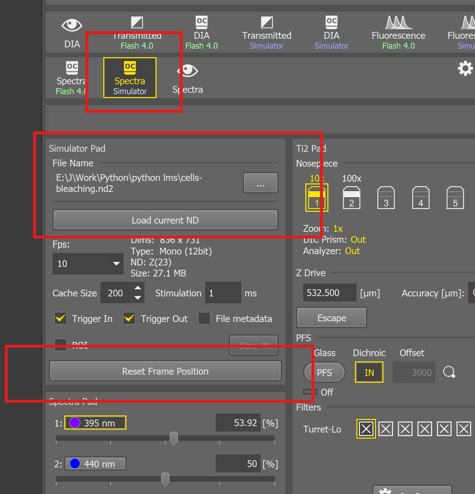
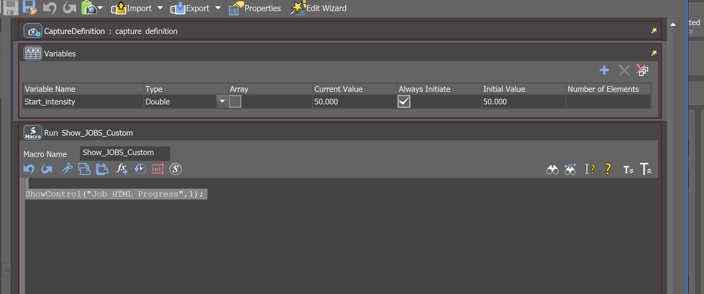
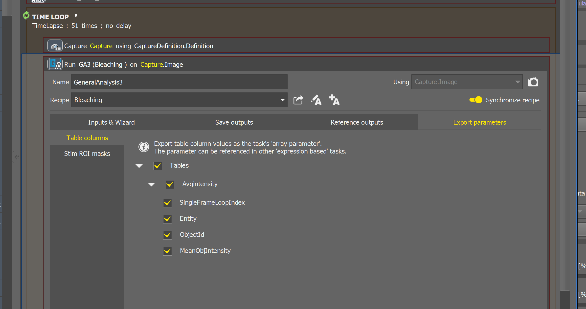
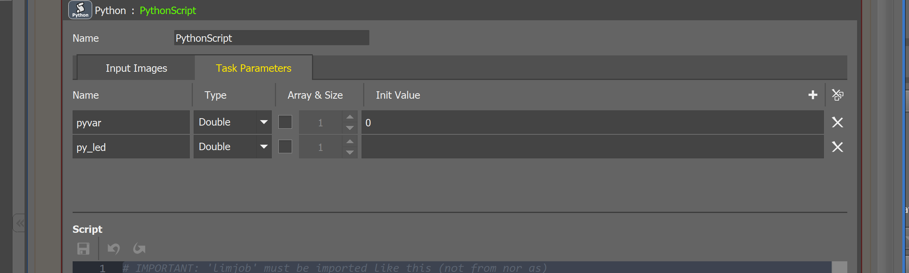
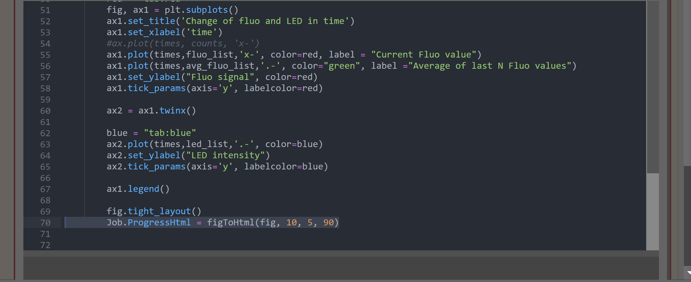
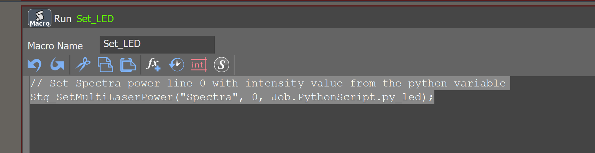
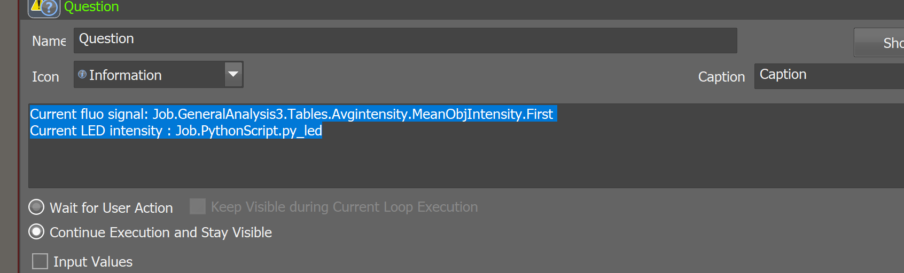
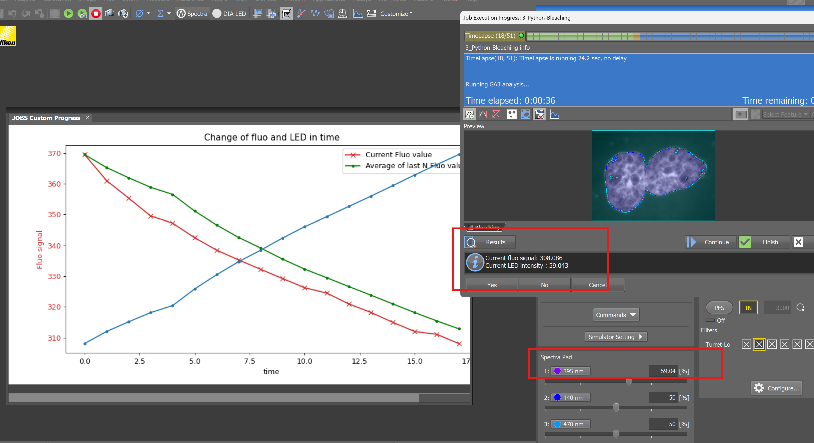

# How to Control Microscope Hardware Using Python Code

Author : Andrii Rogov

## Table of Contents

- [How to Control Microscope Hardware Using Python Code](#how-to-control-microscope-hardware-using-python-code)
  - [Table of Contents](#table-of-contents)
  - [Overview](#overview)
    - [Value in Microscopy Applications](#value-in-microscopy-applications)
    - [Learning Objectives](#learning-objectives)
    - [Workflow Summary](#workflow-summary)
    - [Learning Resources](#learning-resources)
  - [Prerequisites](#prerequisites)
  - [Setup Instructions](#setup-instructions)
    - [Hardware Setup](#hardware-setup)
    - [Camera File Simulator Setup](#camera-file-simulator-setup)
  - [Implementation Steps](#implementation-steps)
    - [Step 1: Create JOBs Variables](#step-1-create-jobs-variables)
    - [Step 2: Display JOBs HTML Progress Window](#step-2-display-jobs-html-progress-window)
    - [Step 3: Setup Time-lapse and GA3 Analysis](#step-3-setup-time-lapse-and-ga3-analysis)
    - [Step 4: Implement Python Feedback Script](#step-4-implement-python-feedback-script)
    - [Step 5: Control LED Intensity with Macro Command](#step-5-control-led-intensity-with-macro-command)
    - [Step 6: Display Real-time Monitoring Information](#step-6-display-real-time-monitoring-information)
  - [Expected Results](#expected-results)

---

## Overview

This tutorial demonstrates how to create an **automated feedback system** that monitors fluorescence intensity during time-lapse imaging and automatically adjusts LED excitation power to compensate for photobleaching. The system analyzes fluorescence signal in real-time and maintains consistent illumination levels throughout long-term experiments.

### Value in Microscopy Applications

The workflow demonstrates the ability to:

- **Work with data** using Python functions and libraries. Python has many well developed functions and libraries to communicated with external devices and software : TCP/IP, file I/O, serial commands, etc. 
- **Control microscope hardware** dynamically using Python-calculated variables
- **Monitor system performance** with real-time plots and data visualization

### Learning Objectives

By completing this tutorial, you will learn how to:

- **Integrate GA3 analysis results** into Python scripts for data processing
- **Implement feedback control algorithms** using Python arrays and calculations
- **Control hardware parameters** through JOBs macro commands driven by Python variables
- **Create real-time monitoring displays** with matplotlib and HTML integration
- **Build automated compensation systems** for photobleaching and signal degradation

### Workflow Summary

This implementation demonstrates a **complete feedback control system** that automatically compensates for fluorescence photobleaching during time-lapse imaging.

**Processing Flow:**

1. **First Image (Initialization):**
   - Capture image and run GA3 analysis
   - Store baseline fluorescence intensity in Python
   - Set initial LED power reference

2. **Subsequent Images (Feedback Loop):**
   - Capture current image and analyze fluorescence
   - Import GA3 results into Python arrays
   - Calculate moving average of recent intensity values
   - Compare current signal to baseline intensity
   - Calculate LED adjustment factor to compensate for signal loss
   - Update LED power through macro command
   - Display monitoring plots and data

3. **Real-time Monitoring:**
   - Generate matplotlib plots showing fluorescence trends and LED adjustments
   - Display numerical values for current intensity and LED power
   - Provide visual feedback on system performance

> **Note:** This example uses the `cells-bleaching.nd2` simulator file and can be used offline with the simulator or adapted for real hardware with appropriate calculation modifications.

### Learning Resources

This tutorial closely follows **Video 1.8 "Bleaching"** from the JOBs Feedback Microscopy course, extending the macro-only approach with Python's array processing capabilities.

- **Nikon e-Learning Registration:** [microscope.healthcare.nikon.com/resources/e-learning](https://www.microscope.healthcare.nikon.com/resources/e-learning)
- **JOBs Feedback Microscopy Course:** [JOBs Training Portal](https://training.nikoninstruments.com/#/online-courses/fa56d3c2-79b1-451c-a0dc-8c48a0db2492)
- **Complete JOBs Curriculum:** [JOBs A-Z Training](https://training.nikoninstruments.com/#/curricula/a413e7a8-6f95-4332-996b-12803c391ecf)

---

## Prerequisites

Before starting this tutorial, ensure you have the following:

**Software Requirements:**
- NIS Elements with JOBs module installed and licensed
- Python integration enabled in NIS Elements

**Sample Data:**
- `cells-bleaching.nd2` file (provided with tutorial)

**Knowledge Requirements:**
- Basic understanding of Python syntax, arrays, and functions
- Familiarity with fundamental JOBs commands and macro creation
- Understanding of fluorescence microscopy and photobleaching concepts

---

## Setup Instructions

### Hardware Setup

If you need guidance on configuring NIS Elements with the camera file simulator, please refer to **Video 1.2 "Setup"** from the JOBs Microscopy Course.

**Alternative:** This workflow is compatible with real microscope hardware if you have an appropriate fluorescent sample. Note that you will need to modify the LED adjustment calculation formula for real bleaching characteristics.

### Camera File Simulator Setup

Follow these steps to configure the simulator environment:

1. **Load Sample File:** Use the provided `cells-bleaching.nd2` file in the camera simulator
2. **Set Objective:** Configure the system to use the **10x objective**
3. **Configure Simulator:** Set up the simulator interface as shown in the reference image
4. **Initialize Position:** Use **"Reset Frame Position"** to start from the first time-lapse iteration



---

## Implementation Steps

### Step 1: Create JOBs Variables

**Purpose:** Create the baseline intensity variable that will store the reference fluorescence value and can be configured as user input.

**Implementation:** Create a JOBs variable named `Start_intensity` with type Double and initial value 50. This variable serves as the baseline reference for all intensity comparisons and LED adjustment calculations.



---

### Step 2: Display JOBs HTML Progress Window

**Purpose:** Initialize the HTML progress display that will show real-time monitoring plots generated by the Python script.

**Implementation:** Use the JOBs macro command to activate the HTML progress window interface.


---

### Step 3: Setup Time-lapse and GA3 Analysis

**Purpose:** Configure the time-lapse acquisition and GA3 analysis that will provide fluorescence intensity measurements for Python processing.

**Process Details:**
- **Time-lapse Setup:** Configure 51 iterations (matching the simulator file)
- **Image Capture:** Standard capture command for each time point
- **GA3 Analysis:** Configure to calculate and output "Avgintensity" variable containing average fluorescence intensity

**Critical Integration Point:** The GA3 analysis must produce `MeanObjIntensity` values that will be accessed by the Python script via `Job.GeneralAnalysis3.Tables.Avgintensity.MeanObjIntensity[0]`.



---

### Step 4: Implement Python Feedback Script

**Purpose:** Create the core Python script that processes fluorescence data, calculates LED adjustments, and generates real-time monitoring displays.

**Process Details:**
- **Data Import:** Access GA3 analysis results and store in Python arrays
- **Moving Average Calculation:** Smooth fluorescence measurements using last 5 data points
- **LED Adjustment Calculation:** Compute required LED power to maintain constant signal
- **Real-time Visualization:** Generate matplotlib plots for monitoring display



**Python Implementation:**

```python
# IMPORTANT: 'limjob' must be imported like this (not from nor as)
import limjob
import base64, io, matplotlib, matplotlib.pyplot as plt
import numpy as np

times = []
fluo_list = []
led_list = []
avg_fluo_list = []
t = 0
start_fluo = 0

# function which transforms matplotlib fig to html 
def figToHtml(fig: plt.Figure, width: float, height: float, dpi: float) -> str:
    fig.set_figwidth(width)
    fig.set_figheight(height)
    file = io.BytesIO()
    fig.savefig(file, dpi=dpi)
    b64 = base64.b64encode(file.getvalue())
    return f''

def run(imgs: tuple[limjob.Image], Job: limjob.JobParam, macro: limjob.MacroParam, ctx: limjob.RunContext):
    global times, fluo_list, led_list, t, start_fluo
    
    if t==0:
        start_fluo = Job.GeneralAnalysis3.Tables.Avgintensity.MeanObjIntensity[0]
        
    
    current_fluo =  Job.GeneralAnalysis3.Tables.Avgintensity.MeanObjIntensity[0]
    

    fluo_list.append(current_fluo)
    times.append(t)
    t = t + 1
  
    avg_window = 5
    avg_fluo = sum(fluo_list[-avg_window:])/len(fluo_list[-avg_window:]) # calculate avg of last N points 
    
    avg_fluo_list.append(avg_fluo)
    
    # ! this formula is created for the simulator example. It is different for real bleaching! 
    Job.PythonScript.py_led = macro.Start_intensity*(start_fluo/avg_fluo)
    
    led_list.append(Job.PythonScript.py_led)
    
    # matplotlib ploting
    plt.clf()
    with matplotlib.style.context('default', True):
        
        red = 'tab:red'
        fig, ax1 = plt.subplots()
        ax1.set_title('Change of fluo and LED in time')
        ax1.set_xlabel('time')
        #ax.plot(times, counts, 'x-')
        ax1.plot(times,fluo_list,'x-', color=red, label = "Current Fluo value")
        ax1.plot(times,avg_fluo_list,'.-', color="green", label ="Average of last N Fluo values")
        ax1.set_ylabel("Fluo signal", color=red)
        ax1.tick_params(axis='y', labelcolor=red)
        
        ax2 = ax1.twinx()
        
        blue = "tab:blue"
        ax2.plot(times,led_list,'.-', color=blue)
        ax2.set_ylabel("LED intensity")
        ax2.tick_params(axis='y', labelcolor=blue)
        
        ax1.legend()
        
        fig.tight_layout()
        Job.ProgressHtml = figToHtml(fig, 10, 5, 90)
```

**Key Algorithm Components:**

**Data Import from GA3:**
```python
if t==0:
    start_fluo = Job.GeneralAnalysis3.Tables.Avgintensity.MeanObjIntensity[0]
    
current_fluo = Job.GeneralAnalysis3.Tables.Avgintensity.MeanObjIntensity[0]
```

**Moving Average Calculation:**
```python
avg_window = 5
avg_fluo = sum(fluo_list[-avg_window:])/len(fluo_list[-avg_window:])
```

**LED Adjustment Calculation:**
```python
Job.PythonScript.py_led = macro.Start_intensity*(start_fluo/avg_fluo)
```



---

### Step 5: Control LED Intensity with Macro Command

**Purpose:** Use the Python-calculated LED adjustment value to control the actual microscope hardware through JOBs macro commands.

**Implementation:** Create a macro command that reads the `py_led` variable calculated by Python and applies it to the LED hardware control.

**Macro Command:**
```c
// Set Spectra power line 0 with intensity value from the python variable
Stg_SetMultiLaserPower("Spectra", 0, Job.PythonScript.py_led);
```

**Integration Flow:** Python calculates → `py_led` variable stores result → JOBs macro reads variable → Hardware command executes LED power change



---

### Step 6: Display Real-time Monitoring Information

**Purpose:** Provide text-based monitoring of key system variables alongside the graphical plot display.

**Implementation:** Use Question/Information command to display numerical values for current fluorescence and LED intensity.

**Monitored Variables:**
- **Current Fluorescence Signal:** `Job.GeneralAnalysis3.Tables.Avgintensity.MeanObjIntensity.First`
- **Current LED Intensity:** `Job.PythonScript.py_led`



---

## Expected Results

Upon successful completion of the workflow, you should observe the following:

**Real-time Plot Display:**
- **Red Line:** Current fluorescence intensity showing gradual decline due to photobleaching
- **Green Line:** 5-point moving average providing smoother trend indication
- **Blue Line:** LED intensity showing gradual increase to compensate for signal loss

**Text Monitoring Display:**
- Current fluorescence signal values updated each iteration
- LED intensity values showing compensation adjustments
- Time point progression through the experiment

**Hardware Response:**
- LED power display on the microscope interface showing updated values
- Maintained image brightness throughout the time-lapse sequence
- Smooth, gradual adjustments without oscillations or erratic behavior

