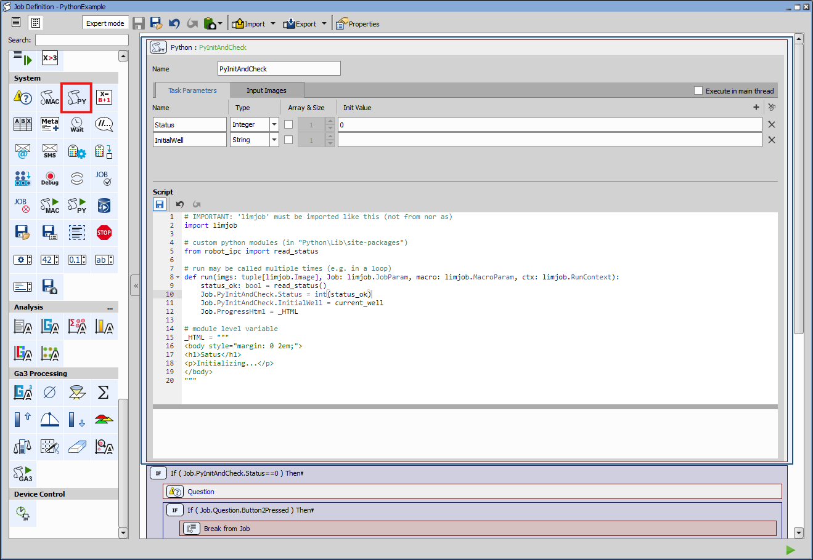
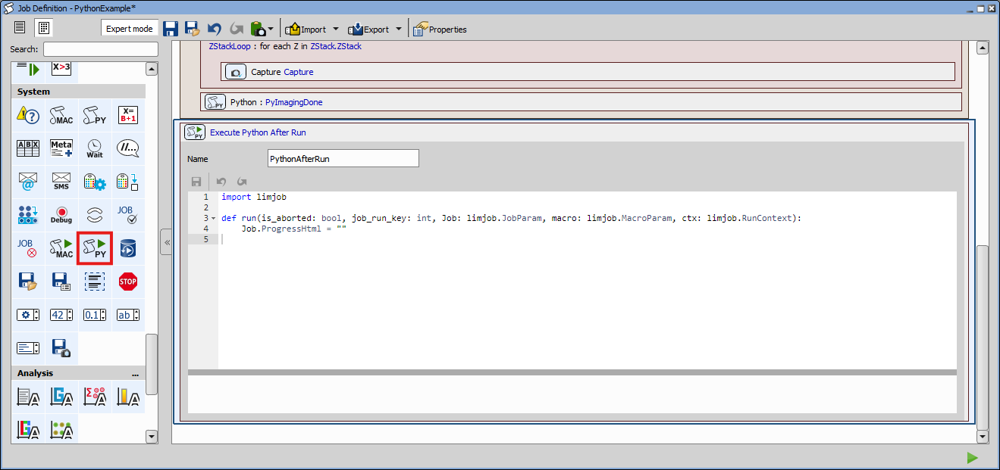
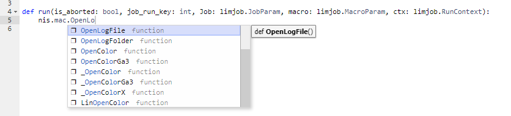

# Python in JOBS

This page describes JOB tasks that execute Python scripts and provides simple examples demonstrating how to use them in practice.

## Contents
- [Python Script task](#python-script-task)
  - [Default code template](#default-code-template)
  - [Task Parameters](#task-parameters)
  - [Input Images](#input-images)
  - [Execute in the main/jobs thread](#execute-in-the-main-thread) (new in 7.01)
  - [Python code execution model](#python-code-execution-model)
  - [Available built-in python modules](#python-code-execution-model)
  - [DeviceManager API](#devicemanager-api)
  - [Pointset](#pointset)
  - [Image](#image)
  - [Examples](#examples)
- [Execute Python after Run task](#execute-python-after-run-task)
  - [Default code template](#default-code-template-1)
  - [Examples](#examples-1)
- [Using NIS macro in Python](#using-nis-macro-in-python)
  - [Purpose of the nis module](#purpose-of-the-nis-module)
  - [Calling NIS macro functions](#calling-nis-macro-functions)

## Python Script task



The `Python Script` task execute Python code.
Its alternative to `Run Macro` task. It enables you to use both
* Python code
* NIS macro calls (via [`nis` module](#using-nis-macro-in-python))

> [!NOTE]
>
> Execution in the main thread may be required when using NIS-Elements macro language functions or accessing macro variables.
>
> Running the task in a side thread, on the other hand:
> * Allows interaction with the JOB progress dialog
> * Enables use of `ctx.shouldAbort()` for responsive cancellation
> * Prevents the NIS-Elements window from freezing while the task is running
>
> Choose the execution mode according to whether your code relies on macro functionality or requires responsive UI behavior.

In addition, you can create custom JOB parameters and easily access captured images.

Users can define task parameters that:
* Are visible to other tasks in the JOB
* Are accessible within the task itself during execution

These parameters are initialized to their specified values before the JOB starts.
User can define parameters of the task that are visible to other tasks in the job and to itself during the run.

After modifying the code, click Apply.
The script is evaluated immediately, and any syntax or validation errors are displayed in the message box below the editor.

### Default code template
The task provides the following default structure:

````python
import limjob

def run(imgs: tuple[limjob.Image], Job: limjob.JobParam, macro: limjob.MacroParam, ctx: limjob.RunContext):
    pass
````

The function `run` is called everytime the Python Script task is executed.
It must always be defined and must have the following parameters:

* `imgs`
  * Type: `tuple[limjob.Image]`
  * Provide access to images defined in Input Images
  * The index in the tuple cprresponds to the `#` column in the Input Images table.
  * Call the `array()` method to retrieve image data as a **read only** 4D `numpy.ndarray` with shape (Z, Y, X, Component).
  ````python
  def run(imgs: tuple[limjob.Image], Job: limjob.JobParam, macro: limjob.MacroParam, ctx: limjob.RunContext):
    img_data = img[0].array()[0, :, :, 0] # Retrieve first Z-slice and first component as 2D numpy array
  ````

* `Job`
  * Type: `limjob.JobParam`
  * Provides access to JOB tasks and task parameters

  ````python
  def run(imgs: tuple[limjob.Image], Job: limjob.JobParam, macro: limjob.MacroParam, ctx: limjob.RunContext):
      print(Job.Plate.Wellplate.Barcode) # prints barcode of wellplate defined in `Plate` task
  ````

* `macro`
  * Type: `limjob.MacroParam`
  * Provides access to global macro variables

  If a global variable is defined in a macro, it becomes accessible in the `Execute Python After Run` task through the macro parameter
  ````cpp
  // macro
  global int my_global_variable;
  my_global_variable = -1;
  ````
  Accessing and modifying the variable in Python:
  ````python
  def run(imgs: tuple[limjob.Image], Job: limjob.JobParam, macro: limjob.MacroParam, ctx: limjob.RunContext):
      print(macro.my_global_variable) # prints current value
      macro.my_global_variable = 5;   # sets a new value
  ````

* `ctx`
  * Type: `limjob.RunContext`
  * Provides access to additional helper functions
  * See `limjob.py` in the `site-packages folder` for available methods (see [examples](#examples))

### Task Parameters
You can add a new parameter by clicking the `+` button, then defining
* Name
* Type
* Initial value

The initial value is evaluated as python code.
For example, for initializing float array you can use either `[0, 1, 2, 3, 4]` or `range(0,5)`.
Parameters are reinitialized each time the JOB program starts.

Task parameters:
* Can be accessed for reading and writing within the same task.
* Can also be accessed and edited by other tasks (e.g., an Expression task).

When modifying an array parameter in Python, you must assign the entire array:
````python
def run(imgs: tuple[limjob.Image], Job: limjob.JobParam, macro: limjob.MacroParam, ctx: limjob.RunContext):
    Job.PythonScript.NewParam = (0, 1, 2, 3, 4)
````

Task parameters of type Filepath are not evaluated as Python code. The simplest way to set them is:
1. Click the `...` button
2. Select the desired file.

In a Python script, Filepath parameters are treated as string variables.

### Input Images
You can add a new input image by clicking the `+` button and selecting an image from the drop-down menu.
The drop-down list contains images produced by tasks that appear earlier in the JOB.
To access the selected images in Python, use the `imgs` input parameter in the `run` function.

> [!NOTE]
>
> Image access is currently limited by the loop structure of the JOB.
>
> To access an image:
> * The Python task and the task generating the image must be placed at the same loop level.
> * If they are in different loop levels, the image may not be accessible.
>
> Ensure that both tasks are located within the same loop scope if image data needs to be shared.


### Execute in the main thread

The Execute in the main thread checkbox controls whether the Python script runs in the NIS-Elements main GUI application thread or in a background (JOBS) thread.

#### When Enabled
* The script runs in the main thread of NIS-Elements.
* It is blocking the GUI when executing python code.
* Required when:
  * Calling certain NIS macro functions
  * Accessing or modifying macro variables
  * Using functionality that must interact directly with the application UI

If a macro function requires main-thread execution and this option is not enabled, the script may fail or behave unpredictably.

#### When Disabled
* The script runs in the JOBS thread.
* Recommended for:
  * Long-running calculations
  * Image processing
  * Tasks that should remain responsive to cancellation

Running in a side thread:
* Allows interaction with the JOB progress dialog
* Enables responsive cancellation via `ctx.shouldAbort()`
* Prevents the NIS-Elements window from freezing during execution

> [!NOTE]
>
> Enable this option when using macro functions. Disable it for computational tasks that do not require macro interaction and benefit from responsive UI behavior.

### Python code execution model

The python code is evaluated when the job is initialized. The `run(...)` function is called every time the task is executed in the JOBs sense:
more than once when the task is in a loop. Module level variables may be used to store values between consecutive `run(...)` calls.

Each Python node is defined in a dedicated python module separated from others. Hence it has its own namespace.

Nodes can share state between each other using:

1. provided JOBS tools (for primitive types)
    - task parameters (Python's or of other nodes)
    - macro variables

2. python language tools (for python managed objects)
    - ad-hoc module attributes (see example below)
    - proper dedicated module with supporting functionality (see example below)
    - files, ...

#### How to use a module (e.g. limjob) to share ad hoc state between tasks

In JOBS python nodes are executed in within the NIS-Elements process inside a single python interpreter. In python
every module is a *singleton* guaranteed to exist in exactly one instance. This feature can be used to store the
state and be sure to always access the same state. We use `limjob` for convenience as it must be imported anyway.

As python is an interpreted language it is possible to read, write and query attributes of a module after it is loaded using
[`setattr(...)`](https://docs.python.org/3/library/functions.html#setattr),
[`getattr(...)`](https://docs.python.org/3/library/functions.html#getattr),
[`delattr(...)`](https://docs.python.org/3/library/functions.html#delattr) and
[`hasattr(...)`](https://docs.python.org/3/library/functions.html#hasattr).

> [!WARNING]
>
> Be careful not to overwrite existing module attribute.

> [!NOTE]
>
> The attribute remains in the module until NIS-Elements end (the module is unloaded) unless explicitly deleted.
> When using this technique be sure to first initialize such attribute before using it.

See an example [How to share state between Python tasks](sharing-state-example.md).

#### How to create dedicated module

When the functionality grows above a level that is manageable from within one python task it is better to create
a dedicated module (a python file) that exposes its functionality using functions. It hides the complexity and
state.

Modules are loaded from the Python site-package folder inside NIS-Elements installation:
```
C:\Program Files\NIS-Elements\Python\Lib\site-packages
```

However it is more convenient to have the module elsewhere (perhaps under version control like git) and add
that folder to the Python path variable using:

```python
# IMPORTANT: 'limjob' must be imported like this (not from nor as)
import limjob

# Add a folder to search path
# This has to be done only once (in the first python task)
import sys
sys.path.append(R'C:\NisPythonExtensions\MyRobot')

# the C:\NisPythonExtensions\MyRobot will be searched for robot_control.py
from robot_control import connect_robot, disconnect_robot, command_for_robot

# Use the imported functionality
```

See an example [How to create a dedicated module](dedicated-module-example.md).

### Available built-in python modules

The following list of modules is preinstalled with NIS-Elements. Any of these modules can be safely used.

- httpx
- Jinja2
- limnd2
- matplotlib
- numpy
- ome_types
- openpyxl
- pandas
- packaging
- paramiko
- psutil
- pydantic
- pydantic-settings
- pywin32
- playwright
- requests
- scikit-image
- scikit-learn
- scipy
- uvicorn[standard]

Additional Python packages can be installed and managed with `pip.bat` from the NIS-Elements folder:

1. Change to the NIS-Express directory

```cmd
cd "C:\Program Files\NIS-Elements"
```
2. Install a package using `pip.bat`. It has same syntax as pip.exe.

```cmd
pip.bat install <package>
```

or alternatively, use `python.bat` to call pip

```cmd
python.bat -m pip install <package>
```

3. Run the interpreter and try to import the package.

```cmd
python.bat
>>> import <package>
```

> [!WARNING]
>
> Installing other packages in the internal Python may potentially break NIS-Elements.
> Be especially careful with large packages such as torch or tensorflow which may require
> different version of built-in packages or dlls which NIS-Elements use as well. <br/>
> Failing to do so may require reinstalling NIS-Elements.

> [!NOTE]
>
> In order to use potentially breaking package install it using conda/mamba environment managers outside NIS-Elements.
> Run it using python ipc primitives (tasks, workers). 

### DeviceManager API

There are currently implemented few “global” functions which can be called inside the function `run`. Parameters and returned values are in micrometres.

> [!WARNING]
> This API is experimental and may be changed completely in next version.

* `XY_GetPosition() -> Tuple[float, float]`
* `XY_Move(x: float, y: float) -> None`
* `XY_MoveRelative(x: float, y: float) -> None`
* `Z_GetPosition() -> float`
* `Z_Move(z: float) -> None`
* `Z_MoveRelative(z: float) -> None`

### PointSet
Class `limjob.PointSetParam` has dedicated methods for simple insertion of points.
* `append(x: float|list[float], y: float|list[float], z: float|list[float] = None) -> None`
* `set(x: float|list[float], y: float|list[float], z: float|list[float] = None) -> None`

### Image
Class `limjob.Image` has these methods and parameters.
* `componentCount: int`
* `bitsPerComponent: int`
* `size: tuple[int, int, int]`
* `calibration: tuple[float, float, float]`
* `alignment: int`
* `calibrated: tuple[bool, bool, bool]`
* `units: tuple[str, str, str]`
* `transformPxToStage(x: float|list[float], y: float|list[float]) -> tuple[float|list[float], float|list[float]]`
* `array() -> ndarray`

> [!NOTE]
> `limjob.Image.size()` returns the dimensions in the order (width, height, depth), but when we take the NumPy array data via `limjob.Image.array()`, the dimensions are in the opposite order.

> [!WARNING]
> Currently, NIS-Elements macro functions do not take numpy datatypes as input parameters so these have to be converted to classic python integers or floats.

### Examples

#### Analyzing captured image and storing points
````python
import limjob
import numpy as np

def run(imgs, Job, macro, ctx):
    img = imgs[0]
    img_data = img.array()[0, :, :, 0]
    t = np.max(img_data)
    pixels = np.argwhere(img_data == t)[0]
    (x,y) = (float(pixels[1]), float(pixels[0]))
    (x,y) = img.transformPxToStage(x, y)
    Job.NewPointSet.PointSet.append(x, y)
````

#### Moving microscope to selected point
````python
import limjob

def run(imgs, Job, macro, ctx):
    if len(Job.NewPointSet.PointSet.Positions):
        stg = Job.NewPointSet.PointSet.Positions[0].Position.Stage
        XY_Move(stg.x, stg.y)
````

## Execute Python after Run task



The `Execute Python After Run` task is executed after the JOB finished.
Its alternative to `Execute Macro after Run` task. It enables you to use both
* Python code
* NIS macro calls (via [`nis` module](#using-nis-macro-in-python))

At that point all files are saved and closed. It is ideal time to call analyses or convert the files.

> [!NOTE]
>
> If multiple "... after Run" tasks are present they are executed in the same order as they appear in the JOB.

### Default code template

The task provides the following default structure:
````python
import limjob

def run(is_aborted: bool, job_run_key: int, Job: limjob.JobParam, macro: limjob.MacroParam, ctx: limjob.RunContext):
    pass
````

The function `run` is called at the end of JOB run.
It is expected to be always defined and having these inputs:

* `is_aborted`
  * Type: `bool`
  * `False` on finished job, `True` on aborted job

* `job_run_key`
  * Type: `int`
  * Current JOB key number.
  * Often required when calling certain macro functions (see [examples](#examples))


* `Job`
  * Type: `limjob.JobParam`
  * Provides access to JOB tasks and task parameters

  ````python
  def run(is_aborted: bool, job_run_key: int, Job: limjob.JobParam, macro: limjob.MacroParam, ctx: limjob.RunContext):
      print(Job.Plate.Wellplate.Barcode) # prints barcode of wellplate defined in `Plate` task
  ````

* `macro`
  * Type: `limjob.MacroParam`
  * Provides access to global macro variables

  If a global variable is defined in a macro, it becomes accessible in the `Execute Python After Run` task through the macro parameter
  ````cpp
  // macro
  global int my_global_variable;
  my_global_variable = -1;
  ````
  Accessing and modifying the variable in Python:
  ````python
  def run(is_aborted: bool, job_run_key: int, Job: limjob.JobParam, macro: limjob.MacroParam, ctx: limjob.RunContext):
      print(macro.my_global_variable) # prints current value
      macro.my_global_variable = 5;   # sets a new value
  ````


* `ctx`
  * Type: `limjob.RunContext`
  * Provides access to additional helper functions
  * See `limjob.py` in the `site-packages folder` for available methods (see [examples](#examples))

### Examples

#### Opening jobrun folder after execution.

````python
import limjob
import nis
import subprocess

def run(is_aborted: bool, job_run_key: int, Job: limjob.JobParam, macro: limjob.MacroParam, ctx: limjob.RunContext):
    if is_aborted:
        return
    path = nis.ptr.char()
    ret = nis.mac.Jobs_GetJobrunFolder(job_run_key, path)
    subprocess.Popen(fr'explorer "{path.get()}"')
````

#### Executing GA3 recipe on saved files.
````python
import limjob
import nis

def run(is_aborted: bool, job_run_key: int, Job: limjob.JobParam, macro: limjob.MacroParam, ctx: limjob.RunContext):
    for file in ctx.savedFiles():
        nis.mac.GA3_Execute("C:\\path\\recipe.ga3", file, None)
        nis.mac.ImageOpen(file)
````

## Using NIS macro in Python

In every Python task, access to NIS macro functions is enabled by importing the `nis` module:
````python
import nis
````
The `nis` module is an internal NIS-Elements module implemented in the host application (C++) and exposed to the embedded Python environment.

> [!WARNING]
> **Macro functions may require Python tasks to be executed in the main thread.**
> * `Execute Python After Run` task always runs in the main thread.
> * `Python Script` task includes an option to execute the script in the main thread

### Purpose of the `nis` module
The module provides:
* Access to NIS macro functions via `nis.mac`
* Automatic type conversion between Python and the macro
* Pointer wrappers that allow retrieval of output values from macro calls

This enables Python scripts executed inside JOBs to interact directly with NIS-Elements functionality.

### Calling NIS macro functions

Macro functions are called using:

````python
nis.mac.MacroFunctionName(macro_inputs...)
````

````cpp
// macro definition
OpenLogFile();
````
````python
# Python calling
nis.mac.OpenLogFile()
````

The python editor has an auto-complete functionality.



> [!NOTE]
> If input parameter has type `char *`, you can pass either a Python `str` or a `nis.mac.char()` object.
> However, if you need to retrieve a value written back by the macro function, you must use `nis.mac.char()`
>
> For other types, you must distinguish between a value (e.g.`int`) and a pointer (e.g.`int *`)
>   * Use a native Python type (`int`, `float`, `bool`) for value parameters
>   * Use the corresponding nis.ptr type (e.g., `nis.ptr.int()`, `nis.ptr.double()`) for pointer parameters.<br>
>   `nis.ptr` types may also be used for value parameters, but they are **required** when the macro expects a pointer.

#### Value Inputs
If a macro parameter expects a value, you can use native Python types:
* `int`
* `float`
* `str`
* `bool`

````cpp
// macro definition
PiezoXYMoveToXYPosition(
   double  PiezoX,
   double  PiezoY
);
````
````python
# Python calling
nis.mac.PiezoXYMoveToXYPosition(0, 0)
````

````cpp
// macro definition
GA3_Execute(
   char *GA3Name,
   char *GA3FileName,
   char *GA3OutputFileName
);
````
````python
# Python calling
nis.mac.GA3_Execute("C:\\path\\recipe.ga3", file, None)
````

#### Pointer Inputs
If a macro parameter expects a pointer and you want to retrieve a value modified by the macro function, you must construct and pass an object from `nis.ptr`.
These `nis.ptr` objects act as wrappers for native C++ pointer parameters and allow Python code to access output values after the macro call completes.
After the macro function modifies the pointer value, the result can be retrieved using the `get` method.

##### 1) Numeric Pointer Types
* `nis.ptr.char8`
* `nis.ptr.byte`
* `nis.ptr.int`
* `nis.ptr.int64`
* `nis.ptr.word`
* `nis.ptr.long`
* `nis.ptr.dword`
* `nis.ptr.double`

Creating numeric pointer:
* Default value
````python
nis.ptr.int()          # -> 0
nis.ptr.double()       # -> 0.0
````

* Fixed-size array
````python
nis.ptr.int(1)         # -> 0
nis.ptr.double(2)      # -> [0.0, 0.0]
````

* Array with initial value
````python
nis.ptr.int(1, 1)      # -> 1
nis.ptr.double(2, 1)   # -> [1.0, 1.0]
````

* From Python sequence
````python
nis.ptr.int([5])       # -> 5
nis.ptr.double([3, 4]) # -> [3.0, 4.0]
````

##### 2) Text Pointer Types
* `nis.ptr.char`

Creating text pointer:
````python
nis.ptr.char()         # -> ""
nis.ptr.char("text")   # -> "text"
````

##### 3) Using `None`
You can use `None` in place of `nullptr` when a macro argument allows it

````cpp
// macro definition
int64 DB_CreateTable(
   char *Database,
   char *User,
   char *Table,
   char *DB_Description
);
````
````python
# Python calling
res = nis.mac.DB_CreateTable("Database", None, "Table", "DBDescription")
````

#### Retrieving Values from Pointer Parameters
Values modified by macro functions can be retrieved using the `get` method:

````cpp
// macro definition
PiezoXYGetPosition(
   double *LpPiezoX,
   double *LpPiezoY
);
````
````python
# Python calling
x = nis.ptr.double()
y = nis.ptr.double()
nis.mac.PiezoXYGetPosition(x, y)
print(x.get(), y.get())
````
