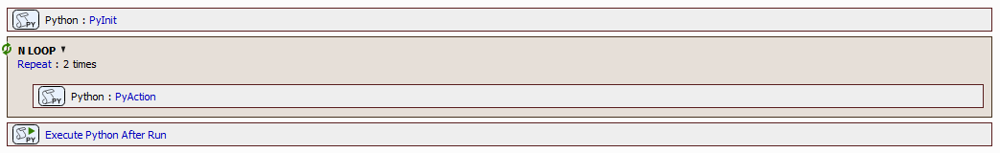

# How to create a dedicated module

This example shows how to create and use a module to hide complex implementation including its state.



JOB file: [[Download link](https://laboratory-imaging.github.io/JOBS-examples\NIS_v7.01\61-Python_in_JOBs\PythonExampleDedicatedModule.bin)]

Let' assume we have

1. module `robot_control.py` with following contents:

```python
def connect_robot() -> None:
    print('Amazing Robot:', 'Hello.')

def disconnect_robot() -> None:
    print('Amazing Robot:', 'Goodbye.')

def command_for_robot(cmd: str) -> None:
    print('Amazing Robot:', cmd)
    print('Amazing Robot:', 'Done.')
```

2. palaced in

```
C:\NisPythonExtensions\MyRobot
```

The job contains three python tasks all importing the module and calling it's function:

```python
# TASK PyInit
# ==========================================

import limjob

# Add a folder to search path
import sys
sys.path.append(R'C:\NisPythonExtensions\MyRobot')

# the C:\NisPythonExtensions\MyRobot will be searched for robot_control.py
from robot_control import connect_robot

def run(imgs: tuple[limjob.Image], Job: limjob.JobParam, macro: limjob.MacroParam, ctx: limjob.RunContext):
    connect_robot()

# TASK PyActiopn
# ==========================================

import limjob

from robot_control import command_for_robot

def run(imgs: tuple[limjob.Image], Job: limjob.JobParam, macro: limjob.MacroParam, ctx: limjob.RunContext):
    command_for_robot(f'insert plate #{Job.Repeat.Current+1}')

# TASK PyAfterRun
# ==========================================

import limjob, nis

print('PyAfterRun', 'at module level', 'limjob has mystate =', hasattr(limjob, 'mystate'))

def run(is_aborted: bool, job_run_key: int, Job: limjob.JobParam, macro: limjob.MacroParam, ctx: limjob.RunContext):
    if hasattr(limjob, 'mystate'):
        print('PyAfterRun', 'deleting mystate')
        delattr(limjob, 'mystate')
    nis.mac.OpenLogFile()
    print('PyAfterRun', 'opening log file')
```

When running the JOB we gwt the expected output:

<pre>
2026-02-13 12:28:40.075 *nis* 00009738 5572424 Executing Job
2026-02-13 12:28:40.397 *nis* 00002f4c 5572746 Starting Job Program Execution
2026-02-13 12:28:40.397 *nis* 00002f4c 5572747 Job instruction - Block Begin: PROGRAM
2026-02-13 12:28:40.397 *nis* 00002f4c 5572747 Job instruction - Execute: PyInit
2026-02-13 12:28:40.428 *nis* 00009738 5572777 PYTHON OUT: <b>Amazing Robot: Hello.</b>
2026-02-13 12:28:40.428 *nis* 00002f4c 5572777 Job instruction - Block Begin: Repeat
2026-02-13 12:28:40.429 *nis* 00002f4c 5572778 Job instruction - Execute: PyAction
2026-02-13 12:28:40.460 *nis* 00009738 5572809 PYTHON OUT: <b>Amazing Robot: insert plate #1</b>
2026-02-13 12:28:40.460 *nis* 00009738 5572809 PYTHON OUT: <b>Amazing Robot: Done.</b>
2026-02-13 12:28:40.460 *nis* 00002f4c 5572810 Job instruction - Execute: PyAction
2026-02-13 12:28:40.491 *nis* 00009738 5572840 PYTHON OUT: <b>Amazing Robot: insert plate #2</b>
2026-02-13 12:28:40.491 *nis* 00009738 5572840 PYTHON OUT: <b>Amazing Robot: Done.</b>
2026-02-13 12:28:40.491 *nis* 00002f4c 5572841 Job instruction - Block End: Repeat
2026-02-13 12:28:40.491 *nis* 00002f4c 5572841 Job instruction - Execute: PyAfterRun
2026-02-13 12:28:40.491 *nis* 00002f4c 5572841 Job instruction - Block End: PROGRAM
2026-02-13 12:28:40.492 *nis* 00002f4c 5572841 Job instruction - Program Did End: PyAfterRun
2026-02-13 12:28:40.492 *nis* 00002f4c 5572841 Finished Job Program Execution (0.094s)
...
2026-02-13 12:28:41.268 *nis* 00009738 5573617 PYTHON OUT: <b>Amazing Robot: Goodbye.</b>
</pre>