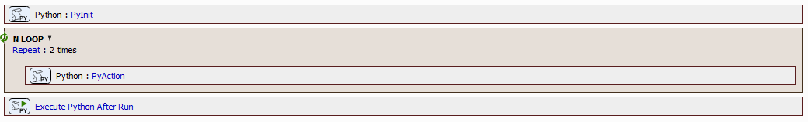

# How to share state between Python tasks

This example shows how to share a dict using a module. Here `limjob` which is imported anyway.



JOB file: [[Download link](https://laboratory-imaging.github.io/JOBS-examples/NIS_v7.01/61-Python_in_JOBs/PythonExampleSharingState.bin)]

```python
# TASK PyInit
# ==========================================

import limjob

mystate = None
print('PyInit', 'at module level', mystate)

def run(imgs: tuple[limjob.Image], Job: limjob.JobParam, macro: limjob.MacroParam, ctx: limjob.RunContext):
    global mystate # !!!
    if mystate is None:
        mystate = { 'i': -1,  'name': 'initialized' }
    print('PyInit', 'in run(...)', mystate)
    setattr(limjob, 'mystate', mystate)

# TASK PyActiopn
# ==========================================

import limjob

print('PyAction', 'at module level', 'limjob has mystate =', hasattr(limjob, 'mystate'))

def run(imgs: tuple[limjob.Image], Job: limjob.JobParam, macro: limjob.MacroParam, ctx: limjob.RunContext):
    mystate = getattr(limjob, 'mystate')
    if mystate is None:
        print('PyAction', 'in run(...)', 'Error: mystate is None!')
    mystate['i'] = Job.Repeat.Current
    mystate['name'] = "In the Repeat loop"
    print('PyAction', 'in run(...)', mystate)

# TASK PyAfterRun
# ==========================================

import limjob, nis

print('PyAfterRun', 'at module level', 'limjob has mystate =', hasattr(limjob, 'mystate'))

def run(is_aborted: bool, job_run_key: int, Job: limjob.JobParam, macro: limjob.MacroParam, ctx: limjob.RunContext):
    if hasattr(limjob, 'mystate'):
        print('PyAfterRun', 'deleting mystate')
        delattr(limjob, 'mystate')
    nis.mac.OpenLogFile()
    print('PyAfterRun', 'opening log file')
```

The output from the python `print(...)` function goes to log file.

<pre>
2026-02-13 08:34:12.342 *nis* 00009564 61274292 Executing Job
...
2026-02-13 08:34:12.633 *nis* 0000610c 61274582 Starting Job Program Execution
2026-02-13 08:34:12.633 *nis* 0000610c 61274583 Job instruction - Block Begin: PROGRAM
2026-02-13 08:34:12.633 *nis* 0000610c 61274583 Job instruction - Execute: PyInit
2026-02-13 08:34:12.664 *nis* 00009564 61274614 PYTHON OUT: <b>PyInit at module level None</b>
2026-02-13 08:34:12.665 *nis* 00009564 61274614 PYTHON OUT: <b>PyInit in run(...) {'i': -1, 'name': 'initialized'}</b>
2026-02-13 08:34:12.665 *nis* 0000610c 61274614 Job instruction - Block Begin: Repeat
2026-02-13 08:34:12.666 *nis* 0000610c 61274615 Job instruction - Execute: PyAction
2026-02-13 08:34:12.696 *nis* 00009564 61274646 PYTHON OUT: <b>PyAction at module level limjob has mystate = True</b>
2026-02-13 08:34:12.697 *nis* 00009564 61274646 PYTHON OUT: <b>PyAction in run(...) {'i': 0, 'name': 'In the Repeat loop'}</b>
2026-02-13 08:34:12.697 *nis* 0000610c 61274646 Job instruction - Execute: PyAction
2026-02-13 08:34:12.728 *nis* 00009564 61274677 PYTHON OUT: <b>PyAction in run(...) {'i': 1, 'name': 'In the Repeat loop'}</b>
2026-02-13 08:34:12.728 *nis* 0000610c 61274677 Job instruction - Block End: Repeat
2026-02-13 08:34:12.728 *nis* 0000610c 61274677 Job instruction - Execute: PyAfterRun
2026-02-13 08:34:12.728 *nis* 0000610c 61274677 Job instruction - Block End: PROGRAM
2026-02-13 08:34:12.728 *nis* 0000610c 61274677 Job instruction - Program Did End: PyAfterRun
...
2026-02-13 08:34:13.499 *nis* 00009564 61275449 PYTHON OUT: <b>PyAfterRun at module level limjob has mystate = True</b>
2026-02-13 08:34:13.499 *nis* 00009564 61275449 PYTHON OUT: <b>PyAfterRun deleting mystate</b>
2026-02-13 08:34:13.528 *nis* 00009564 61275478 PYTHON OUT: <b>PyAfterRun opening log file</b>
</pre>