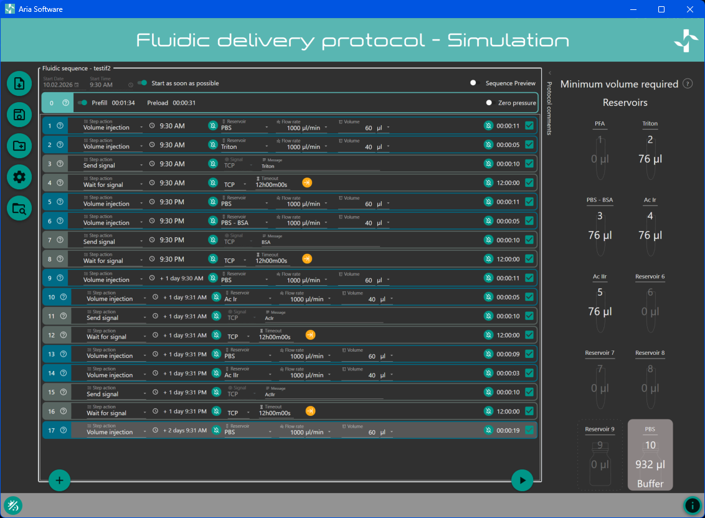
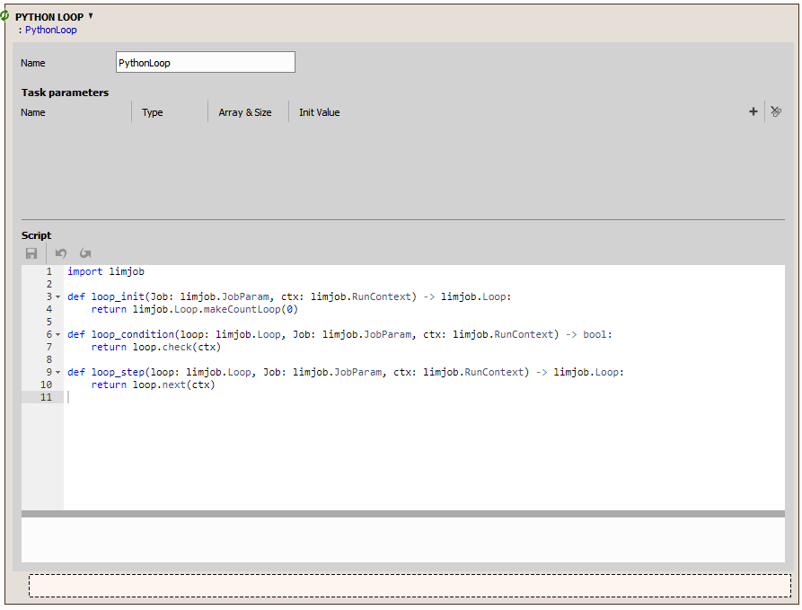
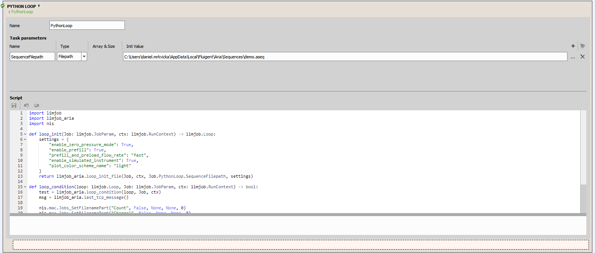
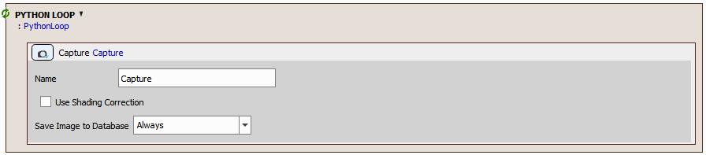
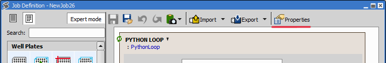
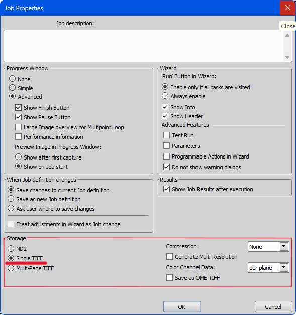
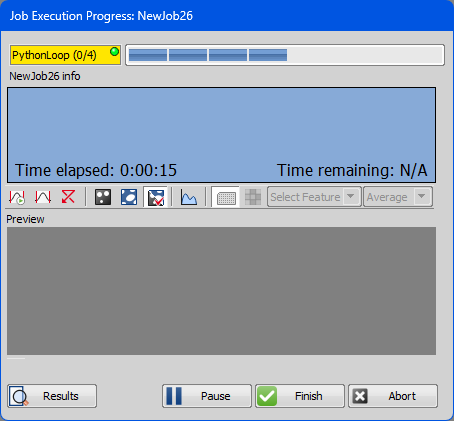
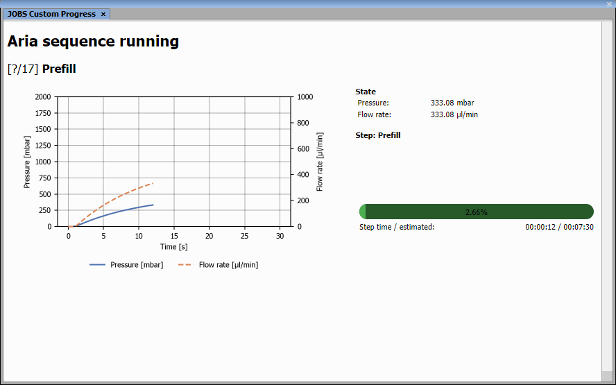
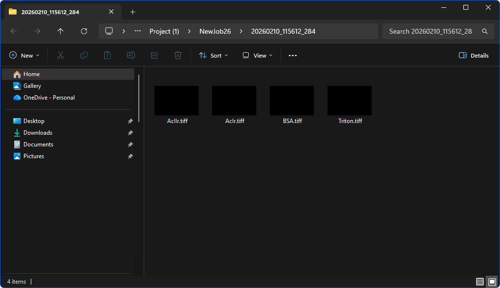

# Aria fluidic control

The goal of this example is to show how to install the Aria SDK Python package and use it from a NIS-Elements JOBS Python Loop to simulate fluidic control with an ARIA Sequence.

> [!NOTE]
> This example is shown on simulated devices — it doesn’t require any real hardware for trying it out; you may use simulators if available.

## Contents

- [Prerequisites](#prerequisites)
- [Python Aria SDK installation](#python-aria-sdk-installation)
- [Aria sequence](#aria-sequence)
  - [Setup reservoirs](#1-setup-reservoirs)
  - [Setup sequence tasks](#2-setup-sequence-tasks)
  - [Save sequence](#3-save-sequence)
- [Setting up the JOB](#setting-up-the-job)
  - [Python Loop task](#python-loop-task)
  - [Capture task](#capture-current-task)
  - [Job properties](#job-properties)
  - [JOBS Custom Progress](#jobs-custom-progress)
- [Running the JOB](#running-the-job)
  - [Job Execution Progress](#job-execution-progress)
  - [JOBS Custom Progress](#jobs-custom-progress-1)
- [Results](#results)
- [Explanation of Python script](#explanation-of-python-script)
  - [Imports](#imports)
  - [Loop functions](#loop-functions)
  - [ARIA settings](#aria-settings)
  - [NIS macro function](#nis-macro-function)
- [Update to real instrument](#update-to-real-instrument)

## Prerequisites

- NIS-Elements with **JOBS** module enabled
- ARIA device and installed ARIA software (for sequence editing)

## Python Aria SDK installation

The Aria SDK used in this job task is based on a fork of the Fluigent Aria SDK (v1.2.0).
The Python package has been adapted for installation via pip and for compatibility with embedded Python 3.12 in NIS-Elements 7.00.01.
The package can be downloaded from: https://github.com/Laboratory-Imaging/aria-sdk/releases

1) Download Aria SDK in the form of python package `aria_sdk-1.2.0+nis7.zip` from the [Releases page](https://github.com/Laboratory-Imaging/aria-sdk/releases)
2) Note the download location, e.g. `C:\Users\UserName\Downloads\aria_sdk-1.2.0+nis7.zip`
3) Locate the NIS-Elements Python executable, e.g.`C:\Program Files\NIS-Elements\Python\python.exe`
4) Open the Windows Command Prompt (`cmd.exe`)
5)  Install the package using the NIS-Elements Python interpreter:
````bash
C:\Program Files\NIS-Elements\Python\python.exe -m pip install C:\Users\UserName\Downloads\aria_sdk-1.2.0+nis7.zip
````

During installation, pip will also install required dependencies,
including `pythonnet` and its dependency `clr_loader`, if they are
not already present in the NIS-Elements Python environment.

While still in the Windows Command Prompt, start the NIS-Elements Python interpreter:
````bash
C:\Program Files\NIS-Elements\Python\python.exe
````

At the Python prompt, run:
````python
import Aria.SDK
````

If no error is raised, the installation was successful.

## Aria Sequence

We can prepare Aria Sequence using [Aria Software](https://www.fluigent.com/research/instruments/aria/).

For this example we will modify sequence used in [Automated Immunofluorescence Application Note](https://www.fluigent.com/resources-support/expertise/application-notes/automated-immunofluorescence/).

### 1) Setup reservoirs

* 2: Triton
* 3: PBS-BSA
* 4: Ac-Ir
* 5: Ac-IIr
* 10: PBS

### 2) Setup sequence tasks

1) **Volume injection**, reservoir PBS, flow rate 1000 &micro;l/min, volume 60 &micro;l
2) **Volume injection**, reservoir Triton, flow rate 1000 &micro;l/min, volume 40 &micro;l
3) **Send signal**, TCP signal, message "Triton"
4) **Wait for signal**, TCP signal, timeout 12 hours, Start listening before the step starts

5) **Volume injection**, reservoir PBS, flow rate 1000 &micro;l/min, volume 60 &micro;l
6) **Volume injection**, reservoir PBS-BSA, flow rate 1000 &micro;l/min, volume 40 &micro;l
7) **Send signal**, TCP signal, message "BSA"
8) **Wait for signal**, TCP signal, timeout 12 hours, Start listening before the step starts

9) **Volume injection**, reservoir PBS, flow rate 1000 &micro;l/min, volume 60 &micro;l
10) **Volume injection**, reservoir Ac-Ir, flow rate 1000 &micro;l/min, volume 40 &micro;l
11) **Send signal**, TCP signal, message "AcIr"
12) **Wait for signal**, TCP signal, timeout 12 hours, Start listening before the step starts

13) **Volume injection**, reservoir PBS, flow rate 1000 &micro;l/min, volume 60 &micro;l
14) **Volume injection**, reservoir Ac-Ir, flow rate 1000 &micro;l/min, volume 40 &micro;l
15) **Send signal**, TCP signal, message "AcIIr"
16) **Wait for signal**, TCP signal, timeout 12 hours, Start listening before the step starts

17) **Volume injection**, reservoir PBS, flow rate 1000 &micro;l/min, volume 60 &micro;l

You should end up with a sequence like the one shown below.



### 3) Save sequence
Save the sequence (for example, into the default Aria sequences folder):

`C:\Users\<username>\AppData\Local\Fluigent\Aria\Sequences\demo.seq`

> [!IMPORTANT]
> #### Imaging step managed by TCP signals
> The Aria instrument will run fluidic steps such as injections or washing. To trigger actions in NIS-Elements JOBS (for example, image acquisition) at specific points in the sequence, insert the following two steps at each place where you want JOBS to take over:
>
> * **Send signal**, TCP signal, message "READ_BY_PYTHON_LOOP_TASK"
> * **Wait for signal**, TCP signal, timeout 12 hours, Start listening before the step starts
>
> It is important to set both signals to **TCP** and to set the **Wait for signal** timeout to e.g. **12 hours**, so JOBS has enough time to complete its tasks and send the signal back to Aria. For **Wait for signal**, also enable **Start listening before the step starts**.
>
> You can set a custom **Message** in **Send signal**. The `Python Loop` can read this message (via `last_tcp_message()`) and use it for things like file naming or branching to different actions.

> [!NOTE]
> #### Demo speedup
> Because this demo runs on a simulated instrument, we reduced all volumes and increased flow rates so the demo finishes within minutes. This is not representative of real-life experiments.

> [!CAUTION]
> #### Unsupported Aria tasks
> The ARIA SDK used inside the `Python Loop` task does not currently support running sequences that contain `Loop` or `Group` tasks.

> [!CAUTION]
> #### Bad reservoir index handling
> The ARIA SDK used inside the `Python Loop` task currently handles reservoir indices in `*.aseq` files incorrectly.
>
> - The flush buffer must always be set to **position 10**.
> - Reservoir indices are shifted (for example: reservoir 2 at ARIA software will be reservoir 1 at reality when sequence runned by `Python Loop`).

## Setting up the JOB

This JOB consists of two tasks:
1) `Python Loop`
2) `Capture (current)`

### Python Loop Task

We will start by creating the `Python Loop` task which will manage the fluidic loop.



1) Setup the paramater which holds path to Aria sequence path.

* In **Task parameters**, click the `+` button to add a new parameter.
* Set **Name** to `SequenceFilepath`.
* Set **Type** to `Filepath`.
* Set **Init value** by clicking `...` and selecting your `*.aseq` file. (for example `C:\Users\<username>\AppData\Local\Fluigent\Aria\Sequences\demo.seq`)

2) Insert the code below to code area.

````python
import limjob
import limjob_aria
import nis

def loop_init(Job: limjob.JobParam, ctx: limjob.RunContext) -> limjob.Loop:
    settings = {
        "enable_zero_pressure_mode": True,
        "enable_prefill": True,
        "prefill_and_preload_flow_rate": "fast",
        "enable_simulated_instrument": True,
        "plot_color_scheme_name": "light"
    }
    return limjob_aria.loop_init_file(Job, ctx, Job.PythonLoop.SequenceFilepath, settings)

def loop_condition(loop: limjob.Loop, Job: limjob.JobParam, ctx: limjob.RunContext) -> bool:
    test = limjob_aria.loop_condition(loop, Job, ctx)
    msg = limjob_aria.last_tcp_message()

    nis.mac.Jobs_SetFilenamePart("Count", False, None, None, 0)
    nis.mac.Jobs_SetFilenamePart("Channel", False, None, None, 0)
    nis.mac.Jobs_SetFilenamePart("Seq", False, None, None, 0)
    nis.mac.Jobs_SetFilenamePart("Prefix", True, str(msg), None, 0)
    return test

def loop_step(loop: limjob.Loop, Job: limjob.JobParam, ctx: limjob.RunContext) -> limjob.Loop:
    return limjob_aria.loop_step(loop, Job, ctx)
````

The `Python Loop` task should now look like the screenshot below (parameter created and code pasted).



### Capture (current) Task

Inside `Python Loop` task insert simple `Capture (current)` task. No additional settings are required for this task.



### Job properties

Now we need to set up `Storage`. Open the `Job Properties` dialog.



In the `Storage` section, select `Single TIFF` so each capture is saved as a separate TIFF file.
For this example, file naming is handled by the Python script inside the `Python Loop` task and will be explained later.



JOB file: [[Download link](https://laboratory-imaging.github.io/JOBS-examples/NIS_v7.01/62-Aria_fluidic_control/AriaCapture.bin)]

### JOBS Custom Progress

Open *JOBS Custom Progress* window.

1) open from NIS menu:  View > Analysis control > Jobs Custom Progress
2) or search in NIS: type *jobs* in *Search [Ctrl+F3]* and select *JOBS Custom Progress*.

### Complete demo setup

You should now have a fully prepared demo for Aria fluidic control.

## Running the JOB

### Job Execution Progress

After the job starts, you should see the `Python Loop` task in the **Job Execution Progress** window with multiple steps — one step for each **pair of TCP signals** in the Aria Sequence.



### JOBS Custom Progress

In the **JOBs Custom Progress** window, you should see basic information about the Aria device state and the currently running step.



## Results

In the run’s **Containing Folder**, you should find **four TIFF images**, each named after the fluid used.



## Explanation of Python script

### Imports

At the beginning of file we import three modules

````python
import limjob
import limjob_aria
import nis
````
  * module `limjob`
    * is located at `...\NIS-Elements\Python\Lib\site-packages\limjob.py`.
    * Provides access to JOB execution context and task parameters.
      * `limjob.JobParam` - used to access properties of the JOB and individual JOB tasks
      * `limjob.RunContext` - provides runtime context during JOB execution
      * `limjob.Loop` - creates basic loop types which may be used inside `Python Loop` task

  * module `limjob_aria`
    * is located at `...\NIS-Elements\Python\Lib\site-packages\limjob_aria.py`.
    * currently provides this API
      * `loop_init_file(Job: limjob.JobParam, ctx: limjob.RunContext, sequence_path: str, settings: dict|None = None) -> limjob.Loop`
        * initializes and launches an ARIA sequence from a file
        * internally creates and behaves as a simple count-based loop
        * returns a `limjob.Loop` instance.
        * intended to be used as the return value of a `loop_init` function in a `Python Loop` task

      * `loop_init_json(Job: limjob.JobParam, ctx: limjob.RunContext, sequence_json: str, settings: dict|None= None) -> limjob.Loop`
        * initializes and launches an ARIA sequence from a JSON string
        * internally creates and behaves as a simple count-based loop
        * returns a `limjob.Loop` instance.
        * intended to be used as the return value of a `loop_init` function in a `Python Loop` task

      * `loop_condition(loop: limjob.Loop, Job: limjob.JobParam, ctx: limjob.RunContext) -> bool`:
        * advances the ARIA system sequence
        * waits until a TCP signal recieved is received from the ARIA system
        * returns `True` or `False` to control loop continuation
        * intended to be used as the return value of a `loop_condition` function in a `Python Loop` task

      * `loop_step(loop: limjob.Loop, Job: limjob.JobParam, ctx: limjob.RunContext) -> limjob.Loop`
        * iterates the inner count loop
        * sends a TCP signal back to ARIA system so the ARIA sequence can continue
        * returns the updated `limjob.Loop` instance.
        * intended to be used as the return value of a `loop_step` function in a Python Loop task

      * `last_tcp_message() -> str|None`
        * returns last TCP message received from the ARIA system
        * returns None if no message has been received

  * module `nis`
    * internal NIS module
    * enables calling NIS macro functions

### Loop functions
The Python Loop task requires that the script defines the following three functions, which control loop behavior:

* `def loop_init(Job: limjob.JobParam, ctx: limjob.RunContext) -> limjob.Loop`
  * This function is called:
    * at the beginning of the Job execution, and
    * at the start of each loop cycle
  * It is responsible for initializing and returning the `limjob.Loop` object.

* `def loop_condition(loop: limjob.Loop, Job: limjob.JobParam, ctx: limjob.RunContext) -> bool`

  * This function is called before each loop iteration.
  * It determines whether the loop should continue executing.
  * Returns:
    * True → continue the loop
    * False → terminate the loop

* `def loop_step(loop: limjob.Loop, Job: limjob.JobParam, ctx: limjob.RunContext) -> limjob.Loop`
  * This function is called at the end of each loop iteration.
  * It typically updates and returns the modified `limjob.Loop` object (e.g., incrementing counters or updating state).

### Nis macro function

Original NIS macro function `nis.mac.Jobs_SetFilenamePart(...)` has this calling
````cpp
 Jobs_SetFilenamePart(
   char *FilePart,
   int  FilePartEnabled,
   char *FilePartPrefix,
   char *FilePartInfo,
   int  FilePartWidth
);
````
In Python,  NIS macro functions are called using the generic pattern
````python
nis.mac.MacroFunctionName(arguments)
````

The `nis` module automatically handles conversion from native Python types to the underlying C++ types.
* `char*` → Python `str`
* `int` → Python `int`

The following calls modify how filename parts are constructed in a JOB:
````python
nis.mac.Jobs_SetFilenamePart("Count", False, None, None, 0) # remove loop count indexing from name
nis.mac.Jobs_SetFilenamePart("Channel", False, None, None, 0) # remove camera channel from name
nis.mac.Jobs_SetFilenamePart("Seq", False, None, None, 0) # remove uniqueness/index from name
nis.mac.Jobs_SetFilenamePart("Prefix", True, str(msg), None, 0) # sets `msg` as prefix part of name
````

Each call modifies one logical filename component.
* The first three calls disable automatic indexing components:
  * Loop count (Count)
  * Camera channel (Channel)
  * Sequence uniqueness/index (Seq)
* The last call enables the Prefix component and assigns it the value of msg.

With automatic components disabled and only the prefix enabled, the resulting filename has the form: `<msg>.tif`

### ARIA Settings
Functions `limjob_aria.loop_init_file` and `limjob_aria.loop_init_file` accept an optional argument `settings`.
The `settings` argument is a Python `dict` that allows configuration of ARIA behavior before the sequence is started.

#### Example
````python
settings = {
    "enable_zero_pressure_mode": True,
    "enable_prefill": True,
    "prefill_and_preload_flow_rate": "fast",
    "enable_simulated_instrument": True,
    "plot_color_scheme_name": "light"
}
````
#### Available Settings
* `enable_zero_pressure_mode` (`bool | None`)
  * Enables or disables zero pressure mode for the sequence.

* `enable_prefill` (`bool | None`)
  * Enables or disables sequence prefill.

* `prefill_and_preload_flow_rate` (`str | None`)
  * Sets the flow rate preset used during prefill and preload.
  * Values:
    * `"precision"`
    * `"balanced"`
    * `"fast"`
    * `"max"`

* `enable_simulated_instrument` (`bool | None`)
  * If `True`, loads a simulated ARIA instrument when a physical instrument cannot be loaded.

* `plot_color_scheme_name` (`str`)
  * Sets the color scheme for the runtime pressure/flow plot.
  * Allowed values:
    * `"light"`
    * `"dark"`

> [!NOTE]
> All settings are optional.
> If a setting is omitted or set to None, the default ARIA behavior is used.

## Update to real instrument
Inside `limjob_aria`, a TCP server is created to enable communication with the ARIA device.
* The ARIA device is switched to client mode.
* The current ARIA TCP port is retrieved and used to initialize the local TCP server.
* Communication between NIS (Python) and ARIA then occurs over this TCP connection.

> [!WARNING]
> Cleanup after the run is not managed automatically by NIS.
